# QuickPitik

## Software Requirements Specification (SRS)

**Project title:** QuickPitik — A Marathon Photography Ecosystem for Cebu

**Capstone code:** 2526-sem2-it332-31

**Institution:** Cebu Institute of Technology — University, College of Computer Studies

**Team members:**

- Tapales, Christian Kyle
- Chan, Theo Cedric
- Ycoy, Dillan Marquin
- Purez, Kristine Eunice
- Sy, Brye Kane L.

**Document version:** 1.0 (Review Draft)

**Published date:** 04 May 2026

**Standards:**

- IEEE Std 830-1998 — Recommended Practice for Software Requirements Specifications
- CIT-U COCS Capstone SRS Template

> **Page header (every body page when pasted into Word):**
> Left — *Software Requirements Specifications / QuickPitik*
> Right — *Document Version: 1.0 / Published Date: 04 May 2026*
> Bottom-right — *Page X of Y*

> **Point-in-time document (frozen).** This SRS is the capstone deliverable as published **04 May 2026** — an IEEE-830 requirements snapshot, **not** a description of the current implementation. Routes here use the `/v1/...` proposal form (the shipped API is `/api/v1/...`); status and architecture reflect May 2026. For current architecture read the repo `docs/` and module `CLAUDE.md` files; for live status, the vault `VAULT-INDEX.md`. Do not "correct" this file to match the code — it is a historical artifact governed by the Document Skill.

---

## Change History

| Version | Date | Author | Changes |
|---------|------|--------|---------|
| 0.1 | 2026-05-03 | Theo Cedric Chan | Initial drafts of §1 Introduction and §2 Overall Description. |
| 0.2 | 2026-05-04 | Theo Cedric Chan | Drafted §3.1 External Interface Requirements, §3.2 Functional Requirements (Modules 1–3, 17 transactions × 4 artifacts), §3.4 Non-functional Requirements, §3.5 Requirements Validation Considerations, and Traceability Matrix appendix; added §2.6 Project Risks (summary) per adviser feedback. |
| 1.0 | 2026-05-04 | Theo Cedric Chan | All ten sections compiled at *review* status for adviser delivery; GO-signal received 2026-05-04. |

---

## Table of Contents

1. Introduction
   - 1.1 Purpose
   - 1.2 Scope
   - 1.3 Definitions, Acronyms, and Abbreviations
   - 1.4 References
2. Overall Description
   - 2.1 Product Perspective
   - 2.2 User Characteristics
   - 2.4 Constraints *(template skips 2.3 — preserved)*
   - 2.5 Assumptions and Dependencies
   - 2.6 Project Risks (summary)
3. Specific Requirements
   - 3.1 External Interface Requirements
     - 3.1.1 Hardware Interfaces
     - 3.1.2 Software Interfaces
     - 3.1.3 Communications Interfaces
   - 3.2 Functional Requirements
     - Module 1 — Mobile Application (M1.1 – M1.5)
     - Module 2 — Desktop Application (M2.1 – M2.4)
     - Module 3 — Web/Mobile Marketplace & AI Search (M3.1 – M3.8)
   - 3.4 Non-functional Requirements *(template skips 3.3 — preserved)*
     - 3.4.1 Performance
     - 3.4.2 Security and Privacy
     - 3.4.3 Reliability and Availability
     - 3.4.4 Usability
     - 3.4.5 Portability and Compatibility
     - 3.4.6 Maintainability
   - 3.5 Requirements Validation Considerations
     - 3.5.1 Requirements Quality Attributes
     - 3.5.2 Validation Methods
     - 3.5.3 Stakeholder Roles in Validation
     - 3.5.4 Acceptance Criteria for the SRS
     - 3.5.5 Change Control and Traceability Maintenance
- Appendix — Traceability Matrix

---

# 1. Introduction

## 1.1 Purpose

The purpose of this Software Requirements Specification (SRS) is to define the functional and non-functional requirements of **QuickPitik** — a marathon photography ecosystem for Cebu, Philippines that combines real-time camera-to-cloud synchronization, AI-powered blur detection, multi-modal participant search (face recognition and bib-number recognition), and an integrated marketplace for photo discovery and purchase.

This document is intended for the following audiences:

- **Developers** building the mobile, desktop, web, backend, and AI services.
- **Project managers** tracking requirements coverage, scope changes, and milestone readiness.
- **The capstone adviser and CIT-U COCS reviewers** assessing scope, feasibility, and alignment with the project proposal.
- **External stakeholders** — pilot photographers and runner representatives — reviewing the system's contracted behavior.

The document is structured according to **IEEE Std 830-1998** and the **CIT-U COCS Capstone SRS Template**. It is the authoritative reference for *what* the system must do and *how well* it must do it; downstream artifacts — the Software Design Description (SDD), Software Project Management Plan (SPMP), test plan, and user manual — derive from this baseline.

## 1.2 Scope

QuickPitik is a multi-platform application comprising a mobile application (Android first), a desktop application (Electron-based, named **BatchMyPhotos**), a web/mobile marketplace (Next.js), and an internal AI inference service (`ai-api`). It addresses two coupled problems in marathon photography:

1. **Photographers** cannot upload photos in real time, must manually cull and sort thousands of images per event (1–2 hours of post-processing per event), and lack tooling to detect motion-blurred or out-of-focus photos at scale.
2. **Runners** cannot efficiently locate their own photos among thousands of unsorted images and have no local platform on which to purchase them.

### In scope

The system shall provide the following core functionalities, organized by module:

**Module 1 — Mobile Application (GO1).** Camera tethering via Picture Transfer Protocol (PTP) or manufacturer SDK; real-time cloud upload pipeline; background local caching during connectivity loss with automatic resume; runner-side push notifications on photo identification.

**Module 2 — Desktop Application (GO2).** AI-powered blur detection; automated batch sorting into configurable folder sizes; combined culling-and-sorting workflow; event library synchronization from local storage. The desktop application is named **BatchMyPhotos**.

**Module 3 — Web/Mobile Marketplace (GO3).** Multi-modal AI search via face recognition and bib-number recognition; selfie-based and bib-based search interfaces; watermarked photo preview; cart-and-checkout with secure payment via PayMongo; instant download upon payment confirmation; event browsing; user registration and authentication.

### Out of scope

The following are explicitly excluded from this SRS and the associated capstone deliverable:

- Live-stream photo broadcasting.
- In-platform photo editing.
- Race timing integration (independent of photo identification).
- Multi-event aggregated runner profiles spanning multiple events.
- Native iOS mobile (Android-first; iOS deferred to a future phase).

## 1.3 Definitions, Acronyms, and Abbreviations

The following terms are used throughout this SRS.

| Term | Definition |
|------|------------|
| **AI** | Artificial Intelligence. |
| **API** | Application Programming Interface. |
| **Bib number** | Numeric identifier worn by a marathon runner; used as a search key. |
| **Blur culling** | Automated rejection of out-of-focus photos to leave a clean, sellable set. |
| **Camera tether** | Wired or wireless connection between a camera and a host device for live image transfer. |
| **Confidence threshold** | Minimum similarity score for a face match to be accepted; applied per event by the backend, not by `ai-api`. |
| **CRNN** | Convolutional Recurrent Neural Network; used for OCR sequence prediction. |
| **Event isolation** | Architectural rule that no face embedding or photo may leak across event boundaries. |
| **Face embedding** | A 512-dimensional vector encoding a face, stored in pgvector and compared via cosine similarity. |
| **GO / SO / RQ** | General Objective, Specific Objective, and Research Question — proposal-aligned identifiers. |
| **HMAC** | Hash-based Message Authentication Code; used for webhook signature verification. |
| **NFR** | Non-functional Requirement. |
| **OCR** | Optical Character Recognition. |
| **PTP** | Picture Transfer Protocol. |
| **RRL** | Reviewed Related Literature. |
| **SDK** | Software Development Kit. |
| **Watermark** | Visible mark overlaid on photo previews; removed only on paid download. |
| **YOLO** | You Only Look Once; family of object-detection models used in bib-number detection. |

## 1.4 References

This SRS draws on the following references; full citations follow APA 7 style.

**Primary anchors**

1. Tapales, C. K., Chan, T. C., Ycoy, D. M., Purez, K. E., & Sy, B. K. L. (2026). *QuickPitik: A marathon photography ecosystem for Cebu — Final Software Proposal* (Capstone code 2526-sem2-it332-31). Cebu Institute of Technology — University, College of Computer Studies.
2. Institute of Electrical and Electronics Engineers. (1998). *IEEE Standard 830-1998: Recommended practice for software requirements specifications*. IEEE.

**Template**

3. CIT-U College of Computer Studies. *Capstone SRS Template*. Cebu Institute of Technology — University.

**Reviewed Related Literature**

The system design and accuracy targets in this SRS are grounded in the **25 Reviewed Related Literature (RRL) papers** cited in the project proposal, covering bib-number recognition, face recognition on edge devices, image deblurring and quality assessment, and edge-cloud orchestration for image retrieval. The complete list is reproduced verbatim from the project proposal at delivery time.

---

# 2. Overall Description

> **Numbering note.** The CIT-U COCS template intentionally skips §2.3. The numbering below preserves that gap.

## 2.1 Product Perspective

QuickPitik is an **integrated multi-platform ecosystem** consisting of three end-user applications and two internal services:

- **Mobile application** (Android, Kotlin) — used by photographers during events for camera tethering and capture-to-cloud upload, and by runners after events to search, view, and purchase photos and to receive push notifications on identification.
- **Desktop application** (Electron, named **BatchMyPhotos**) — used by photographers post-event for AI-driven blur culling and automated batch sorting.
- **Web/mobile marketplace** (Next.js on Vercel) — public-facing storefront for browsing events, multi-modal AI search, watermarked preview, and payment.
- **Spring Boot backend** (Kotlin, internal) — public API for the mobile and web clients; owns user, event, and payment data; proxies all AI-inference work to the internal AI service.
- **AI inference service `ai-api`** (FastAPI + Celery, internal) — provides blur detection, face recognition, bib-number OCR, and asynchronous batch processing.

The system integrates with the following external services: **Amazon S3** for photo object storage, **Amazon RDS (PostgreSQL with pgvector)** for relational data and face embeddings, **PayMongo** for payment processing, **Firebase Cloud Messaging (FCM)** for runner push notifications, and **AWS EC2** for compute hosting.

The architectural boundaries of QuickPitik are governed by the following rules, which constrain interface design throughout this SRS:

1. The mobile and web clients **never** call `ai-api` directly; they communicate exclusively with the Spring Boot backend, which holds the `ai-api` API key and proxies inference.
2. The desktop application is the only client permitted to call `ai-api` directly, with restricted scopes (`blur:read`, `jobs:read`).
3. `ai-api` is **stateless** with respect to user, event, and participant data; it stores only face embeddings, tagged with an `api_key_id` and `event_id` pair to enforce tenant and event isolation.
4. **Confidence thresholds** for face matches are a backend concern; `ai-api` returns raw similarity scores and the backend applies per-event thresholds.
5. **Event isolation** is enforced by mandatory `event_id` parameters on every face enrollment and search call.

## 2.2 User Characteristics

QuickPitik recognizes the following user classes. Where a use case in §3.2 names a *Primary Actor*, that name is drawn from the table below verbatim.

| User class | Authentication | Description | Technical proficiency | Primary device(s) |
|------------|----------------|-------------|------------------------|--------------------|
| **Guest** | None | Browses public events, views watermarked previews, may optionally search by selfie or bib without an account. | Low | Smartphone or desktop browser |
| **Registered User (Runner)** | Required | Authenticated marathon participant who can search, save, purchase, and download photos; receives push notifications on identification. | Low to moderate | Smartphone (Android primary) + occasionally desktop browser |
| **Photographer** | Required | Authenticated photographer who joins events configured by the Admin, captures and uploads photos via the mobile app, post-processes with the desktop app, and tracks sales. | Moderate (comfortable with DSLRs and editing software) | DSLR/mirrorless camera + Android phone + laptop |
| **Admin** | Required | QuickPitik internal operator (capstone team during pilot). Configures events; manages all entities (users, events, photos, orders) with full Create-Read-Update-Delete (CRUD) authority; reviews event-level analytics; resolves disputes; overrides per-event thresholds. | High | Web admin panel |

## 2.4 Constraints

The following constraints limit design freedom for QuickPitik. They are derived from the project proposal, the regulatory environment, and the architectural rules established in §2.1.

### Regulatory and policy

- **Data privacy.** The system processes biometric data (face embeddings) of marathon participants. It must comply with **Republic Act No. 10173 — Data Privacy Act of 2012** of the Philippines. Consent for face enrollment and storage is captured at runner registration.
- **Photographer rights.** Photo licensing remains with the photographer; QuickPitik functions as a marketplace and does not assume ownership of the underlying images.
- **Default privacy.** Photos are private by default. Per-event public galleries are opt-in per event, configured by the Admin.

### Hardware and platform

- **Camera tethering compatibility.** Initial implementation supports Digital Single-Lens Reflex (DSLR) and mirrorless cameras with **Picture Transfer Protocol (PTP)** or vendor-specific Software Development Kits (SDKs) (Canon EOS Utility, Sony Imaging Edge, Nikon SnapBridge). Compact, smartphone, or older cameras lacking PTP are out of scope.
- **Mobile platform.** Android 10 or higher; iOS deferred to a future phase.
- **Desktop platform.** Windows 10/11 or macOS 12 or higher.

### Performance ceilings

- **AI accuracy is bounded by environmental factors** including obscured bib numbers, motion blur, occlusion, low light, and physical-exertion artefacts (closed eyes, distorted expressions). The system targets the SO3.1 combined face-and-bib identification accuracy (≥ 85 %; see §3.4.1, NFR-P-7) under nominal conditions; the target is not a guaranteed minimum on adversarial inputs.
- **Connectivity dependency.** Real-time upload performance depends on Long-Term Evolution (LTE) or 5G availability. Dense event venues with degraded signal will reduce real-time sync rates; the local-cache mitigation in UC-M1-1.4 guarantees eventual sync but not instant delivery.

### Architectural and operational

- **Internal-only AI service.** `ai-api` is never exposed to end-user applications. The mobile and web clients must always proxy inference through the Spring Boot backend.
- **Tenant boundary.** Each backend has one `api_key_id` per environment in `ai-api`. Cross-tenant data access is structurally prevented.
- **Webhook signing.** All `ai-api` → backend webhook callbacks are HMAC-signed with `X-QuickPitik-Signature` and must be verified on receipt.

### Commercial

- **Payment provider.** **PayMongo** is the sole payment gateway in the initial release; only Philippine peso (PHP) transactions are supported. International payment gateways are out of scope until a future phase.
- **Hosting.** AWS-only (EC2 / RDS / S3) for backend and AI services; Vercel for the web marketplace.

## 2.5 Assumptions and Dependencies

The following assumptions hold throughout the QuickPitik project lifecycle. A material change to any of these assumptions will require a corresponding revision to this SRS.

- **Operating systems.** End-user devices run Android 10 or higher (mobile), Windows 10/11 or macOS 12 or higher (desktop), and current evergreen browsers (web).
- **Camera tethering.** Photographer-supplied cameras support PTP or have an officially supported Android SDK accessible at runtime.
- **Cloud service availability.** Amazon Web Services (EC2, RDS, S3), Vercel, and Firebase services remain available throughout the project lifecycle, within free-tier or capstone-budgeted limits.
- **Payment provider stability.** PayMongo's API contract remains stable; the merchant onboarding process completes before the marketplace pilot.
- **Event scope.** A pilot event managed under the capstone has at most approximately **5,000–15,000 photos** and **500–3,000 registered runners**, consistent with single-day local marathons in Cebu.
- **Regulatory landscape.** No material change to RA 10173 or to local payment regulation occurs during the project lifecycle that would invalidate the design.
- **Team availability.** All five capstone team members remain available for the academic year of the project, and the capstone adviser remains available for SRS / SDD / SPMP review at the scheduled milestones.

## 2.6 Project Risks (summary)

The full risk register, severity matrix, and review cadence are owned by the SPMP (§4 Risk Management). This sub-section surfaces the **highest-severity risks** that materially shape the requirements stated in §3.1, §3.2, and §3.4, so that the adviser can read the SRS with the operational context in view; it is not the authoritative register and shall not be modified independently of SPMP §4.

| ID | Risk | Severity | Bound requirements / mitigations in this SRS |
|----|------|----------|----------------------------------------------|
| **R1** | LTE / 5G unreliable at event venue | High | Mitigated in §3.2 by UC-M1-1.4 (local cache + auto-resume) and in §3.4 by NFR-R-2 (queue persistence). The **Connectivity dependency** entry under §2.4 *Performance ceilings* is the constraint side of this risk. |
| **R2** | AI identification accuracy below the SO3.1 target on adversarial inputs (obscured bibs, motion, occlusion) | High | Acknowledged in §2.4 *Performance ceilings* and bound in §3.4 by NFR-P-7 (combined face + bib ≥ 85 %). Mitigations include manual override (UC-M2-2.2-A2) and the bib-search alternative (UC-M3-3.4) when selfie search fails. |
| **R3** | Camera tether incompatibility with the photographer's specific camera body | High | Constrained at §2.4 *Hardware and platform* (PTP / vendor-SDK requirement) and at §3.4 by NFR-C-4 (declared camera support matrix). UC-M1-1.1 exception E1 ("Camera model not supported") makes the failure mode explicit to the operator. |
| **R4** | Spring Boot backend lags schedule and blocks website + mobile integration | High | Schedule risk owned by SPMP §4; affects the realisation of every transaction in §3.2 *except* the desktop UC-M2-2.1 → UC-M2-2.2 chain (which calls `ai-api` directly). |
| **R9** | Data-privacy compliance gap under RA 10173 | Medium | Bound in §2.4 *Regulatory and policy* (RA 10173 commitment), in §3.2 by UC-M3-3.1's consent flow (M3.1-A1), and in §3.4 by NFR-S-7 (PII minimisation) and NFR-S-8 (RA 10173 compliance). |

For the complete register (twelve risks at present, including operational, scheduling, and infrastructure risks), the severity matrix, and the sprint-retrospective review cadence, see SPMP §4. Any new risk that materially changes a requirement in §3 of this SRS shall be linked back to the affected requirement via this sub-section in the same revision.

---

# 3. Specific Requirements

## 3.1 External Interface Requirements

This section specifies the external interfaces through which QuickPitik shall interact with hardware, third-party software, and communication networks. Three categories are addressed: the **hardware interfaces** between the system and the physical devices it tethers to or runs on (§3.1.1); the **software interfaces** between QuickPitik's own modules and the external systems they integrate with (§3.1.2); and the **communications interfaces** that govern how data shall move between the modules and across the network (§3.1.3). Detailed protocol mechanics, port-level contracts, and deployment topology are deferred to the Software Design Description (SDD §5 — Interface Design and SDD §6 — Deployment); this section establishes only the externally visible requirements that any conforming implementation must satisfy.

### 3.1.1 Hardware Interfaces

QuickPitik shall interface with five distinct categories of hardware. The mobile application shall tether to a digital camera over Universal Serial Bus On-The-Go (USB OTG) or Wi-Fi using either the Picture Transfer Protocol (PTP) or a vendor-supplied Software Development Kit (Canon, Sony, Nikon). The mobile application itself shall run on a photographer- or runner-supplied Android device meeting the minimum hardware floor specified below. The desktop application shall run on a photographer-supplied workstation. The backend services (Spring Boot and `ai-api`) shall run on Amazon Elastic Compute Cloud (EC2) compute instances, with the AI service requiring a Graphics Processing Unit (GPU)-enabled instance class for face-recognition and blur-detection inference. The system shall depend on a mobile-broadband or fixed-broadband network connection — Long-Term Evolution (LTE), 5G, or wired — for all client-to-cloud traffic. The minimum interface characteristics for each are summarised in the table that follows.

| Interface | Description | Requirements |
|-----------|-------------|--------------|
| **Digital camera ↔ mobile app** | Tether via USB or Wi-Fi using **PTP** or vendor SDK (Canon EOS, Sony, Nikon) | Cable/Wi-Fi connection; PTP-compatible camera; Android USB Host (OTG) for wired tether |
| **Mobile device** | Android phone running the QuickPitik mobile app | Android 10+, ≥4 GB RAM, ≥32 GB storage, LTE/5G capability, camera permission, USB OTG support |
| **Desktop computer** | Windows / macOS workstation running the desktop app | Windows 10/11 or macOS 12+, ≥8 GB RAM, ≥50 GB free disk, 64-bit CPU |
| **Backend server (EC2)** | AWS EC2 instances hosting Spring Boot + `ai-api` + Redis | t3.medium (Spring Boot), g4dn.xlarge with NVIDIA T4 GPU (`ai-api`), t3.small (Redis) — sized for capstone scale |
| **Network** | LTE/5G for mobile uploads; broadband for desktop and web | ≥10 Mbps sustained for live mobile upload; ≥50 Mbps for desktop batch upload |

### 3.1.2 Software Interfaces

QuickPitik shall integrate with two internal services and seven external systems, listed in the table below. The internal `ai-api` service shall be invoked only by the Spring Boot backend and (with restricted scopes) the desktop application; mobile and web clients shall never invoke `ai-api` directly. The external systems comprise managed cloud infrastructure (PostgreSQL with the `pgvector` extension on Amazon RDS, AWS S3 for object storage, AWS EC2 for compute hosting), a managed cache and Celery broker (Redis), a payment gateway (PayMongo) for Philippine peso transactions, a push-notification service (Firebase Cloud Messaging), and a managed deployment target for the marketplace front-end (Vercel).

| System | Type | Purpose |
|--------|------|---------|
| **`ai-api` (FastAPI + Celery)** | Internal microservice | Blur detection, face recognition, bib OCR, async batch processing |
| **Spring Boot Backend (Kotlin)** | Internal API | Public API for web + mobile; proxies all `ai-api` calls; owns users, events, photos, payments |
| **PostgreSQL 16 + pgvector** | Database | Relational data + face embeddings (vector cosine search) |
| **AWS S3** | Object storage | Photo originals, watermarked previews, delivery downloads |
| **Redis** | Cache + queue | Celery task broker for `ai-api` async batches |
| **Firebase Cloud Messaging** | Push notification service | Real-time notification delivery to mobile devices |
| **PayMongo** | Payment gateway | Card and e-wallet payment processing |
| **AWS RDS** | Managed DB | PostgreSQL hosting |
| **Vercel** | Web hosting | Next.js website deployment |

### 3.1.3 Communications Interfaces

All network traffic between QuickPitik clients, backend, and `ai-api` shall use Hypertext Transfer Protocol Secure (HTTPS) with Transport Layer Security (TLS) 1.2 or higher. End-user authentication on the mobile and web clients shall use signed JSON Web Tokens (JWT) issued by the Spring Boot backend. Server-to-server authentication into `ai-api` shall use long-lived Application Programming Interface (API) keys, with each consumer (Spring Boot, desktop) holding a distinct key whose `api_key_id` defines the tenant boundary inside `ai-api`. Asynchronous result delivery from `ai-api` to the Spring Boot backend shall use HTTP webhook callbacks signed with a per-tenant Hash-based Message Authentication Code (HMAC) secret carried in the `X-QuickPitik-Signature` header; the receiving backend shall verify the signature on every callback before processing. Real-time progress updates from the mobile and desktop applications to the backend shall use WebSocket connections framed with the Simple Text Oriented Messaging Protocol (STOMP) sub-protocol. Push notifications to runner devices shall be delivered through Firebase Cloud Messaging (FCM). The camera-to-mobile tether shall use PTP over USB OTG or the relevant vendor SDK over Wi-Fi.

| Protocol | Use |
|----------|-----|
| **HTTPS (TLS 1.2+)** | All client ↔ backend, backend ↔ `ai-api`, backend ↔ external services |
| **WebSocket / STOMP** | Real-time upload progress notifications between mobile/desktop and backend |
| **HMAC-signed Webhooks** | `ai-api` → Spring Boot backend on async batch / face match events. Header: `X-QuickPitik-Signature` |
| **JWT Bearer Auth** | User authentication on mobile and web (issued by Spring Boot) |
| **API Key Auth** | Server-to-server authentication for backend → `ai-api` and desktop → `ai-api` |
| **PTP / vendor SDK** | Camera ↔ mobile app over USB or Wi-Fi |
| **FCM Protocol** | Push notification delivery (proprietary) |

---

## 3.2 Functional Requirements

### Scope of this section

This section specifies the behaviour the QuickPitik system **shall** exhibit when invoked by its primary actors. Each transaction below traces upward to one or more Specific Objectives (SO1.1–SO3.3) defined in the project proposal, and downward to one or more workflows defined in the project's workflow catalogue. Every numerical performance target referenced in a transaction's *Special Requirements* is a citation of the proposal-locked target enumerated in §3.4.1, never a re-statement.

### Module split (proposal-aligned)

| Module | Section | # Transactions | Traces to | Primary actors |
|--------|---------|----------------|-----------|----------------|
| **Module 1 — Mobile Application** | §3.2 / Module 1 | 5 | GO1 (SO1.1, SO1.2, SO1.3) | Photographer, Registered User (Runner), Mobile App (system) |
| **Module 2 — Desktop Application (BatchMyPhotos)** | §3.2 / Module 2 | 4 | GO2 (SO2.1, SO2.2, SO2.3) | Photographer, Desktop App (system) |
| **Module 3 — Web/Mobile Marketplace & AI Search** | §3.2 / Module 3 | 8 | GO3 (SO3.1, SO3.2, SO3.3) | Guest, Registered User (Runner), Photographer, Admin |

**Total: 17 transactions.**

### Use case identifier convention

Every use case carries the identifier:

```
UC-M<N>-<X.Y>
```

where `M<N>` is the module (M1, M2, M3) and `X.Y` is the transaction number within the module — for example `UC-M1-1.3` (Auto-upload to cloud), `UC-M3-3.4` (Search by bib number).

### Required artifacts per transaction

Every transaction in §3.2 shall be documented through the following four artifacts (per adviser submission criteria, 2026-05-04):

| # | Artifact | Format | Produced by |
|---|----------|--------|-------------|
| 1 | **Use Case Diagram** | PlantUML code block (rendered to image manually; final delivery via Draw.io) | Agent (code) → User (render) |
| 2 | **Use Case Description** | Filled-in template (table + Main Success Scenario + Alternative Flows + Exceptions) | Agent |
| 3 | **Activity Diagram** | Mermaid `flowchart` code block (rendered to image manually; final delivery via Draw.io) | Agent (code) → User (render) |
| 4 | **Wireframe** | Hand-made screen mock-up (Figma, draw.io, or hand-drawn) | **User (manual)** |

---

## Module 1 — Mobile Application

Functional requirements for the QuickPitik mobile application (Android, Kotlin / Jetpack Compose). All requirements in this module are written in IEEE 830 spec voice ("shall") and describe the *proposed* system.

### Module-level overview

The mobile application is the photographer-facing capture-to-cloud pipeline and the runner-facing notification receiver. It supports five transactions: tethering a digital camera (M1.1), receiving and queuing each captured photo (M1.2), automatically uploading queued photos to the cloud (M1.3), retaining photos locally during connectivity loss and resuming on recovery (M1.4), and receiving a push notification when AI identification matches a runner (M1.5). Transactions M1.1–M1.4 trace to **GO1** via SO1.1 (transfer initiation ≤ 5 s) and SO1.2 (≥ 95 % sync within 3 min); M1.5 traces to **GO1** via SO1.3 (notification within 60 s of identification).

### Transaction inventory

| ID | Name | Primary actor | Traces to | Workflow |
|----|------|---------------|-----------|----------|
| M1.1 | Tether camera to mobile app | Photographer | SO1.1 | W1 step 2 |
| M1.2 | Capture & queue photo for upload | Photographer (camera) | SO1.1 | W1 steps 3–4 |
| M1.3 | Auto-upload to cloud | Mobile App (system) | SO1.1, SO1.2 | W1 step 4 |
| M1.4 | Local-cache during signal loss | Mobile App (system) | SO1.2 | W1 step 5 |
| M1.5 | Receive photo-found notification | Registered User (Runner) | SO1.3 | W5 |

---

### M1.1 Tether Camera to Mobile App

#### Use Case Description

| Field | Value |
|-------|-------|
| **Use Case ID** | UC-M1-1.1 |
| **Use Case Name** | Tether Camera to Mobile App |
| **Primary Actor** | Photographer |
| **Stakeholders** | Photographer (needs reliable tether); QuickPitik Admin (needs uploads to flow into the configured event); Runner (eventual consumer of the photos) |
| **Trigger** | Photographer plugs the camera into the phone via Universal Serial Bus On-The-Go (USB OTG), or initiates a Wi-Fi pairing from the camera's vendor Software Development Kit (SDK). |
| **Preconditions** | (a) Photographer is signed in to the mobile app; (b) Photographer is joined to an active event configured by Admin; (c) Camera is powered on and is compatible with the Picture Transfer Protocol (PTP) or with a bundled vendor SDK; (d) Phone has USB OTG support or is on the same Wi-Fi network as the camera. |
| **Postconditions (success)** | The mobile app holds an open camera session; subsequent capture events from the camera are received by the app (M1.2). |
| **Postconditions (failure)** | No camera session is established; an error message names the failed step (cable, protocol mismatch, permission). |
| **Frequency** | Once per event setup, plus reconnection attempts on disconnect. |
| **Special Requirements** | The session shall be established within 10 s of physical connection. The app shall surface the active connection mode (USB / Wi-Fi) and the camera model. |
| **Traces to** | SO1.1; GO1 |

#### Main Success Scenario

1. Photographer opens the QuickPitik mobile app and selects the active event.
2. Photographer connects the camera to the phone (USB OTG cable, or Wi-Fi pairing initiated from the camera).
3. The mobile app detects the camera and prompts the user to grant USB / network permission.
4. Photographer grants permission.
5. The app initiates a PTP (USB) or vendor-SDK (Wi-Fi) handshake with the camera.
6. The handshake succeeds; the app displays the camera model, battery level, and connection mode.
7. The app marks the tether session as **active** and is ready to receive captures.

#### Alternative Flows

**A1. Wi-Fi tether instead of USB.** At step 2, the photographer enables Wi-Fi mode on the camera and selects the camera's SSID on the phone; flow continues at step 3 with Wi-Fi-specific permission.

**A2. Reconnect after temporary disconnect.** If the session drops mid-event, the app shall auto-attempt re-handshake every 5 s for up to 60 s before requiring manual reconnection.

#### Exceptions

**E1. Unsupported camera.** At step 5, if the camera does not support PTP and no vendor SDK is bundled, the app shall display "Camera model not supported" and abort.

**E2. Permission denied.** At step 4, if the user denies USB/network permission, the app shall display the permission requirement and offer a retry.

**E3. Cable / pairing failure.** If the handshake at step 5 times out after 10 s, the app shall display a connectivity-troubleshooting dialog and offer a retry.

#### Use Case Diagram (PlantUML)

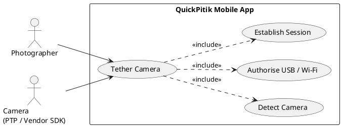

#### Activity Diagram (Mermaid)

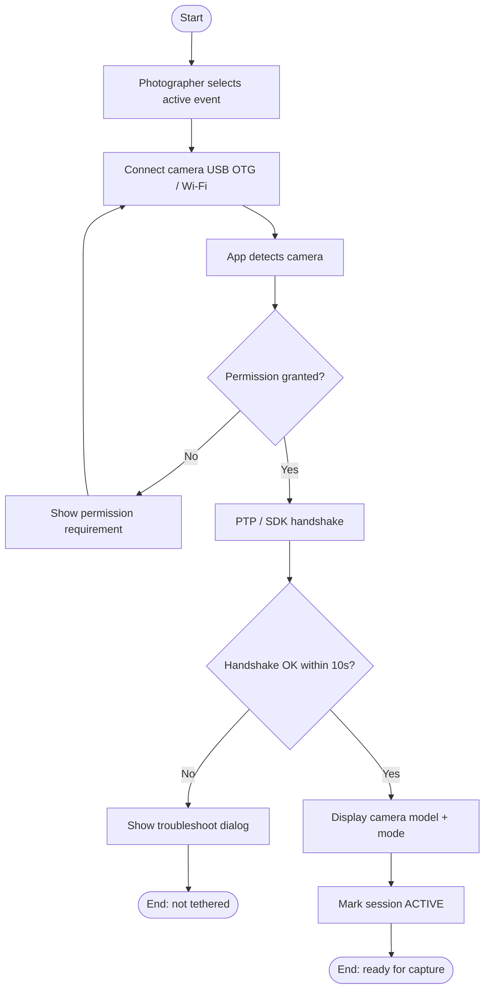

#### Wireframe

> **Wireframe placeholder — Tether screen (M1.1)**
>
> *To be supplied manually by the user.*
>
> **Must show:** active-event banner; "Connect camera" primary CTA; camera-detection in-progress state; camera model + battery + mode (USB / Wi-Fi) on success; troubleshoot dialog on failure; "Reconnect" affordance for A2.
> **Linked transaction:** M1.1
> **Linked use case:** UC-M1-1.1

---

### M1.2 Capture & Queue Photo for Upload

#### Use Case Description

| Field | Value |
|-------|-------|
| **Use Case ID** | UC-M1-1.2 |
| **Use Case Name** | Capture & Queue Photo for Upload |
| **Primary Actor** | Photographer (via tethered camera) |
| **Stakeholders** | Photographer; Runner (consumer of the captured photos); QuickPitik Admin (event owner) |
| **Trigger** | The tethered camera fires the shutter and emits a new image over the active session (UC-M1-1.1). |
| **Preconditions** | (a) Tether session from UC-M1-1.1 is active; (b) Mobile app has write access to internal storage; (c) Active event is selected. |
| **Postconditions (success)** | The captured photo is written to the local upload queue with metadata (timestamp, event ID, photographer ID); the queue depth indicator increments. |
| **Postconditions (failure)** | The capture is logged as an error in the app's session log; the photo is not lost (re-fetched from the camera if still on the SD card) or, if irrecoverable, surfaced to the photographer. |
| **Frequency** | Per shutter actuation — typically 100s–1000s of times per event. |
| **Special Requirements** | Queue write shall complete within 1 s of receipt to avoid blocking the next capture. The app shall not block the camera's continuous-shooting cadence. |
| **Traces to** | SO1.1; GO1 |

#### Main Success Scenario

1. Photographer presses the camera shutter; the camera emits the captured image over PTP / vendor SDK.
2. The mobile app receives the binary photo data.
3. The app generates a local upload record with `event_id`, `photographer_id`, `capture_timestamp`, and a deterministic local ID.
4. The app writes the photo to local storage in the event's upload directory.
5. The app appends the upload record to the persistent upload queue.
6. The app increments the visible queue-depth counter and emits a "ready to upload" event for M1.3.

#### Alternative Flows

**A1. Burst capture.** Steps 1–6 are repeated for each frame in a burst; the app shall handle continuous-shooting cadence without dropping frames.

#### Exceptions

**E1. Local storage full.** At step 4, if free space falls below the configured threshold (default 500 MB), the app shall warn the photographer and offer to delete already-uploaded photos.

**E2. Camera disconnect mid-capture.** If the tether session drops between step 1 and step 2, the app shall mark the photo as pending re-fetch and attempt to retrieve it from the camera SD card on reconnection (A2 of UC-M1-1.1).

#### Use Case Diagram (PlantUML)

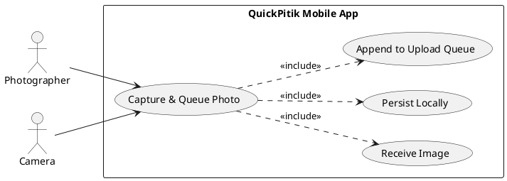

#### Activity Diagram (Mermaid)

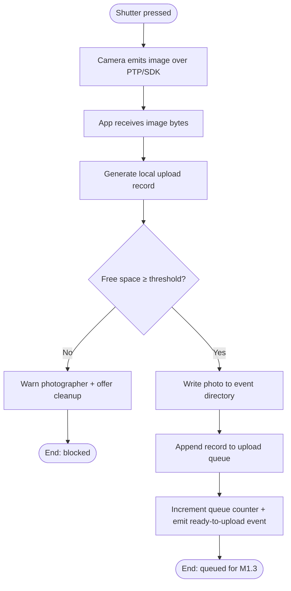

#### Wireframe

> **Wireframe placeholder — Capture screen (M1.2)**
>
> *To be supplied manually by the user.*
>
> **Must show:** live capture counter; queue-depth counter; per-frame thumbnail strip with "uploading / queued / failed" badges; storage-low warning state; per-photo retry / view-error affordance.
> **Linked transaction:** M1.2
> **Linked use case:** UC-M1-1.2

---

### M1.3 Auto-Upload to Cloud

#### Use Case Description

| Field | Value |
|-------|-------|
| **Use Case ID** | UC-M1-1.3 |
| **Use Case Name** | Auto-Upload to Cloud |
| **Primary Actor** | Mobile App (system actor) |
| **Stakeholders** | Photographer (wants timely sync); Runner (wants photos available within minutes); QuickPitik Admin (owns the upload pipeline). |
| **Trigger** | A "ready to upload" event from UC-M1-1.2, **or** a periodic queue scan (every 30 s while the queue is non-empty). |
| **Preconditions** | (a) Upload queue has at least one queued record; (b) The device has an active Long-Term Evolution (LTE) or Wi-Fi connection meeting the configured minimum throughput; (c) The user is authenticated (a valid JSON Web Token (JWT) is present). |
| **Postconditions (success)** | The photo is transferred to the Spring Boot backend, persisted to AWS Simple Storage Service (S3) by the backend, and the local upload record is marked **uploaded** with the server-issued `photo_id`. |
| **Postconditions (failure)** | The upload record is left in queued state with an incremented retry count; if retry count exceeds the configured limit, the record is moved to the failed-uploads view for manual retry. |
| **Frequency** | Per queued photo. |
| **Special Requirements** | Transfer initiation shall meet the SO1.1 target (≤ 5 s after capture; see §3.4.1, NFR-P-1); cumulative sync shall meet the SO1.2 target under nominal connectivity (≥ 95 % within 3 min; see §3.4.1, NFR-P-2). All traffic shall use Hypertext Transfer Protocol Secure (HTTPS) over Transport Layer Security (TLS) 1.2 or higher (§3.1.3). |
| **Traces to** | SO1.1, SO1.2; GO1 |

#### Main Success Scenario

1. The upload worker dequeues the next pending record.
2. The worker requests a signed upload target from the Spring Boot backend (`POST /v1/events/{eventId}/photos/upload-init`) using the user's JWT.
3. The backend returns a signed S3 destination and a temporary `photo_id`.
4. The worker streams the photo bytes to the destination over HTTPS.
5. On a successful HTTP 200 response, the worker calls `POST /v1/events/{eventId}/photos/{photoId}/finalize` to confirm completion.
6. The backend persists the photo record, fans the photo into the AI processing pipeline (out of scope for this use case), and returns the final `photo_id`.
7. The worker marks the local upload record **uploaded**, decrements the queue counter, and emits a "photo synced" UI event.

#### Alternative Flows

**A1. Slow link with progressive upload.** If sustained throughput drops below the threshold, the worker shall continue the upload but display a "slow link" badge on the queue UI; no error is raised unless the upload times out.

#### Exceptions

**E1. Auth failure (401).** If the backend returns 401 at step 2 or step 5, the worker shall pause uploads, request a JWT refresh, and resume.

**E2. Server error (5xx).** If the backend returns 5xx, the worker shall apply exponential back-off (initial 1 s, factor 2, cap 60 s) and retry up to the configured retry limit.

**E3. Connectivity loss.** If the device loses connectivity during steps 4–5, the upload shall be marked failed-with-retry; the device transitions to the local-cache state of UC-M1-1.4.

#### Use Case Diagram (PlantUML)

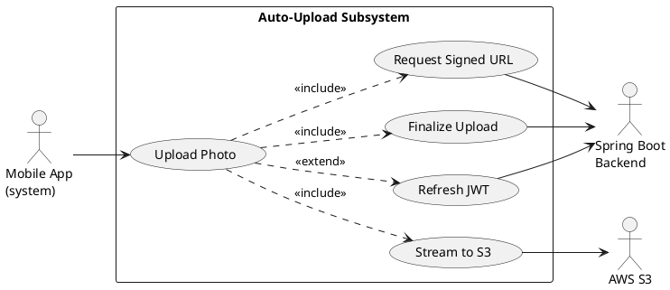

#### Activity Diagram (Mermaid)

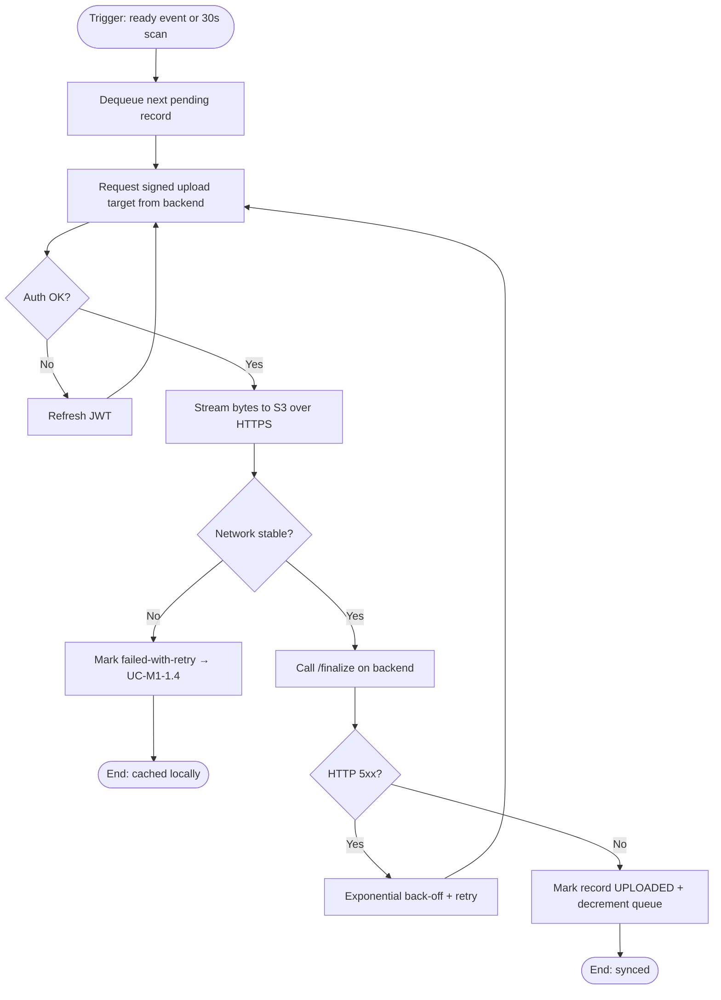

#### Wireframe

> **Wireframe placeholder — Upload queue screen (M1.3)**
>
> *To be supplied manually by the user.*
>
> **Must show:** queue list with per-photo state (queued / uploading / uploaded / failed); aggregate progress bar and ETA; sync-rate ticker (e.g., "23 of 145 uploaded"); slow-link badge; failed-uploads filter; manual retry CTA.
> **Linked transaction:** M1.3
> **Linked use case:** UC-M1-1.3

---

### M1.4 Local-Cache During Signal Loss

#### Use Case Description

| Field | Value |
|-------|-------|
| **Use Case ID** | UC-M1-1.4 |
| **Use Case Name** | Local-Cache During Signal Loss |
| **Primary Actor** | Mobile App (system actor) |
| **Stakeholders** | Photographer (cannot lose photos); Runner (eventual consumer); QuickPitik Admin. |
| **Trigger** | The auto-upload worker detects connectivity loss (E3 of UC-M1-1.3), or an OS-level network-state change to "offline / no-internet". |
| **Preconditions** | (a) UC-M1-1.3 has been active; (b) The phone has free local storage above the configured floor. |
| **Postconditions (success)** | All captured photos remain on device; on connectivity recovery, the upload queue resumes automatically without user intervention; the cumulative sync rate ultimately reaches the SO1.2 target measured from capture, not from recovery. |
| **Postconditions (failure)** | If local storage exhausts during the offline window, the photographer is alerted to free space; no photo is silently discarded. |
| **Frequency** | Whenever signal degrades — common in dense event venues. |
| **Special Requirements** | Detection of the offline state shall occur within 10 s of the actual loss. Resumption upon recovery shall begin within 10 s of network return. The local cache shall persist across app restarts. |
| **Traces to** | SO1.2; GO1 |

#### Main Success Scenario

1. The auto-upload worker observes a connectivity-loss event (timeout, DNS failure, or OS callback).
2. The worker pauses outbound HTTPS traffic and marks the queue as **offline**.
3. The mobile app surfaces an "Offline — caching locally" indicator on the upload UI.
4. New captures from UC-M1-1.2 continue to enter the queue and are written to local storage.
5. The OS / app emits a network-restored event.
6. The worker re-checks connectivity by issuing a lightweight backend health probe.
7. On a successful probe, the worker resumes the upload pipeline of UC-M1-1.3 from the head of the queue.
8. The "Offline" indicator is replaced by an "Uploading" indicator.

#### Alternative Flows

**A1. Manual force-resume.** The photographer may tap "Retry now" on the offline indicator at any time to short-circuit the auto-poll.

#### Exceptions

**E1. Storage exhaustion during offline window.** When free storage falls below the floor, the app shall display a blocking "Free space" dialog listing already-uploaded photos that may be safely deleted.

**E2. Persistent offline state past N minutes.** If connectivity is not restored within a configurable window (default 30 min), the app shall emit a warning notification reminding the photographer.

#### Use Case Diagram (PlantUML)

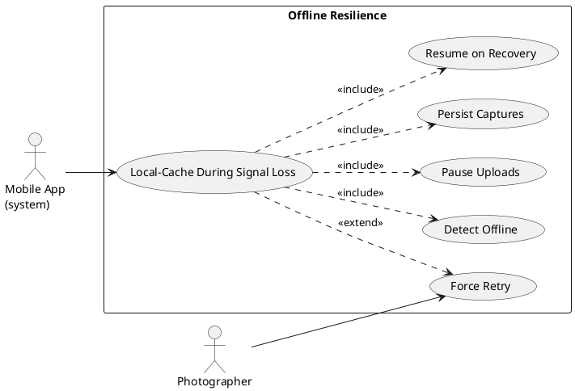

#### Activity Diagram (Mermaid)

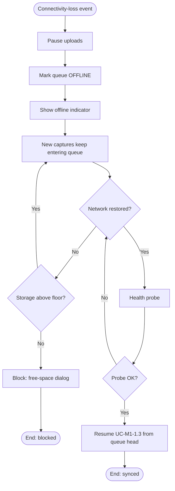

#### Wireframe

> **Wireframe placeholder — Offline / cache state (M1.4)**
>
> *To be supplied manually by the user.*
>
> **Must show:** offline banner with cached-count and storage-remaining; per-photo "cached" badge; "Retry now" CTA; storage-low blocking dialog (E1); auto-resume transition to upload state on recovery.
> **Linked transaction:** M1.4
> **Linked use case:** UC-M1-1.4

---

### M1.5 Receive Photo-Found Notification (Runner)

#### Use Case Description

| Field | Value |
|-------|-------|
| **Use Case ID** | UC-M1-1.5 |
| **Use Case Name** | Receive Photo-Found Notification |
| **Primary Actor** | Registered User (Runner) |
| **Stakeholders** | Runner (wants timely awareness); Photographer (wants engagement / sales); QuickPitik Admin. |
| **Trigger** | The Spring Boot backend, having received a Hash-based Message Authentication Code (HMAC)-signed match webhook from `ai-api`, emits a Firebase Cloud Messaging (FCM) push notification targeting the matched runner's device. |
| **Preconditions** | (a) Runner has installed the mobile app and signed in; (b) Runner is registered to the relevant event with a face embedding enrolled; (c) FCM device token is registered with the backend; (d) Push notifications are not disabled at the operating-system level. |
| **Postconditions (success)** | The runner's device displays the notification; tapping it deep-links into the runner's filtered gallery for that event. |
| **Postconditions (failure)** | The notification is logged as undelivered; the runner can still find the match by performing a manual selfie or bib search (UC-M3-3.3 or UC-M3-3.4). |
| **Frequency** | Per AI identification — potentially multiple per event. |
| **Special Requirements** | The notification shall meet the SO1.3 delivery target (≤ 60 s after AI identification; see §3.4.1, NFR-P-3). Notifications shall include only non-sensitive metadata (event name, count of new matches); biometric data shall not appear in the payload. |
| **Traces to** | SO1.3; GO1 |

#### Main Success Scenario

1. `ai-api` identifies a registered runner in a freshly uploaded photo and fires a `face.match` webhook to the backend.
2. The backend verifies the `X-QuickPitik-Signature` HMAC header.
3. The backend resolves the matched runner's FCM device token from its database.
4. The backend constructs an FCM payload containing event ID, event name, and the count of new matches.
5. The backend issues the push notification via FCM.
6. FCM delivers the notification to the runner's device.
7. The runner sees the notification on the lock screen / notification tray.
8. The runner taps the notification.
9. The mobile app opens the runner's filtered gallery for that event, ready for preview / purchase via Module 3.

#### Alternative Flows

**A1. App in foreground.** If the app is already running in the foreground, the notification is rendered as an in-app toast and the gallery refresh is performed inline rather than via a deep link.

#### Exceptions

**E1. FCM delivery failure.** If FCM returns a permanent failure (invalid token), the backend shall remove the stale token and surface the missed match in the runner's in-app inbox.

**E2. Webhook signature invalid.** At step 2, if the HMAC verification fails, the backend shall reject the webhook and not emit any notification. The event shall be logged for incident review.

**E3. OS-level notifications disabled.** If the OS reports notifications are disabled, the backend shall still write the match to the in-app inbox; the runner sees it on next app open.

#### Use Case Diagram (PlantUML)

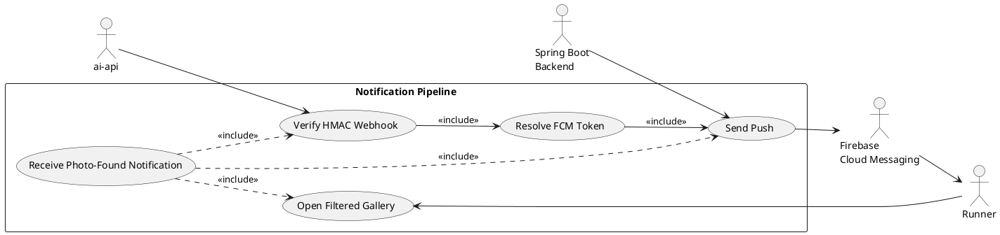

#### Activity Diagram (Mermaid)

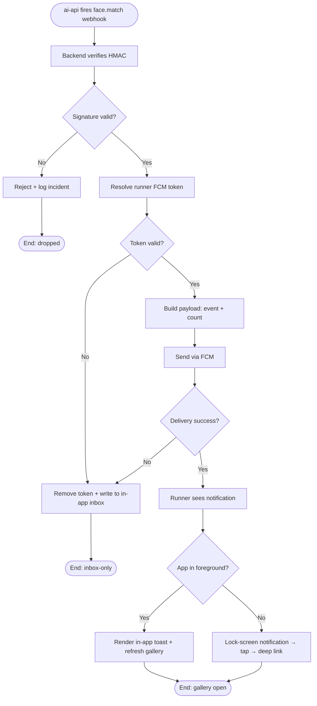

#### Wireframe

> **Wireframe placeholder — Runner notification + filtered gallery (M1.5)**
>
> *To be supplied manually by the user.*
>
> **Must show:** lock-screen notification copy; in-app toast variant; deep-link landing on filtered gallery with new-match count and watermarked previews; in-app inbox fallback for OS-disabled notifications.
> **Linked transaction:** M1.5
> **Linked use case:** UC-M1-1.5

---

## Module 2 — Desktop Application (BatchMyPhotos)

Functional requirements for the QuickPitik desktop application. The desktop application shall be implemented as an Electron-based product named **BatchMyPhotos**, providing the photographer's post-event culling and sorting station. All requirements use IEEE 830 spec voice and describe the *proposed* system.

### Module-level overview

The desktop application is the photographer's post-event station for AI-driven culling and automated batch sorting. It supports four transactions: importing the local event library (M2.1), running blur detection over the imported library (M2.2), automatically sorting non-blurry photos into batch folders (M2.3), and uploading the sorted batches to the Spring Boot backend for marketplace listing (M2.4). The combined M2.1 → M2.2 → M2.3 → M2.4 sequence implements the SO2.3 post-processing reduction objective. The desktop application is the **only** client permitted to call `ai-api` directly, with restricted scopes `blur:read` and `jobs:read`.

### Transaction inventory

| ID | Name | Primary actor | Traces to | Workflow |
|----|------|---------------|-----------|----------|
| M2.1 | Sync event library | Photographer | SO2.3 | W2 step 1 |
| M2.2 | Run blur detection | Desktop App (system) | SO2.1 | W2 step 2 |
| M2.3 | Auto-sort into batch folders | Desktop App (system) | SO2.2 | W2 step 3 |
| M2.4 | Upload sorted batch to backend | Photographer | SO2.3 | W2 step 4 |

---

### M2.1 Sync Event Library

#### Use Case Description

| Field | Value |
|-------|-------|
| **Use Case ID** | UC-M2-2.1 |
| **Use Case Name** | Sync Event Library |
| **Primary Actor** | Photographer |
| **Stakeholders** | Photographer (wants the library imported quickly); QuickPitik Admin (owner of the event being processed); Runner (downstream consumer of the photos). |
| **Trigger** | Photographer launches the desktop application after an event and selects "Open / sync event library". |
| **Preconditions** | (a) Photographer is signed into the desktop app with a valid JSON Web Token (JWT) or Application Programming Interface (API) key; (b) The event configured by Admin is present in the application's event list; (c) The photographer's local photo folder contains the event's photos. |
| **Postconditions (success)** | All photos in the selected folder are indexed in the desktop app's local SQLite database, with file path, Exchangeable Image File Format (EXIF) capture timestamp, file size, and a `pending_blur_check` status. |
| **Postconditions (failure)** | The library indexing aborts cleanly; no partial state is committed to the local DB; the photographer is shown the failed file count and reason. |
| **Frequency** | Once per event, occasionally re-run after additional photos are added. |
| **Special Requirements** | Indexing 15,000 photos shall complete within 60 s on the reference hardware (8 GB RAM, SSD). The indexing operation shall not load image bytes into memory — only metadata is read. |
| **Traces to** | SO2.3; GO2 |

#### Main Success Scenario

1. Photographer selects the event from the desktop app's event list.
2. Photographer clicks "Sync local folder" and chooses the local folder containing the event's photos.
3. The desktop app walks the folder tree, enumerating supported image files (JPEG, RAW formats per configuration).
4. For each file, the app reads EXIF metadata (capture timestamp, camera model, dimensions) without loading the full image.
5. The app inserts an indexing record into the local SQLite database with status `pending_blur_check`.
6. On completion, the app displays the total indexed count, the per-file-type breakdown, and any skipped files with reasons.

#### Alternative Flows

**A1. Re-sync after additional captures.** If the folder is selected for an event that has already been synced, the app shall index only files whose path is not yet present, leaving existing records untouched.

#### Exceptions

**E1. Unreadable file.** If a file cannot be read (corrupt, permission denied), the file is skipped and added to the "skipped files" report; indexing continues.

**E2. Folder not chosen / cancelled.** If the photographer cancels the folder dialog, the operation is aborted with no state change.

#### Use Case Diagram (PlantUML)

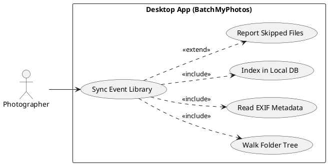

#### Activity Diagram (Mermaid)

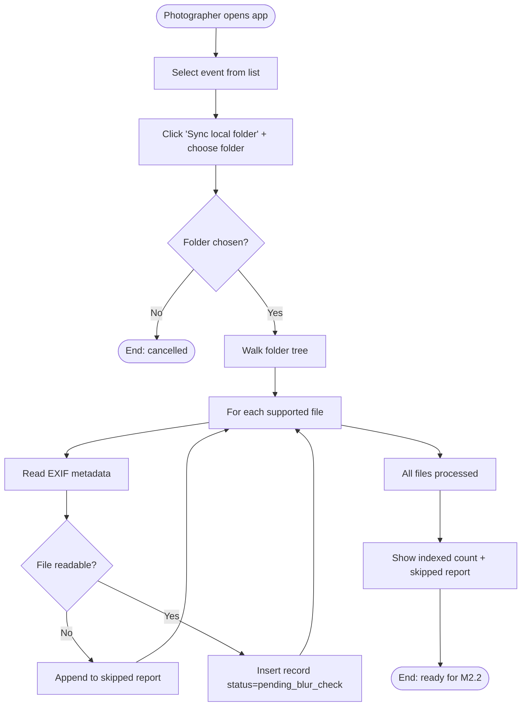

#### Wireframe

> **Wireframe placeholder — Library sync screen (M2.1)**
>
> *To be supplied manually by the user.*
>
> **Must show:** event picker; "Sync local folder" CTA; folder-walk progress with file count; skipped-files report panel; total / pending / skipped tally on completion; re-sync affordance.
> **Linked transaction:** M2.1
> **Linked use case:** UC-M2-2.1

---

### M2.2 Run Blur Detection

#### Use Case Description

| Field | Value |
|-------|-------|
| **Use Case ID** | UC-M2-2.2 |
| **Use Case Name** | Run Blur Detection |
| **Primary Actor** | Desktop App (system actor, on photographer command) |
| **Stakeholders** | Photographer (wants high-precision culling); Runner (wants only sharp photos surfaced); QuickPitik Admin. |
| **Trigger** | Photographer clicks "Detect blur" after a successful M2.1 sync, **or** the desktop app's auto-pipeline mode advances from M2.1 to M2.2. |
| **Preconditions** | (a) M2.1 has populated the local DB with `pending_blur_check` records; (b) The desktop app holds a valid `ai-api` API key with `blur:read` and `jobs:read` scopes; (c) The user's network connection can reach `ai-api`. |
| **Postconditions (success)** | Each photo record carries a `blur_score`, a derived `is_blurry` decision (using the photographer's configured threshold), and a status of `culled` or `clean`. |
| **Postconditions (failure)** | Photos that could not be scored remain at `pending_blur_check`; the photographer can retry. |
| **Frequency** | Once per synced library, optionally re-run after threshold change. |
| **Special Requirements** | Blur identification shall meet the SO2.1 precision target (≥ 85 %; see §3.4.1, NFR-P-4). The desktop app shall call `ai-api` only with the configured scopes (`blur:read`, `jobs:read`). The threshold for `is_blurry` shall be locally configurable but defaulted from a value baked into the desktop app. |
| **Traces to** | SO2.1; GO2 |

#### Main Success Scenario

1. Photographer clicks "Detect blur".
2. The desktop app submits a batch job to `ai-api` (`POST /v1/blur/batch`) referencing the local files via the blob-store path convention.
3. `ai-api` enqueues the job to its Celery workers and returns a `job_id`.
4. The desktop app polls `GET /v1/jobs/{job_id}` periodically until status is `completed`.
5. The desktop app fetches per-photo blur scores via `GET /v1/jobs/{job_id}/results`.
6. The desktop app applies the local threshold and records `is_blurry = (blur_score < threshold)` for each photo.
7. The desktop app updates each record to status `culled` (blurry) or `clean` (sharp).
8. The desktop app displays the cull rate and a sortable preview grid.

#### Alternative Flows

**A1. Adjust threshold and re-classify.** Photographer changes the threshold; the desktop app re-applies the comparison from step 6 onward without re-calling `ai-api`.

**A2. Per-photo manual override.** Photographer toggles a photo's `is_blurry` flag manually; the override is recorded and is honoured by M2.3.

#### Exceptions

**E1. ai-api unreachable.** If the desktop app cannot reach `ai-api` at step 2, it shall surface the failure and offer to retry; no DB state changes.

**E2. Job failure on a subset.** If `ai-api` reports per-photo failures, those photos remain at `pending_blur_check` and are surfaced in a "failed scoring" panel.

#### Use Case Diagram (PlantUML)

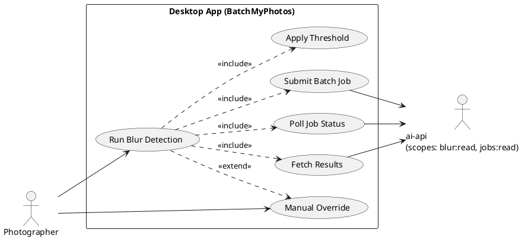

#### Activity Diagram (Mermaid)

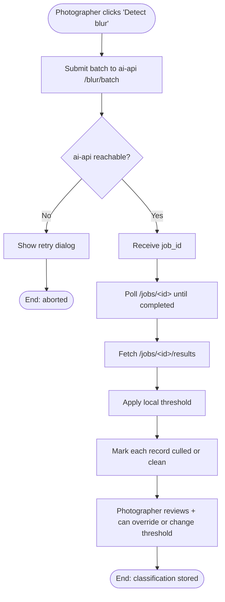

#### Wireframe

> **Wireframe placeholder — Blur detection screen (M2.2)**
>
> *To be supplied manually by the user.*
>
> **Must show:** "Detect blur" CTA; in-progress state with job ID and live percentage; classification results grid (clean / culled tabs); per-photo blur score badge; threshold slider for re-classification; manual-override toggle; failed-scoring panel.
> **Linked transaction:** M2.2
> **Linked use case:** UC-M2-2.2

---

### M2.3 Auto-Sort into Batch Folders

#### Use Case Description

| Field | Value |
|-------|-------|
| **Use Case ID** | UC-M2-2.3 |
| **Use Case Name** | Auto-Sort into Batch Folders |
| **Primary Actor** | Desktop App (system actor, on photographer command) |
| **Stakeholders** | Photographer (wants ready-to-upload batches); Admin; Runner. |
| **Trigger** | Photographer clicks "Sort to batches" after a successful M2.2 classification, **or** the desktop app's auto-pipeline mode advances from M2.2 to M2.3. |
| **Preconditions** | (a) M2.2 has classified all photos (or the photographer has chosen to sort the currently-clean subset only); (b) The configured batch size is set (default 500). |
| **Postconditions (success)** | All `clean` photos are placed in batch sub-folders of configurable size (e.g., `Batch-001`, `Batch-002`, …) under the event's output directory; the local DB records each photo's batch assignment. |
| **Postconditions (failure)** | No partial sort is left on disk; on failure, the operation rolls back. |
| **Frequency** | Once per culled library, occasionally re-run after manual overrides. |
| **Special Requirements** | The sort shall meet the SO2.2 throughput target (≤ 10 s for 15 000 images; see §3.4.1, NFR-P-5) on the reference hardware. The sort shall be filesystem-level (move or hardlink), not byte-copy. |
| **Traces to** | SO2.2; GO2 |

#### Main Success Scenario

1. Photographer clicks "Sort to batches".
2. The desktop app reads the configured batch size and the list of `clean` photos from the local DB.
3. The desktop app deterministically partitions the list (capture-timestamp ascending) into chunks of the configured batch size.
4. The desktop app creates `Batch-001`, `Batch-002`, … sub-folders inside the event's output directory.
5. The desktop app moves (or hardlinks, where the filesystem permits) each photo into its assigned folder.
6. The desktop app updates each photo's record with its `batch_id`.
7. The desktop app displays the sort summary (number of batches created, photos per batch).

#### Alternative Flows

**A1. Re-sort after override.** If photos have been overridden via M2.2-A2, the photographer may re-run the sort; the desktop app shall remove obsolete batch assignments and recompute.

**A2. Custom batch size.** Photographer changes the batch size before clicking "Sort"; the new size is used.

#### Exceptions

**E1. Insufficient disk space (rare with hardlinks).** If a move fails for space reasons, the sort aborts and rolls back partial moves.

**E2. Permission failure on output directory.** If the output directory is not writable, the sort aborts before any move.

#### Use Case Diagram (PlantUML)

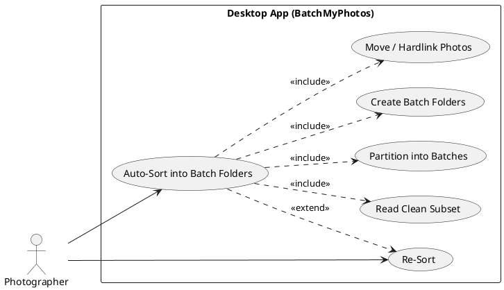

#### Activity Diagram (Mermaid)

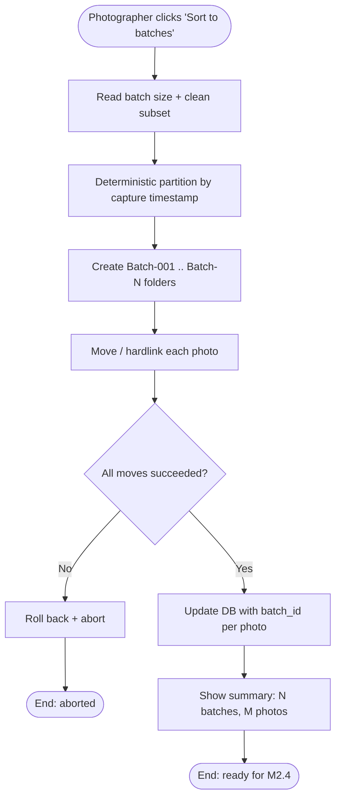

#### Wireframe

> **Wireframe placeholder — Batch sorting screen (M2.3)**
>
> *To be supplied manually by the user.*
>
> **Must show:** batch-size input with default; "Sort to batches" CTA; in-progress indicator with elapsed time; folder tree preview after sort; per-batch photo count; re-sort affordance after overrides.
> **Linked transaction:** M2.3
> **Linked use case:** UC-M2-2.3

---

### M2.4 Upload Sorted Batch to Backend

#### Use Case Description

| Field | Value |
|-------|-------|
| **Use Case ID** | UC-M2-2.4 |
| **Use Case Name** | Upload Sorted Batch to Backend |
| **Primary Actor** | Photographer |
| **Stakeholders** | Photographer (sales depend on uploaded photos appearing on the marketplace); Runner; Admin. |
| **Trigger** | Photographer clicks "Upload to QuickPitik" after a successful M2.3 sort. |
| **Preconditions** | (a) M2.3 has produced batch folders; (b) The photographer is authenticated to the Spring Boot backend; (c) The photographer's connection meets the configured upload throughput minimum. |
| **Postconditions (success)** | All photos in the selected batches are uploaded to S3 via backend-issued signed URLs; backend has finalised each photo's record; the photo is queued for the AI processing pipeline managed by the backend; the local DB marks each uploaded photo with a server `photo_id`. |
| **Postconditions (failure)** | Failed uploads are marked retry-pending; the upload manager surfaces the failure list. |
| **Frequency** | Once per event after M2.3, occasionally re-run for additional batches. |
| **Special Requirements** | Uploads target the Spring Boot backend, **not** AWS Simple Storage Service (S3) directly — the backend issues signed URLs. All traffic shall use Hypertext Transfer Protocol Secure (HTTPS) over Transport Layer Security (TLS) 1.2 or higher. The desktop app shall throttle concurrent uploads (default 4) to avoid saturating the user's link. |
| **Traces to** | SO2.3; GO2 |

#### Main Success Scenario

1. Photographer selects the batches to upload (default: all unuploaded batches).
2. The desktop app calls the backend `POST /v1/events/{eventId}/photos/upload-init-batch` with the batch's photo manifest.
3. The backend returns a list of signed S3 destinations and per-photo `photo_id`s.
4. The desktop app uploads each photo concurrently (up to the configured concurrency limit) to S3.
5. On per-photo HTTP 200 from S3, the desktop app calls `POST /v1/events/{eventId}/photos/{photoId}/finalize`.
6. The backend persists the photo record and queues it for AI processing (face / bib pipelines, scoped by `event_id`).
7. The desktop app updates each local record with the server `photo_id` and marks it `uploaded`.
8. The desktop app displays the upload summary.

#### Alternative Flows

**A1. Resume partial upload.** If the upload was interrupted, the desktop app shall resume from the first non-uploaded photo without re-uploading completed ones.

#### Exceptions

**E1. Auth failure (401).** Same handling as UC-M1-1.3 E1: pause, refresh JWT, resume.

**E2. S3 transfer failure.** Per-photo retries with exponential back-off; persistent failures are surfaced for manual retry.

**E3. Backend rejects manifest.** If the backend returns 4xx on `upload-init-batch` (event not configured, scope mismatch), the desktop app shall display the precise error and abort the batch.

#### Use Case Diagram (PlantUML)

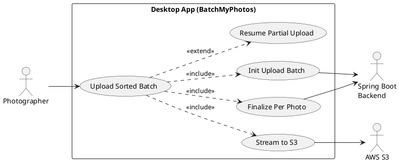

#### Activity Diagram (Mermaid)

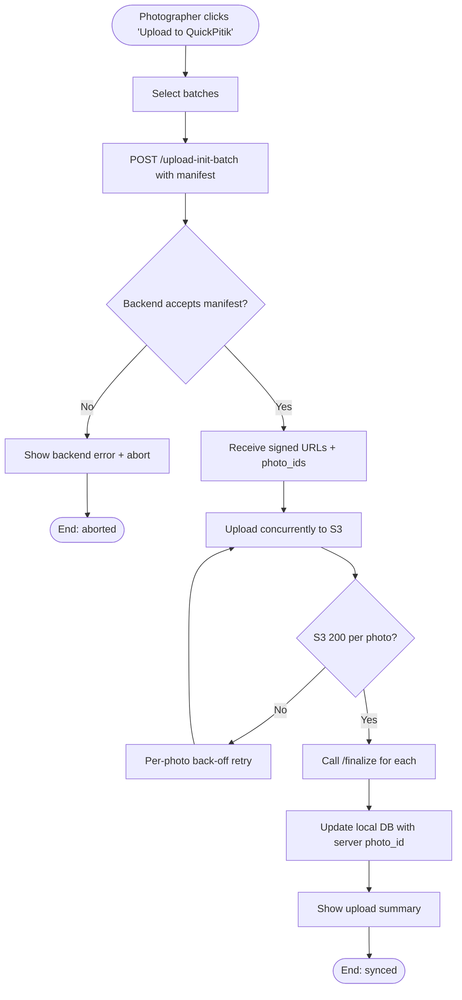

#### Wireframe

> **Wireframe placeholder — Batch upload screen (M2.4)**
>
> *To be supplied manually by the user.*
>
> **Must show:** batch selector with checkboxes; concurrency / throttle setting; aggregate progress bar; per-photo state (queued / uploading / finalised / failed); failed-upload retry panel; resume affordance for partial uploads.
> **Linked transaction:** M2.4
> **Linked use case:** UC-M2-2.4

---

## Module 3 — Web/Mobile Marketplace & AI Search

Functional requirements for the runner-facing marketplace and AI search. The marketplace is delivered through the Next.js website (Vercel) and mirrored in the mobile application's runner mode. All eight transactions are written in IEEE 830 spec voice and describe the *proposed* system.

### Module-level overview

The marketplace is the demand-side surface of QuickPitik: it is where guests browse events, runners search for and purchase their own photos, and registered users authenticate. Eight transactions are specified: account creation and authentication (M3.1), browsing the active event list (M3.2), AI selfie search (M3.3), AI bib-number search (M3.4), watermarked preview (M3.5), cart management (M3.6), checkout and payment via PayMongo (M3.7), and post-payment download (M3.8). The runner-facing client never calls `ai-api` directly: every search, preview, and download request is mediated by the Spring Boot backend.

### Transaction inventory

| ID | Name | Primary actor | Traces to | Workflow |
|----|------|---------------|-----------|----------|
| M3.1 | Register / Login | Registered User (Runner), Photographer | (supports GO3) | W3 (runner) / W7 (photographer) |
| M3.2 | Browse events | Guest, Registered User (Runner) | (supports GO3) | W3 step 2 |
| M3.3 | Search by selfie | Registered User (Runner), Guest | SO3.1, SO3.2 | W3 |
| M3.4 | Search by bib number | Registered User (Runner), Guest | SO3.1, SO3.2 | W4 |
| M3.5 | Preview photo (watermarked) | Registered User (Runner), Guest | SO3.3 | W3 step 6 |
| M3.6 | Add to cart | Registered User (Runner) | SO3.3 | W3 step 7 |
| M3.7 | Checkout & pay | Registered User (Runner) | SO3.3 | W3 step 7 |
| M3.8 | Download purchased photos | Registered User (Runner) | SO3.3 | W3 step 8 |

---

### M3.1 Register / Login

#### Use Case Description

| Field | Value |
|-------|-------|
| **Use Case ID** | UC-M3-3.1 |
| **Use Case Name** | Register / Login |
| **Primary Actor** | Registered User (Runner) or Photographer |
| **Stakeholders** | Runner / Photographer (account holder); QuickPitik Admin (operator); Capstone team (privacy-act compliance). |
| **Trigger** | A guest visits the marketplace and selects "Sign up" or "Log in". |
| **Preconditions** | (a) The marketplace front-end is reachable; (b) For login, the user has an existing account. |
| **Postconditions (success)** | The user holds a signed JSON Web Token (JWT) issued by the Spring Boot backend; the user's session is active; the runner's face embedding is enrolled if the consent flow has been completed. |
| **Postconditions (failure)** | No session is established; the user remains a guest. |
| **Frequency** | Once per device per JWT lifetime; sign-up is one-time per user. |
| **Special Requirements** | Passwords shall be transmitted over Hypertext Transfer Protocol Secure (HTTPS) only and stored as bcrypt hashes server-side. The face-enrolment consent flow shall conform to **Republic Act No. 10173** (Data Privacy Act of 2012 of the Philippines) — biometric data requires explicit, informed consent (see §2.4 *Regulatory and policy*). |
| **Traces to** | (supports GO3); RQ on account / privacy. |

#### Main Success Scenario (login)

1. Guest visits the marketplace and clicks "Log in".
2. The marketplace presents the login form.
3. User submits email and password.
4. The Next.js front-end POSTs the credentials to `POST /v1/auth/login` on the Spring Boot backend over HTTPS.
5. The backend verifies the password against the bcrypt hash, issues a JWT, and returns it.
6. The front-end stores the JWT in an HTTP-only cookie / secure storage.
7. The user is redirected to the post-login landing (events list).

#### Alternative Flows

**A1. Sign-up flow.** A new user clicks "Sign up", supplies email, password, full name, and (for runners) accepts the face-enrolment consent dialog. Upon acceptance, the runner is prompted to capture or upload a reference selfie which is enrolled into `ai-api` via the backend. Sign-up returns directly to the events list.

**A2. Forgot password.** User clicks "Forgot password", supplies email, receives a reset link via email; reset link expires after 1 hour.

#### Exceptions

**E1. Wrong credentials.** The backend returns 401; the form shows a generic "incorrect email or password" message (no account-existence disclosure).

**E2. Rate limit hit.** After 5 failed attempts within 10 minutes, the backend returns 429 and locks the account for 15 minutes.

#### Use Case Diagram (PlantUML)

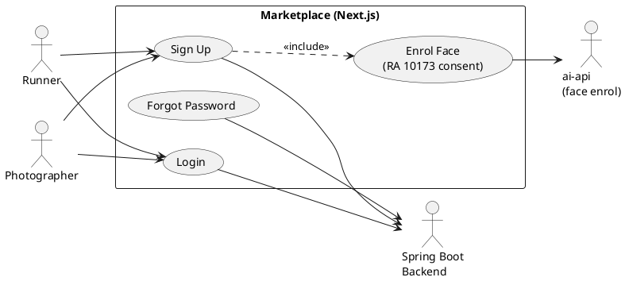

#### Activity Diagram (Mermaid)

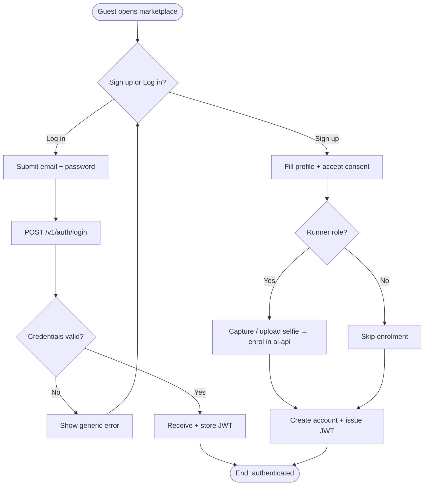

#### Wireframe

> **Wireframe placeholder — Auth screens (M3.1)**
>
> *To be supplied manually by the user.*
>
> **Must show:** login form; sign-up form with consent dialog and selfie-capture step (runner only); forgot-password flow; rate-limit error state; success-redirect to events list.
> **Linked transaction:** M3.1
> **Linked use case:** UC-M3-3.1

---

### M3.2 Browse Events

#### Use Case Description

| Field | Value |
|-------|-------|
| **Use Case ID** | UC-M3-3.2 |
| **Use Case Name** | Browse Events |
| **Primary Actor** | Guest, Registered User (Runner) |
| **Stakeholders** | Runner; Photographer (visibility of their events drives sales); Admin. |
| **Trigger** | User lands on the marketplace home, or navigates to the "Events" tab. |
| **Preconditions** | (a) Marketplace front-end is reachable; (b) Spring Boot backend's events API is operational. |
| **Postconditions (success)** | The user sees a paginated list of events filtered to those Admin has marked active or recently completed. |
| **Postconditions (failure)** | An empty state is shown with a retry CTA. |
| **Frequency** | High; first interaction for guests and a frequent revisit for runners. |
| **Special Requirements** | Listing shall load within 3 s on a typical mobile-broadband connection. Events shall be searchable by name and filterable by date and location. |
| **Traces to** | (supports GO3) |

#### Main Success Scenario

1. User lands on the marketplace home.
2. The Next.js front-end requests `GET /v1/events?status=active&page=1`.
3. The backend returns a paginated event list with name, date, location, hero image, and participant count.
4. The front-end renders the list as cards.
5. User can apply filters (date range, location) or search by name.
6. User clicks an event card to open the event landing page (precursor to M3.3 / M3.4).

#### Alternative Flows

**A1. No active events.** Backend returns an empty list; front-end shows an "Upcoming events" promo state.

#### Exceptions

**E1. Backend unreachable.** Front-end shows a graceful error and a retry CTA.

#### Use Case Diagram (PlantUML)

```plantuml
@startuml UC-M3-3.2-use-case
left to right direction
actor Guest
actor Runner
actor "Spring Boot\nBackend" as BE
rectangle "Marketplace (Next.js)" {
  usecase "Browse Events" as UC32
  usecase "Filter by Date / Location" as UC32a
  usecase "Search by Name" as UC32b
  usecase "Open Event Landing" as UC32c
}
Guest --> UC32
Runner --> UC32
UC32 ..> UC32a : <<extend>>
UC32 ..> UC32b : <<extend>>
UC32 ..> UC32c : <<include>>
UC32 --> BE
@enduml
```

#### Activity Diagram (Mermaid)

```mermaid
flowchart TD
  S([User opens marketplace]) --> A[GET /v1/events?status=active]
  A --> B{Backend reachable?}
  B -- No --> X1[Show error + retry CTA]
  X1 --> END1([End: blocked])
  B -- Yes --> C[Receive paginated list]
  C --> D[Render event cards]
  D --> E[User filters / searches]
  E --> F[User clicks event card]
  F --> END2([End: event landing open])
```

#### Wireframe

> **Wireframe placeholder — Events listing (M3.2)**
>
> *To be supplied manually by the user.*
>
> **Must show:** event card grid (hero image, name, date, location, participant count); date / location filters; name search; pagination; empty / error states; mobile-responsive layout.
> **Linked transaction:** M3.2
> **Linked use case:** UC-M3-3.2

---

### M3.3 Search by Selfie

#### Use Case Description

| Field | Value |
|-------|-------|
| **Use Case ID** | UC-M3-3.3 |
| **Use Case Name** | Search by Selfie |
| **Primary Actor** | Registered User (Runner); a Guest may also invoke this in sample mode. |
| **Stakeholders** | Runner (wants their photos); Photographer (sales depend on findability); Admin; QuickPitik privacy stewardship (RA 10173 compliance). |
| **Trigger** | User navigates to an event landing page and clicks "Find me — selfie". |
| **Preconditions** | (a) The event has been configured by Admin; (b) Photographers have uploaded photos that have completed AI face indexing; (c) For Registered runners, consent for biometric processing was captured at sign-up (M3.1-A1). |
| **Postconditions (success)** | The runner is shown a watermarked gallery of their matched photos, ranked by similarity score, scoped to the chosen event. |
| **Postconditions (failure)** | No matches are returned; the user is offered the bib-search alternative (M3.4). |
| **Frequency** | One or more times per event per runner. |
| **Special Requirements** | Combined face + bib identification shall meet the SO3.1 accuracy target (≥ 85 %; see §3.4.1, NFR-P-7); search results shall meet the SO3.2 latency target from search initiation (≤ 30 s; see §3.4.1, NFR-P-8). The selfie shall be transmitted only over HTTPS and shall be deleted from `ai-api` after the search completes — only the embedding is stored. |
| **Traces to** | SO3.1, SO3.2; GO3 |

#### Main Success Scenario

1. User clicks "Find me — selfie" on the event landing page.
2. The marketplace front-end opens the selfie capture / upload screen.
3. User captures a selfie via the device camera or selects an existing photo.
4. The front-end POSTs the selfie to `POST /v1/events/{eventId}/search/selfie` on the Spring Boot backend.
5. The backend forwards the request to `ai-api` `POST /v1/faces/search?event_id={eventId}` over HTTPS with its API key.
6. `ai-api` extracts the face embedding, runs cosine similarity against the event-scoped pgvector index, and returns scored matches.
7. The backend applies the per-event confidence threshold and resolves match IDs to photo records, returning watermarked-preview URLs.
8. The front-end renders the result gallery, ordered by descending score.

#### Alternative Flows

**A1. Multiple faces detected in selfie.** `ai-api` returns 400 with "multiple_faces"; the front-end prompts the user to crop or retake.

**A2. Below-threshold result.** All matches fall below the threshold; the front-end shows a "no matches" state with a CTA to try bib search.

#### Exceptions

**E1. AI service unavailable.** Backend returns 503; front-end shows a friendly error with a retry CTA. The user's selfie is not stored anywhere persistent.

**E2. No event-scoped photos yet.** Returns an empty result set with the message "Photos still being indexed — try again in a few minutes."

**E3. Privacy revocation.** If the user has revoked face-processing consent, the search shall not be performed; the user is redirected to bib search.

#### Use Case Diagram (PlantUML)

```plantuml
@startuml UC-M3-3.3-use-case
left to right direction
actor Runner
actor Guest
actor "Spring Boot\nBackend" as BE
actor "ai-api\n(faces)" as AI
rectangle "Marketplace" {
  usecase "Search by Selfie" as UC33
  usecase "Capture Selfie" as UC33a
  usecase "Apply Threshold" as UC33b
  usecase "Render Results" as UC33c
}
Runner --> UC33
Guest --> UC33
UC33 ..> UC33a : <<include>>
UC33 ..> UC33b : <<include>>
UC33 ..> UC33c : <<include>>
UC33 --> BE
BE --> AI
@enduml
```

#### Activity Diagram (Mermaid)

```mermaid
flowchart TD
  S([Click 'Find me — selfie']) --> A[Capture / upload selfie]
  A --> B[POST /search/selfie to backend]
  B --> C[Backend → ai-api /faces/search?event_id]
  C --> D{Single face detected?}
  D -- No --> X1[Prompt to retake / crop]
  X1 --> A
  D -- Yes --> E[ai-api returns scored matches]
  E --> F[Backend applies per-event threshold]
  F --> G{Matches above threshold?}
  G -- No --> X2[Show no-match + offer bib search]
  X2 --> END1([End: no results])
  G -- Yes --> H[Return watermarked URLs]
  H --> I[Front-end renders gallery]
  I --> END2([End: results shown])
```

#### Wireframe

> **Wireframe placeholder — Selfie search (M3.3)**
>
> *To be supplied manually by the user.*
>
> **Must show:** selfie capture / upload step with camera preview; in-progress state with elapsed time; result gallery with similarity badges; no-match / multiple-faces states; revocation-redirect to bib search.
> **Linked transaction:** M3.3
> **Linked use case:** UC-M3-3.3

---

### M3.4 Search by Bib Number

#### Use Case Description

| Field | Value |
|-------|-------|
| **Use Case ID** | UC-M3-3.4 |
| **Use Case Name** | Search by Bib Number |
| **Primary Actor** | Registered User (Runner); Guest. |
| **Stakeholders** | Runner; Photographer; Admin. |
| **Trigger** | User clicks "Find me — bib number" on the event landing page. |
| **Preconditions** | (a) The event has been configured by Admin; (b) Photographers have uploaded photos that have completed AI bib indexing; (c) The runner knows their bib number, or has a photo of their bib. |
| **Postconditions (success)** | The runner sees a watermarked gallery of photos containing the supplied bib number, scoped to the event. |
| **Postconditions (failure)** | No matches; user is offered the selfie search (M3.3). |
| **Frequency** | One or more times per event per runner; preferred when the runner declines biometric processing. |
| **Special Requirements** | Search results shall meet the SO3.2 latency target from search initiation (≤ 30 s; see §3.4.1, NFR-P-8). When a bib image is supplied, Optical Character Recognition (OCR) shall be performed by `ai-api`'s bib pipeline (PaddleOCR PP-OCRv5). |
| **Traces to** | SO3.1, SO3.2; GO3 |

#### Main Success Scenario

1. User clicks "Find me — bib number".
2. User chooses to type the bib number, **or** to upload a photo of their bib.
3. The marketplace POSTs the input to `POST /v1/events/{eventId}/search/bib` on the Spring Boot backend.
4. If the input is an image, the backend forwards to `ai-api` `POST /v1/bibs/recognize` to extract the digit string; otherwise the input is taken at face value.
5. The backend looks up the resolved bib number in its event-scoped `participants` table and resolves the matching photos.
6. The backend returns watermarked-preview URLs ordered by capture time.
7. The front-end renders the result gallery.

#### Alternative Flows

**A1. Multi-candidate OCR.** If `ai-api` returns multiple plausible bib digit strings, the user is prompted to pick the correct one.

#### Exceptions

**E1. No bib match.** Empty result set; front-end shows "no matches" and a CTA to try selfie search.

**E2. Bib OCR failure.** `ai-api` cannot extract a number; the front-end prompts the user to retake the bib photo or type the number manually.

#### Use Case Diagram (PlantUML)

```plantuml
@startuml UC-M3-3.4-use-case
left to right direction
actor Runner
actor Guest
actor "Spring Boot\nBackend" as BE
actor "ai-api\n(bibs)" as AI
rectangle "Marketplace" {
  usecase "Search by Bib Number" as UC34
  usecase "Type Bib Number" as UC34a
  usecase "Upload Bib Photo" as UC34b
  usecase "OCR Bib Image" as UC34c
  usecase "Render Results" as UC34d
}
Runner --> UC34
Guest --> UC34
UC34 ..> UC34a : <<extend>>
UC34 ..> UC34b : <<extend>>
UC34b ..> UC34c : <<include>>
UC34 --> BE
UC34c --> AI
@enduml
```

#### Activity Diagram (Mermaid)

```mermaid
flowchart TD
  S([Click 'Find me — bib number']) --> A{Input type?}
  A -- Text --> B[Type bib number]
  A -- Image --> C[Upload bib photo]
  C --> D[Backend → ai-api /bibs/recognize]
  D --> E{OCR returns digits?}
  E -- No --> X1[Prompt retake or type manually]
  X1 --> A
  E -- Yes --> F{Multiple candidates?}
  F -- Yes --> G[User picks correct digits]
  F -- No --> H[Use single result]
  G --> I[Resolve in participants table]
  H --> I
  B --> I
  I --> J{Matches found?}
  J -- No --> X2[Show no-match + offer selfie search]
  X2 --> END1([End: no results])
  J -- Yes --> K[Return watermarked URLs]
  K --> END2([End: results shown])
```

#### Wireframe

> **Wireframe placeholder — Bib search (M3.4)**
>
> *To be supplied manually by the user.*
>
> **Must show:** input switcher (text vs photo); bib-image upload with OCR preview; multi-candidate disambiguation; result gallery; no-match state; OCR failure prompt.
> **Linked transaction:** M3.4
> **Linked use case:** UC-M3-3.4

---

### M3.5 Preview Photo (Watermarked)

#### Use Case Description

| Field | Value |
|-------|-------|
| **Use Case ID** | UC-M3-3.5 |
| **Use Case Name** | Preview Photo (Watermarked) |
| **Primary Actor** | Registered User (Runner); Guest may preview. |
| **Stakeholders** | Runner (decision to buy); Photographer (IP protection); Admin. |
| **Trigger** | User clicks a thumbnail in the search-results gallery (M3.3 or M3.4). |
| **Preconditions** | (a) The user holds a search-results page from M3.3 or M3.4; (b) The selected photo has a watermarked preview generated. |
| **Postconditions (success)** | A high-resolution watermarked image is displayed; the user can navigate adjacent matches. |
| **Postconditions (failure)** | A preview-unavailable state is shown; the user can still add the photo to the cart on faith of the thumbnail. |
| **Frequency** | High — many previews per runner session. |
| **Special Requirements** | Watermarking shall be applied server-side at preview generation; the un-watermarked original shall **not** be served before payment. Preview URLs shall be signed URLs with a short Time-To-Live (TTL). |
| **Traces to** | SO3.3; GO3 |

#### Main Success Scenario

1. User clicks a thumbnail in the gallery.
2. The front-end requests `GET /v1/photos/{photoId}/preview` on the backend.
3. The backend returns a short-TTL signed URL pointing at the watermarked variant in S3.
4. The front-end loads and renders the watermarked preview in a lightbox.
5. The lightbox exposes "Add to cart" (UC-M3-3.6) and forward / back navigation across the result set.

#### Alternative Flows

**A1. Adjacent navigation.** User uses arrow keys / swipe to step through the result gallery; each step reuses steps 2–4 for the next photo.

#### Exceptions

**E1. Preview unavailable.** Backend returns 404 / 410; front-end shows "preview not yet ready" and offers retry.

**E2. URL expired mid-session.** If the signed URL expires before display, the front-end re-requests step 2.

#### Use Case Diagram (PlantUML)

```plantuml
@startuml UC-M3-3.5-use-case
left to right direction
actor Runner
actor Guest
actor "Spring Boot\nBackend" as BE
actor "AWS S3" as S3
rectangle "Marketplace" {
  usecase "Preview Watermarked Photo" as UC35
  usecase "Request Preview URL" as UC35a
  usecase "Render Lightbox" as UC35b
  usecase "Navigate Adjacent" as UC35c
}
Runner --> UC35
Guest --> UC35
UC35 ..> UC35a : <<include>>
UC35 ..> UC35b : <<include>>
UC35 ..> UC35c : <<extend>>
UC35a --> BE
BE --> S3
@enduml
```

#### Activity Diagram (Mermaid)

```mermaid
flowchart TD
  S([User clicks thumbnail]) --> A[GET /v1/photos/&lt;id&gt;/preview]
  A --> B{Preview available?}
  B -- No --> X1[Show 'not ready' + retry]
  X1 --> END1([End: blocked])
  B -- Yes --> C[Receive short-TTL signed URL]
  C --> D[Render watermarked image in lightbox]
  D --> E[Show 'Add to cart' + nav controls]
  E --> F{Navigate adjacent?}
  F -- Yes --> A
  F -- No --> END2([End: viewing])
```

#### Wireframe

> **Wireframe placeholder — Preview lightbox (M3.5)**
>
> *To be supplied manually by the user.*
>
> **Must show:** watermarked photo at high res; lightbox with prev / next; "Add to cart" CTA; preview-unavailable state; URL-expired re-fetch state; mobile swipe affordance.
> **Linked transaction:** M3.5
> **Linked use case:** UC-M3-3.5

---

### M3.6 Add to Cart

#### Use Case Description

| Field | Value |
|-------|-------|
| **Use Case ID** | UC-M3-3.6 |
| **Use Case Name** | Add to Cart |
| **Primary Actor** | Registered User (Runner) |
| **Stakeholders** | Runner; Photographer; Admin. |
| **Trigger** | User clicks "Add to cart" from a preview (M3.5) or from a multi-select grid action. |
| **Preconditions** | (a) User holds a valid JWT (cart is server-side, not anonymous); (b) The selected photo is purchasable (event published, photo not retired). |
| **Postconditions (success)** | The cart is updated server-side and reflected in the front-end cart counter; the photo is reserved at its current price. |
| **Postconditions (failure)** | The cart is unchanged; the user is told why (e.g., "already in cart", "photo retired"). |
| **Frequency** | Multiple per runner session. |
| **Special Requirements** | Cart contents shall persist across sessions for the same JWT subject. Pricing snapshot at add-time shall be the price honoured at checkout. |
| **Traces to** | SO3.3; GO3 |

#### Main Success Scenario

1. User clicks "Add to cart" on a preview.
2. The front-end POSTs `POST /v1/cart/items` with the `photo_id` and event context.
3. The backend validates photo availability and the JWT, computes price, and adds an item.
4. The backend returns the updated cart total.
5. The front-end updates the cart counter and shows a confirmation toast.

#### Alternative Flows

**A1. Bulk add.** From the gallery, the user multi-selects photos and triggers a single bulk-add request.

**A2. Remove from cart.** Same flow with `DELETE /v1/cart/items/{itemId}`.

#### Exceptions

**E1. Already in cart.** Backend returns 409; front-end shows "already in cart".

**E2. Photo retired.** Backend returns 410; front-end shows "this photo is no longer available".

#### Use Case Diagram (PlantUML)

```plantuml
@startuml UC-M3-3.6-use-case
left to right direction
actor Runner
actor "Spring Boot\nBackend" as BE
rectangle "Marketplace" {
  usecase "Add to Cart" as UC36
  usecase "Bulk Add" as UC36a
  usecase "Remove from Cart" as UC36b
  usecase "Update Cart Counter" as UC36c
}
Runner --> UC36
Runner --> UC36a
Runner --> UC36b
UC36 ..> UC36c : <<include>>
UC36a ..> UC36c : <<include>>
UC36 --> BE
@enduml
```

#### Activity Diagram (Mermaid)

```mermaid
flowchart TD
  S([User clicks 'Add to cart']) --> A[POST /v1/cart/items]
  A --> B{Auth + photo valid?}
  B -- No --> X1[Show specific error 401/409/410]
  X1 --> END1([End: rejected])
  B -- Yes --> C[Backend adds item + returns total]
  C --> D[Front-end updates counter]
  D --> E[Show confirmation toast]
  E --> END2([End: in cart])
```

#### Wireframe

> **Wireframe placeholder — Cart interactions (M3.6)**
>
> *To be supplied manually by the user.*
>
> **Must show:** "Add to cart" CTA on preview and on gallery cards; multi-select bulk-add affordance; cart counter; cart drawer / page with line items, prices, and remove control; error toasts.
> **Linked transaction:** M3.6
> **Linked use case:** UC-M3-3.6

---

### M3.7 Checkout & Pay

#### Use Case Description

| Field | Value |
|-------|-------|
| **Use Case ID** | UC-M3-3.7 |
| **Use Case Name** | Checkout & Pay |
| **Primary Actor** | Registered User (Runner) |
| **Stakeholders** | Runner (purchaser); Photographer (revenue); Admin (fee handling); PayMongo (payment processor). |
| **Trigger** | User clicks "Checkout" from the cart. |
| **Preconditions** | (a) Cart is non-empty; (b) User is authenticated; (c) Total is denominated in Philippine Peso (PHP). |
| **Postconditions (success)** | An order is created with status `paid`; payment receipt is emailed to the user; the order is queued for the download flow (M3.8). |
| **Postconditions (failure)** | Order remains in `pending` until either retry succeeds or the order is cancelled (auto after 24 h). |
| **Frequency** | Once per cart per runner. |
| **Special Requirements** | Payment shall be processed via **PayMongo** in Philippine Peso only (see §2.4 *Commercial*). The backend shall verify the PayMongo webhook signature before transitioning the order to `paid`. 3-D Secure (3DS) and One-Time Password (OTP) authentication shall be supported for cards. |
| **Traces to** | SO3.3; GO3 |

#### Main Success Scenario

1. User clicks "Checkout" from the cart.
2. The front-end fetches the cart total and presents the payment-method selector (card, GCash, Maya, etc., per PayMongo).
3. User selects a method and submits.
4. The front-end calls `POST /v1/orders` on the Spring Boot backend with the cart contents.
5. The backend creates an `order` row in `pending` status and creates a PayMongo PaymentIntent / Source.
6. The backend returns the PayMongo client-side authorization data to the front-end.
7. The front-end completes the PayMongo authorisation flow (redirect or in-page, including 3DS / OTP if required).
8. PayMongo fires a webhook `payment.succeeded` to the backend.
9. The backend verifies the PayMongo webhook signature, transitions the order to `paid`, and emits a "purchase succeeded" event.
10. The front-end polls / receives a status update and renders the success / receipt screen.

#### Alternative Flows

**A1. 3DS / OTP challenge.** During step 7, the user completes a 3-D Secure or OTP challenge supplied by the issuer; control returns to step 8.

#### Exceptions

**E1. Payment declined.** PayMongo returns failure; the front-end surfaces the reason and offers retry with a different method.

**E2. Webhook signature invalid.** The backend rejects the webhook and leaves the order in `pending`; the user is shown a retry CTA.

**E3. Cart mutated mid-checkout.** If the cart contents change after step 4, the backend rejects the order with 409; the user is sent back to review the cart.

#### Use Case Diagram (PlantUML)

```plantuml
@startuml UC-M3-3.7-use-case
left to right direction
actor Runner
actor "Spring Boot\nBackend" as BE
actor "PayMongo" as PM
rectangle "Marketplace" {
  usecase "Checkout & Pay" as UC37
  usecase "Select Method" as UC37a
  usecase "Authorise Payment" as UC37b
  usecase "3DS / OTP Challenge" as UC37c
  usecase "Confirm Order" as UC37d
}
Runner --> UC37
UC37 ..> UC37a : <<include>>
UC37 ..> UC37b : <<include>>
UC37 ..> UC37c : <<extend>>
UC37 ..> UC37d : <<include>>
UC37b --> PM
PM --> BE : webhook (signed)
BE --> UC37d
@enduml
```

#### Activity Diagram (Mermaid)

```mermaid
flowchart TD
  S([User clicks 'Checkout']) --> A[Show method selector]
  A --> B[POST /v1/orders]
  B --> C[Backend creates pending order + PayMongo intent]
  C --> D[Front-end runs PayMongo authorisation]
  D --> E{3DS/OTP required?}
  E -- Yes --> F[Issuer challenge]
  F --> G[Authorisation completes]
  E -- No --> G
  G --> H[PayMongo webhook → backend]
  H --> I{Signature valid?}
  I -- No --> X1[Reject + leave pending]
  X1 --> END1([End: pending])
  I -- Yes --> J{Payment succeeded?}
  J -- No --> X2[Show decline + retry]
  X2 --> A
  J -- Yes --> K[Order = paid + emit success event]
  K --> L[Front-end shows receipt screen]
  L --> END2([End: paid → ready for M3.8])
```

#### Wireframe

> **Wireframe placeholder — Checkout (M3.7)**
>
> *To be supplied manually by the user.*
>
> **Must show:** order summary (line items + total in PHP); payment-method selector; PayMongo authorisation surface (card form / e-wallet redirect); 3DS / OTP challenge screen; decline / retry state; success / receipt screen.
> **Linked transaction:** M3.7
> **Linked use case:** UC-M3-3.7

---

### M3.8 Download Purchased Photos

#### Use Case Description

| Field | Value |
|-------|-------|
| **Use Case ID** | UC-M3-3.8 |
| **Use Case Name** | Download Purchased Photos |
| **Primary Actor** | Registered User (Runner) |
| **Stakeholders** | Runner (purchaser); Photographer (delivery commitment); Admin. |
| **Trigger** | The order transitions to `paid` (M3.7 step 9), or the user re-opens an order detail page later. |
| **Preconditions** | (a) An order in `paid` status exists for the user; (b) Each photo's clean (un-watermarked) variant is available in S3. |
| **Postconditions (success)** | The user holds short-TTL signed download URLs for each photo and may download individually or as a ZIP bundle. |
| **Postconditions (failure)** | If a download URL fails, the user can retry; the order remains downloadable for the configured retention window (default 30 days). |
| **Frequency** | Once or a few times per order; the user may revisit the order page later. |
| **Special Requirements** | Download URLs shall meet the SO3.3 readiness target from payment confirmation (≤ 10 s; see §3.4.1, NFR-P-9). Signed URLs shall expire after a short TTL (default 24 h). The watermarked variant shall not be served to a paid customer when a clean variant is available. |
| **Traces to** | SO3.3; GO3 |

#### Main Success Scenario

1. The "purchase succeeded" event from M3.7 step 9 reaches the marketplace UI (via WebSocket or page reload).
2. The front-end requests `GET /v1/orders/{orderId}/downloads` on the backend.
3. The backend returns a list of short-TTL signed S3 URLs for each clean (un-watermarked) photo, plus a ZIP-bundle URL.
4. The front-end renders the download screen with per-photo download buttons and a "Download all (ZIP)" CTA.
5. User clicks a button; the browser streams the photo from S3.

#### Alternative Flows

**A1. Re-download later.** User opens an old order from "My orders"; the backend re-issues fresh signed URLs at step 2 (constrained by the retention window).

#### Exceptions

**E1. Signed URL expired.** Browser shows a permission error; front-end re-fetches step 2 transparently.

**E2. Clean variant missing.** Backend returns 503 for that specific photo with retry-after; front-end shows a per-photo "preparing" state and polls.

#### Use Case Diagram (PlantUML)

```plantuml
@startuml UC-M3-3.8-use-case
left to right direction
actor Runner
actor "Spring Boot\nBackend" as BE
actor "AWS S3" as S3
rectangle "Marketplace" {
  usecase "Download Purchased Photos" as UC38
  usecase "Per-Photo Download" as UC38a
  usecase "ZIP Bundle Download" as UC38b
  usecase "Re-Download Later" as UC38c
}
Runner --> UC38
UC38 ..> UC38a : <<extend>>
UC38 ..> UC38b : <<extend>>
UC38 ..> UC38c : <<extend>>
UC38 --> BE
BE --> S3
@enduml
```

#### Activity Diagram (Mermaid)

```mermaid
flowchart TD
  S([Order = paid OR user reopens order]) --> A[GET /v1/orders/&lt;id&gt;/downloads]
  A --> B{All clean variants ready?}
  B -- No --> X1[Show 'preparing' + poll]
  X1 --> A
  B -- Yes --> C[Receive short-TTL signed URLs + ZIP URL]
  C --> D[Render download screen]
  D --> E{User action}
  E -- Per-photo --> F[Stream from S3]
  E -- ZIP --> G[Stream ZIP bundle]
  F --> H{URL expired?}
  G --> H
  H -- Yes --> A
  H -- No --> END([End: download complete])
```

#### Wireframe

> **Wireframe placeholder — Order downloads (M3.8)**
>
> *To be supplied manually by the user.*
>
> **Must show:** post-payment success → downloads transition; per-photo download button; "Download all (ZIP)" CTA; in-progress / completed state per item; "preparing" state for E2; "My orders" entry point for re-download.
> **Linked transaction:** M3.8
> **Linked use case:** UC-M3-3.8

---

## 3.4 Non-functional Requirements

> **Numbering note.** The CIT-U COCS template intentionally skips §3.3. The numbering below preserves that gap.

### Section overview

This section enumerates the non-functional requirements (NFRs) that constrain how the QuickPitik system shall behave, in addition to the functional behaviour specified in §3.2. Six categories are addressed: **performance** (§3.4.1), **security and privacy** (§3.4.2), **reliability and availability** (§3.4.3), **usability** (§3.4.4), **portability and compatibility** (§3.4.5), and **maintainability** (§3.4.6). Each NFR carries a unique identifier of the form `NFR-<X>-<n>` where `<X>` is the category code (`P`, `S`, `R`, `U`, `C`, `M`) and `<n>` is a sequential number, enabling traceability from any other artifact (transactions in §3.2, design decisions in SDD, test plan rows in SPMP §5.2).

NFRs derived from the project proposal's Specific Objectives are **proposal-locked**: the numerical target shall not change in this document; if the proposal target itself needs to change, the locked source (the project proposal) is updated first, then the SRS. NFRs derived from architecture or capstone-scope choices are flagged in the corresponding sub-section as such, and any value labelled "DRAFT" carries a footnote indicating that adviser sign-off is pending.

### 3.4.1 Performance

The performance NFRs below are proposal-locked targets; their measurement methodology is specified in SPMP §5.2 (Pass / Fail Criteria). Each target binds the corresponding transaction(s) in §3.2 — for example, NFR-P-1 binds UC-M1-1.3, and NFR-P-7 binds UC-M3-3.3 and UC-M3-3.4. Performance shall be measured under the conditions documented in §2.4 (nominal connectivity, reference hardware, pilot-event scale).

| ID | Requirement | Target | Source | Binds |
|----|-------------|--------|--------|-------|
| NFR-P-1 | Mobile photo transfer initiation | ≤ 5 s after capture | SO1.1 (proposal-locked) | UC-M1-1.2, UC-M1-1.3 |
| NFR-P-2 | Mobile cloud sync rate | ≥ 95 % within 3 min of capture | SO1.2 (proposal-locked) | UC-M1-1.3, UC-M1-1.4 |
| NFR-P-3 | Push notification delivery | ≤ 60 s after AI identification | SO1.3 (proposal-locked) | UC-M1-1.5 |
| NFR-P-4 | Blur detection precision | ≥ 85 % | SO2.1 (proposal-locked) | UC-M2-2.2 |
| NFR-P-5 | Batch sort latency | ≤ 10 s for 15 000 images | SO2.2 (proposal-locked) | UC-M2-2.3 |
| NFR-P-6 | Post-processing time reduction | ≥ 90 % vs. 1–2 hr manual baseline | SO2.3 (proposal-locked) | UC-M2-2.1 → UC-M2-2.4 (sequence) |
| NFR-P-7 | Combined face + bib identification accuracy | ≥ 85 % | SO3.1 (proposal-locked) | UC-M3-3.3, UC-M3-3.4 |
| NFR-P-8 | Search results delivery | ≤ 30 s of search initiation | SO3.2 (proposal-locked) | UC-M3-3.3, UC-M3-3.4 |
| NFR-P-9 | Download readiness after payment | ≤ 10 s of payment confirmation | SO3.3 (proposal-locked) | UC-M3-3.8 |

### 3.4.2 Security and Privacy

The security and privacy NFRs combine architectural rules (TLS, JWT, API-key scoping, HMAC, event isolation), data-handling rules (PII minimisation, payment tokenisation, watermarking), and Philippine regulatory compliance (**Republic Act No. 10173 — Data Privacy Act of 2012**). The combination shall ensure that every transaction in §3.2 operates over verified channels, with consent recorded for biometric processing, and with no path that exposes either the un-watermarked photo before payment or end-user payment-instrument data to QuickPitik's own systems.

| ID | Requirement | Notes / cross-reference |
|----|-------------|-------------------------|
| NFR-S-1 | All client–server traffic shall use Hypertext Transfer Protocol Secure (HTTPS) over Transport Layer Security (TLS) 1.2 or higher. | §3.1.3 |
| NFR-S-2 | Mobile and web user authentication shall use signed JSON Web Tokens (JWTs) issued by the Spring Boot backend; access tokens are short-lived and accompanied by refresh tokens. | §3.1.3 |
| NFR-S-3 | Server-to-server access to `ai-api` shall use Application Programming Interface (API) keys, with each consumer's `api_key_id` as the tenant boundary. Desktop holds the least-privilege scope set `blur:read` + `jobs:read`; the Spring Boot backend holds the full scope set. | §2.1; architectural rule |
| NFR-S-4 | All asynchronous webhook callbacks from `ai-api` shall be Hash-based Message Authentication Code (HMAC)-signed via the `X-QuickPitik-Signature` header; receivers shall verify the signature and reject unsigned or invalid messages. | UC-M1-1.5 |
| NFR-S-5 | Per-event isolation shall be enforced at the `ai-api` layer: every `faces/enroll` and `faces/search` call shall include a non-null `event_id`; the backend shall reject unscoped requests. | UC-M3-3.3 |
| NFR-S-6 | Photos shall be **private by default**. Public galleries shall be opt-in per event and configured by Admin. Download URLs shall be short-Time-To-Live (TTL) signed; the un-watermarked variant shall not be served to a paid customer through any path other than the signed download URL of UC-M3-3.8. | UC-M3-3.5, UC-M3-3.8 |
| NFR-S-7 | Personally Identifiable Information (PII) minimisation: only the email, hashed password (bcrypt or Argon2), display name, and (for runners with explicit consent) face embedding shall be persisted. Raw selfies submitted at search time shall not be retained beyond the request that consumed them. | UC-M3-3.1, UC-M3-3.3 |
| NFR-S-8 | The system shall comply with **Republic Act No. 10173 — Data Privacy Act of 2012** of the Philippines. A Data Privacy Notice shall be presented at registration; explicit, informed consent shall be captured for face enrolment; runners shall be able to revoke consent and request deletion of their embedding via the support flow. | UC-M3-3.1-A1, UC-M3-3.3-E3 |
| NFR-S-9 | Payment instrument data (card numbers, CVV, e-wallet credentials) shall be tokenised by **PayMongo** at the client and shall not transit or rest on QuickPitik servers. | UC-M3-3.7 |
| NFR-S-10 | Authentication endpoints shall be rate-limited (default 5 failed attempts per 10 min per account, with a 15-min lockout on breach). | UC-M3-3.1-E2 |
| NFR-S-11 | Audit logging: privileged Admin actions (event create / configure / activate, user disable, threshold override, dispute resolution) shall be logged with actor, timestamp, and target identifier, retained for at least 12 months. | Admin operations across §3.2 |

### 3.4.3 Reliability and Availability

Reliability NFRs are mostly derived from architectural decisions; they are not explicitly enumerated in the project proposal but follow directly from the proposal's commitment to a robust real-time pipeline. NFRs marked **DRAFT** require adviser sign-off before final SRS submission and shall be ratified — or revised — at the next adviser review.

| ID | Requirement | Notes |
|----|-------------|-------|
| NFR-R-1 | Backend uptime during scheduled event windows shall be **≥ 99 %**. **DRAFT** — pending adviser sign-off. | Operational target |
| NFR-R-2 | The mobile upload queue shall be persistent across application restarts and shall auto-resume on connectivity restoration without user intervention. | UC-M1-1.4 |
| NFR-R-3 | `ai-api` → backend webhook delivery shall be at-least-once with HMAC verification and idempotency keys; receivers shall be safe to redeliver. | UC-M1-1.5; locked architectural choice |
| NFR-R-4 | `ai-api` Celery workers shall auto-restart within **30 s** of crash. **DRAFT** — pending adviser sign-off. | Operational target |
| NFR-R-5 | Photo objects shall be stored with AWS Simple Storage Service (S3)-class durability (designed for 99.999999999 % — "eleven nines" — annual durability). AWS Relational Database Service (RDS) automated backups shall run daily with at least 7-day retention. | Data durability |
| NFR-R-6 | Graceful degradation: if `ai-api` is unavailable, search endpoints (UC-M3-3.3 / UC-M3-3.4) shall return a clear "AI temporarily unavailable" response rather than erroring or hanging. The marketplace browsing, cart, checkout, and download flows shall remain operable. | UC-M3-3.3, UC-M3-3.4 |
| NFR-R-7 | Order lifecycle correctness: a `pending` order that fails to complete within 24 h shall be auto-cancelled; a `paid` order shall remain downloadable for the configured retention window (default 30 days). | UC-M3-3.7, UC-M3-3.8 |

### 3.4.4 Usability

Usability NFRs target both photographer (operator) and runner (consumer) flows. The proposal commits to qualitative feedback via the **System Usability Scale (SUS)**; the threshold below is the industry "good" cut-off used to define the project's usability success criterion (see also SPMP §5.5 SUS Survey Plan).

| ID | Requirement | Target / notes |
|----|-------------|----------------|
| NFR-U-1 | Post-pilot SUS score (photographer cohort) | ≥ 70 (industry "good" threshold) |
| NFR-U-2 | Post-pilot SUS score (runner cohort) | ≥ 70 |
| NFR-U-3 | First-time-user onboarding for runners (sign-up → first selfie search) shall be completable in ≤ 5 minutes without external assistance. | UC-M3-3.1, UC-M3-3.3 |
| NFR-U-4 | All user-facing copy shall be in English; the system shall be designed so that future localisation to Filipino requires no schema changes. | Implementation guidance |
| NFR-U-5 | Tap targets on mobile screens shall meet a minimum 44 × 44 density-independent pixel (dp) size; colour contrast shall meet Web Content Accessibility Guidelines (WCAG) 2.1 AA on text content. | Accessibility floor |
| NFR-U-6 | Error messages shall name the failure (e.g., "incorrect email or password", "preview not yet ready") and offer at least one next step (retry, alternate flow). No raw error codes shall be shown to end users. | All user-facing flows |

### 3.4.5 Portability and Compatibility

Portability NFRs define the platforms and configurations on which the proposed system shall operate. They derive from the constraints recorded in §2.4 and the locked tech stack.

| ID | Requirement | Notes |
|----|-------------|-------|
| NFR-C-1 | The mobile application shall run on **Android 10 or higher** with at least 4 GB RAM. iOS is out of scope for the capstone phase. | §2.4 *Hardware and platform* |
| NFR-C-2 | The desktop application shall run on **Windows 10/11** and **macOS 12 or higher** on 64-bit hardware. Linux is out of scope. | §2.4 *Hardware and platform* |
| NFR-C-3 | The marketplace web client shall function correctly on the latest two evergreen versions of Chrome, Edge, Safari, and Firefox, on both desktop and mobile viewports (≥ 320 px wide). | Browser support |
| NFR-C-4 | The mobile camera tether shall support cameras implementing the **Picture Transfer Protocol (PTP)** over Universal Serial Bus On-The-Go (USB OTG), and Canon, Sony, and Nikon vendor Software Development Kits (SDKs) over Wi-Fi. Cameras lacking PTP or a supported vendor SDK are out of scope. | UC-M1-1.1; §2.4 *Hardware and platform* |
| NFR-C-5 | Backend services (`ai-api`, Spring Boot, Redis) shall be containerised so they may be run identically on a developer workstation, CI runner, and AWS EC2 host. | Implementation guidance |
| NFR-C-6 | Photo formats accepted by the desktop application shall include JPEG and the major DSLR RAW formats (Canon CR2/CR3, Nikon NEF, Sony ARW). | UC-M2-2.1 |

### 3.4.6 Maintainability

Maintainability NFRs reflect the engineering practices listed in SPMP §5.3 (Code Quality Standards); they are stated here as system-level requirements so that they bind every module's implementation.

| ID | Requirement | Notes |
|----|-------------|-------|
| NFR-M-1 | Each module shall publish API documentation (OpenAPI or equivalent) for every endpoint exposed across module boundaries. | Spring Boot, `ai-api` |
| NFR-M-2 | Source code in every module shall be linted on every pull request (PR): ktlint (Kotlin), ruff (Python), ESLint (TypeScript). | SPMP §5.3 |
| NFR-M-3 | Critical paths (authentication, payment, AI inference invocation) shall maintain test coverage ≥ 70 %. | SPMP §5.3 |
| NFR-M-4 | Architectural rules ("mobile and web never call `ai-api` directly", desktop scopes limited to `blur:read` + `jobs:read`, event isolation enforced) shall be enforced by automated tests where feasible, in addition to code review. | Architectural rules |
| NFR-M-5 | Schema changes to the relational database shall be delivered as versioned migrations; ad-hoc schema modifications in production are prohibited. | Operational hygiene |
| NFR-M-6 | All external-facing endpoints shall be versioned under `/v1/...`; breaking changes shall introduce `/v2/...` rather than mutate `/v1/...`. | API stability |
| NFR-M-7 | Configuration values (URLs, thresholds, secret IDs) shall be read from environment variables or a configuration service; hardcoding is prohibited. | Engineering practice |

---

## 3.5 Requirements Validation Considerations

> This section specifies how the **requirements stated in §3.1, §3.2, and §3.4 shall be validated** — that is, how the team and the adviser confirm the requirements correctly capture the approved problem before the system is designed or built. **Verification** of the implemented system against those requirements (test cases, pass/fail thresholds, instrumentation) is owned by SPMP §5; this section does not duplicate that material.

### Section overview

Validation answers the question *"are we specifying the right system?"*; verification answers *"is the system built per specification?"* (IEEE Std 830-1998). This section enumerates the **validation considerations** that govern the QuickPitik SRS: the quality attributes a requirement shall satisfy (§3.5.1), the validation methods the team shall apply (§3.5.2), the stakeholder roles and gates that grant or withhold sign-off (§3.5.3), the acceptance criteria that promote a requirement from draft to approved (§3.5.4), and the change-control mechanism that keeps the SRS aligned with the approved problem statement throughout the capstone (§3.5.5).

This section does not introduce new functional or non-functional requirements; rather, it defines the procedural envelope that allows §3.2 and §3.4 to be relied upon as the system contract. Where a check below cites an external artifact (the traceability matrix, the SPMP, the adviser-feedback log, the writing-quality checklist), the cited artifact is the operative source — this section names the check, not its mechanics.

### 3.5.1 Requirements Quality Attributes

Every requirement recorded in §3.1, §3.2, and §3.4 shall satisfy the eight quality attributes recommended by IEEE Std 830-1998 §4.3. The table below pairs each attribute with the concrete check QuickPitik applies to confirm conformance; failure of any check shall block promotion of the parent section from `review` to `done` per the section status lifecycle.

| Attribute | Definition | Concrete check applied to QuickPitik |
|-----------|------------|--------------------------------------|
| **Correct** | Every stated requirement is one the system is required to meet. | Each functional requirement traces to a workflow in the project workflow catalogue; each non-functional requirement traces to a Specific Objective, an architectural rule, or a regulatory commitment. |
| **Unambiguous** | Each requirement has only one interpretation. | Modal verbs are restricted to **shall** for binding requirements and **may** for permitted options. Acronyms are defined on first use per the writing-quality checklist. |
| **Complete** | All material the SRS must contain is present, with no "TBDs" left at submission time. | The SRS submission checklist enforces 17 transactions × 4 artifacts, all NFR rows populated, all template sub-sections filled. Open `DRAFT` items (NFR-R-1, NFR-R-4) are explicitly flagged for adviser sign-off rather than left silent. |
| **Consistent** | No requirement conflicts with another, with the proposal, or with the architecture. | Cross-document consistency rule: numerical targets are cited from the proposal-locked performance-target source rather than restated, so a single edit propagates everywhere. |
| **Ranked for importance / stability** | Requirements are prioritised so omissions and changes have known impact. | Priority is implicit in the General Objective hierarchy: GO1, GO2, GO3 are top-level; SO-derived NFRs are mandatory; capstone-scoped NFRs (`DRAFT` rows in §3.4.3, the `NFR-S-10` / `NFR-S-11` rows in §3.4.2) are revisable on adviser feedback. |
| **Verifiable** | A finite, cost-effective process exists to confirm the requirement is satisfied. | Every NFR-P row in §3.4.1 carries a numerical target with a measurement method in SPMP §5.2; usability NFRs are verifiable through the SUS instrument in SPMP §5.5. Functional requirements are verifiable through the Main Success Scenario steps in each Use Case Description. |
| **Modifiable** | The SRS structure permits changes to be made completely, consistently, and with retained traceability. | The vault-driven authoring flow keeps the Markdown source modifiable; the Traceability Matrix appendix is rebuilt from the section files on every change so impact is auditable. |
| **Traceable** | Each requirement is identifiable and has clear backward and forward links. | Forward: every transaction has a `UC-M<N>-<X.Y>` identifier; every NFR has an `NFR-<X>-<n>` identifier. Backward: each maps to a GO/SO/RQ in the Traceability Matrix appendix. |

### 3.5.2 Validation Methods

The team shall apply five complementary validation methods, sequenced so that low-cost methods filter defects before high-cost methods are invoked.

| # | Method | Scope | Frequency | Output / artifact |
|---|--------|-------|-----------|-------------------|
| 1 | **Requirements review (writing-quality checklist)** | Each section file, before status moves to `review` | Per section, on every draft pass | A 13-item writing-quality checklist (topic sentences, paragraph length, acronym discipline, hedge audit, spec voice, citations, figure/table numbering, etc.) |
| 2 | **Adviser walkthrough** | Whole SRS, document-by-document | Per adviser meeting | An adviser-feedback note capturing verbatim feedback, interpretation, and action items |
| 3 | **Traceability analysis** | All requirements ↔ proposal commitments | Continuous; rebuilt before each adviser meeting | The Traceability Matrix appendix, with a *Coverage gaps* section that lists any unsatisfied trace |
| 4 | **Prototyping and demonstration** | High-risk transactions (camera tether, AI search, payment) | Per sprint where the transaction is in flight | Working code in the relevant module; demonstration to adviser when an end-to-end thread crosses the GO commitment |
| 5 | **Pilot User Acceptance Testing (UAT) and SUS survey** | The system as a whole, with real photographer and runner participants | Once, post-implementation, at the pilot Cebu marathon event | UAT log, SUS scores per cohort, and a validation report referenced by SPMP §5.5 |

The earlier-numbered methods are the team's own internal filter and run repeatedly throughout the capstone; the later-numbered methods involve external stakeholders and are scheduled at adviser-defined milestones. A requirement is considered fully validated only after methods 1–3 have passed and the relevant external method (4 or 5) has produced a corroborating artifact for the GO it serves.

### 3.5.3 Stakeholder Roles in Validation

Validation is a multi-stakeholder activity. The roles below are derived from the project stakeholder register and the operational structure of the capstone team. Each role validates a defined slice of the SRS; no role is permitted to sign off on a slice owned by another.

| Stakeholder | Validates | Mechanism | Authoritative artifact on disagreement |
|-------------|-----------|-----------|-----------------------------------------|
| **Capstone adviser** | Whole SRS, with emphasis on alignment to the approved problem statement, measurability of NFRs, and conformance to the CIT-U COCS template | Adviser walkthrough; written adviser-feedback notes | Adviser written feedback overrides any internal vault decision |
| **Capstone team — section owner** | Internal correctness of the assigned section (template conformance, citation discipline, writing quality) | Writing-quality checklist; status lifecycle transition to `review` | Section file frontmatter `status` and `last-updated` |
| **Capstone team — peer reviewers** | Cross-section consistency, terminology drift, broken cross-references | Peer review during status transition `review → done` | Tracker rows in the SRS document tracker and master dashboard |
| **Pilot photographer (operator cohort)** | Module 1 (Mobile) and Module 2 (Desktop) transactions reflect real event-day workflow | UAT walk-through during pilot event; SUS survey | UAT log + SUS-photographer report |
| **Pilot runner participants (consumer cohort)** | Module 3 (Marketplace) search, preview, checkout, and download transactions are usable end-to-end | UAT walk-through at and after pilot event; SUS survey | SUS-runner report |
| **Race organiser (out-of-system stakeholder)** | Operational fit of the proposed system inside an actual marathon (does not validate the SRS itself) | Informal feedback through the photographer | Documented as context only; not a sign-off authority |

The race organiser is intentionally excluded from formal SRS sign-off because the proposed system does not expose a use case to them; their input is captured indirectly through the photographer who is contractually engaged with the event.

### 3.5.4 Acceptance Criteria for the SRS

A requirement, a section, and the SRS as a whole each have distinct acceptance criteria. All three layers shall be satisfied before the SRS is submitted to the adviser as the contract for downstream design (SDD) and implementation.

#### 3.5.4.1 Per-requirement acceptance

A single functional or non-functional requirement is considered accepted when:

1. It satisfies all eight quality attributes in §3.5.1;
2. Its identifier appears at least once in the Traceability Matrix appendix;
3. For a functional requirement, its Use Case Description has all four required artifacts (Use Case Diagram, Use Case Description, Activity Diagram, Wireframe) per §3.2;
4. For a non-functional requirement, its target is cited from the proposal-locked performance-target source (where applicable) and its verification entry exists in SPMP §5.2.

#### 3.5.4.2 Per-section acceptance

A section file (for example §3.4) is considered accepted when:

1. Every requirement in the section satisfies §3.5.4.1;
2. The section passes every item in the writing-quality checklist;
3. Frontmatter `status` has progressed `not-started → in-progress → review → done` without skipping `review`;
4. The corresponding tracker row in the SRS document tracker has been updated to reflect the new status, and the master dashboard progress count has been incremented.

#### 3.5.4.3 Per-document acceptance

The SRS as a whole is considered accepted, and therefore submittable, when:

1. All sections listed in the section tracker are at `done`;
2. The SRS submission checklist has every box ticked, including the GO-signal gate (cleared 2026-05-04), the 17-transactions-by-4-artifacts inventory, the Draw.io rendering of all delivery diagrams, and the present section's existence;
3. No row in the Traceability Matrix appendix's *Coverage gaps* section is marked open;
4. The adviser has signed off on the document during a recorded adviser walkthrough.

### 3.5.5 Change Control and Traceability Maintenance

The SRS is a contract; once accepted under §3.5.4, it shall not drift silently. Three change-control mechanisms preserve validity throughout the capstone.

#### 3.5.5.1 Source-of-truth precedence

When the same fact appears in multiple places, the team and any AI agent shall defer up the source-of-truth chain. The project proposal sits at the top; if a downstream artifact (an SRS section, a knowledge-base entry, a research note) conflicts with it, the downstream artifact is fixed, not the proposal. If the proposal itself must change, the locked-edit protocol applies — explicit user approval, an Architecture Decision Record, and a re-export of the submitted PDF.

#### 3.5.5.2 Cited-not-restated numerical targets

Every numerical performance target in §3.4 cites the proposal-locked performance-target source rather than restating the value in the prose. This guarantees that a target change updates one source and propagates by reference, rather than requiring a textual hunt across three documents (SRS, SDD, SPMP). The same convention applies to citations of literature and stakeholders.

#### 3.5.5.3 Adviser-feedback-driven revision cycle

When the adviser issues new written or verbal feedback, the verbatim feedback is filed under the project's adviser-feedback log; each action item is appended to the affected document's tracker as an adviser-feedback row; gating items become explicit blockers in the *Open blockers* section. A section file may not be moved back to `review` after `done` without first opening (or closing) the corresponding feedback row, so the audit trail between adviser comment and SRS revision remains intact.

---

# Appendix — Traceability Matrix

> This appendix demonstrates that every General Objective, Specific Objective, and Research Question stated in the project proposal is realised by at least one feature, transaction, and verification step in the proposed QuickPitik system, and conversely that no transaction or non-functional requirement exists in the SRS without a traceable upstream source. The matrix is the adviser's primary instrument for verifying scope coverage; it should align row-for-row with the proposal's PART 6 traceability table.

## How to read this matrix

The trace flows in two directions:

```
Proposal           Knowledge Base               SRS                       SPMP
──────────────────────────────────────────────────────────────────────────────────
GO  ─→  SO  ─→  Feature  ─→  Use Case  ─→  Functional Req (§3.2)  ─→  Test (§5.2)
        SO  ─→  Workflow  ─→  Use Case  ─→  Functional Req (§3.2)
        SO  ─→  NFR (§3.4)              ─→  Verification (§5.2 / §5.5)
RQ  ─→  Verification approach           ─→  Validation report
RRL ─→  Feature                         ─→  Use Case
```

Read forward (left → right) to confirm a proposal commitment is realised; read backward (right → left) to confirm an SRS artifact is justified by a proposal commitment.

## Coverage summary

| Trace | Sources | Realised by | Coverage |
|-------|---------|-------------|----------|
| General Objectives → Modules | 3 (GO1, GO2, GO3) | 3 modules (M1, M2, M3) | **3 / 3** |
| Specific Objectives → NFR-P | 9 (SO1.1 – SO3.3) | NFR-P-1 … NFR-P-9 | **9 / 9** |
| Research Questions → Verification | 4 (RQ1 – RQ4) | SPMP §5.2 + §5.5 + UAT plan | **4 / 4** |
| Features → Use Cases | 18 user-facing features (F-M*) | 17 use cases (UC-M1 … UC-M3) | **18 / 18** |
| Workflows → Use Cases | 7 (W1 – W7) | 17 use cases | **7 / 7** |
| Non-functional Requirements → SO/Architecture | 44 NFR rows | All cited from KB or §2.4 | **44 / 44** |
| RRL papers → Features | 25 papers (proposal §7) | 9 user-facing features + 1 internal | **25 / 9 mapped** |

---

## 1. General Objectives ↔ Specific Objectives ↔ Research Questions ↔ Module

| GO | Goal statement (abridged) | SO | SO target | RQ | Module | Workflows | Use Cases |
|----|---------------------------|----|-----------|----|--------|-----------|-----------|
| **GO1** | Real-time camera-to-cloud upload pipeline | **SO1.1** | Transfer initiation ≤ 5 s after capture | RQ1 | M1 | W1 | UC-M1-1.1, UC-M1-1.2, UC-M1-1.3 |
| GO1 | — | **SO1.2** | ≥ 95 % cloud sync within 3 min of capture | RQ1 | M1 | W1 | UC-M1-1.3, UC-M1-1.4 |
| GO1 | — | **SO1.3** | Push notification within 60 s of AI identification | RQ4 | M1 | W5 | UC-M1-1.5 |
| **GO2** | AI-driven post-event culling and sorting | **SO2.1** | Blur identification precision ≥ 85 % | RQ2 | M2 | W2 | UC-M2-2.2 |
| GO2 | — | **SO2.2** | Sort 15 000 images into batch folders within 10 s | RQ2 | M2 | W2 | UC-M2-2.3 |
| GO2 | — | **SO2.3** | Post-processing time reduction ≥ 90 % vs. manual | RQ2 | M2 | W2 | UC-M2-2.1 → UC-M2-2.4 (combined sequence) |
| **GO3** | Web/mobile marketplace with multi-modal AI search | **SO3.1** | Combined face + bib identification accuracy ≥ 85 % | RQ3 | M3 | W3, W4 | UC-M3-3.3, UC-M3-3.4 |
| GO3 | — | **SO3.2** | Search results within 30 s of search initiation | RQ3 | M3 | W3, W4 | UC-M3-3.3, UC-M3-3.4 |
| GO3 | — | **SO3.3** | Purchased photo download within 10 s of payment | RQ4 | M3 | W3 | UC-M3-3.5, UC-M3-3.6, UC-M3-3.7, UC-M3-3.8 |
| (Cross-cutting) | Operator and onboarding flows | — | — | — | M3 | W6, W7 | UC-M3-3.1, UC-M3-3.2 |

**Source for GO/SO statements:** project proposal PART 2; numerical targets locked in the proposal's performance-target source.

---

## 2. Research Questions ↔ Verification Approach

| RQ | Question (abridged from proposal) | Bound NFRs | Verification artifact (SPMP) | Validation source |
|----|-----------------------------------|------------|-------------------------------|-------------------|
| **RQ1** | How does the integrated real-time upload system affect time-to-market for marathon photos vs. traditional post-event SD card transfers? | NFR-P-1, NFR-P-2 | SPMP §5.2 rows QA-1, QA-2 | Pilot-event measurement: instrumented timer per capture; cumulative-sync curve over the event window |
| **RQ2** | To what extent does the desktop application's automated culling reduce post-event sorting effort? | NFR-P-4, NFR-P-5, NFR-P-6 | SPMP §5.2 rows QA-4, QA-5, QA-6 | Labelled blur test set (≥ 500 images); synthetic 15 000-image benchmark; manual baseline vs. desktop-app timing |
| **RQ3** | How accurate is the combined bib + facial recognition system in high-motion, high-density Cebu marathon environments? | NFR-P-7, NFR-P-8 | SPMP §5.2 rows QA-7, QA-8 | Pilot-event measurement with manual ground truth on a representative sample |
| **RQ4** | What is the perceived impact of real-time push notifications on photo-discovery and purchase intent? | NFR-P-3, NFR-P-9, NFR-U-1, NFR-U-2 | SPMP §5.2 rows QA-3, QA-9; SPMP §5.5 | Notification-delivery timer; post-pilot SUS survey + qualitative purchase-intent interview |

---

## 3. Features ↔ Use Cases ↔ Workflows

The features list is the user-facing inventory; every feature shall be realised by exactly one or more use cases in §3.2.

### 3.1 Module 1 — Mobile (GO1)

| Feature | Feature name | Realised by use case | Driving workflow | Bound NFRs |
|---------|--------------|----------------------|------------------|------------|
| F-M1-1 | Camera-to-mobile tethering | UC-M1-1.1 | W1 step 2 | NFR-C-4 |
| F-M1-2 | Real-time cloud upload pipeline | UC-M1-1.2, UC-M1-1.3 | W1 steps 3–4 | NFR-P-1, NFR-P-2, NFR-S-1, NFR-S-2 |
| F-M1-3 | Background local cache during connectivity loss | UC-M1-1.4 | W1 step 5 | NFR-R-2 |
| F-M1-4 | Auto-resume sync when network restored | UC-M1-1.4 (A1, recovery branch) | W1 step 5 | NFR-R-2 |
| F-M1-5 | Push notification on photo identification | UC-M1-1.5 | W5 | NFR-P-3, NFR-S-4 |

### 3.2 Module 2 — Desktop (GO2)

| Feature | Feature name | Realised by use case | Driving workflow | Bound NFRs |
|---------|--------------|----------------------|------------------|------------|
| F-M2-1 | AI-powered blur detection engine | UC-M2-2.2 | W2 step 2 | NFR-P-4, NFR-S-3 |
| F-M2-2 | Automated batch sorting | UC-M2-2.3 | W2 step 3 | NFR-P-5 |
| F-M2-3 | Combined culling-and-sorting workflow | UC-M2-2.1 → UC-M2-2.4 (sequence) | W2 (entire) | NFR-P-6 |
| F-M2-4 | Event library sync from local storage | UC-M2-2.1 | W2 step 1 | NFR-C-6 |

### 3.3 Module 3 — Marketplace (GO3)

| Feature | Feature name | Realised by use case | Driving workflow | Bound NFRs |
|---------|--------------|----------------------|------------------|------------|
| F-M3-1 | Multi-modal AI search (face + bib) | UC-M3-3.3, UC-M3-3.4 | W3, W4 | NFR-P-7, NFR-P-8, NFR-S-5 |
| F-M3-2 | Selfie-based photo search interface | UC-M3-3.3 | W3 | NFR-P-7, NFR-P-8, NFR-S-7, NFR-S-8 |
| F-M3-3 | Bib-number search interface | UC-M3-3.4 | W4 | NFR-P-7, NFR-P-8 |
| F-M3-4 | Photo preview with watermark | UC-M3-3.5 | W3 step 6 | NFR-S-6 |
| F-M3-5 | Cart and checkout flow | UC-M3-3.6, UC-M3-3.7 | W3 step 7 | NFR-S-9 |
| F-M3-6 | Secure payment integration (PayMongo) | UC-M3-3.7 | W3 step 7 | NFR-S-9 |
| F-M3-7 | Instant download after payment | UC-M3-3.8 | W3 step 8 | NFR-P-9, NFR-S-6, NFR-R-7 |
| F-M3-8 | User registration and authentication | UC-M3-3.1 | W6 (Admin), W7 (photographer) | NFR-S-2, NFR-S-7, NFR-S-8, NFR-S-10, NFR-U-3 |
| F-M3-9 | Event browsing and filtering | UC-M3-3.2 | W3 step 2 | NFR-U-3 |

### 3.4 Cross-cutting (internal — not user-facing in SRS)

| Feature | Feature name | Realised by | Notes |
|---------|--------------|-------------|-------|
| F-X-1 | `ai-api` service (blur / face / bib / batch) | All AI use cases via backend proxy or desktop direct call | Not a use case; appears in SDD §2 |
| F-X-2 | Spring Boot backend API | All marketplace and mobile use cases | Not a use case; SDD §2 |
| F-X-3 | HMAC-signed webhook delivery | UC-M1-1.5 | NFR-S-4 |
| F-X-4 | Per-event isolation via `event_id` scoping | UC-M3-3.3, UC-M3-3.4 | NFR-S-5 |

---

## 4. Non-functional Requirements ↔ Source ↔ Verification

This sub-section is the inverse of §3 of this matrix: it lists every NFR row defined in §3.4 and traces it backward to a Specific Objective, an architectural rule, or a regulatory commitment, and forward to a verification step in the SPMP.

### 4.1 Performance NFRs (all proposal-locked)

| NFR | Source | Verification |
|-----|--------|--------------|
| NFR-P-1 | SO1.1 (proposal-locked) | SPMP §5.2 QA-1 |
| NFR-P-2 | SO1.2 (proposal-locked) | SPMP §5.2 QA-2 |
| NFR-P-3 | SO1.3 (proposal-locked) | SPMP §5.2 QA-3 |
| NFR-P-4 | SO2.1 (proposal-locked) | SPMP §5.2 QA-4 |
| NFR-P-5 | SO2.2 (proposal-locked) | SPMP §5.2 QA-5 |
| NFR-P-6 | SO2.3 (proposal-locked) | SPMP §5.2 QA-6 |
| NFR-P-7 | SO3.1 (proposal-locked) | SPMP §5.2 QA-7 |
| NFR-P-8 | SO3.2 (proposal-locked) | SPMP §5.2 QA-8 |
| NFR-P-9 | SO3.3 (proposal-locked) | SPMP §5.2 QA-9 |

### 4.2 Security and Privacy NFRs

| NFR | Source | Verification |
|-----|--------|--------------|
| NFR-S-1 | Architectural rule (TLS) | Penetration test + TLS-config audit |
| NFR-S-2 | Architectural rule (JWT auth) | Auth integration tests + manual review |
| NFR-S-3 | Architectural rule (least-privilege scopes) | Scope-enforcement tests on `ai-api` |
| NFR-S-4 | Architectural rule (HMAC webhooks) | Webhook signature integration tests |
| NFR-S-5 | Architectural rule (event isolation) | Cross-event leakage test (negative test) |
| NFR-S-6 | Architectural rule (private-by-default + watermarking) | Path-coverage audit on photo serving |
| NFR-S-7 | RA 10173 (PII minimisation) | PII inventory + DB schema review |
| NFR-S-8 | **RA 10173 — Data Privacy Act of 2012** | Consent-flow walkthrough + revocation test |
| NFR-S-9 | PCI-aligned commercial commitment | PayMongo onboarding compliance documentation |
| NFR-S-10 | Capstone-scoped (rate-limit) | Load-test simulating brute force |
| NFR-S-11 | Capstone-scoped (audit log) | Admin-action audit log review |

### 4.3 Reliability and Availability NFRs

| NFR | Source | Verification |
|-----|--------|--------------|
| NFR-R-1 | Capstone-scoped (uptime ≥ 99 %) — **DRAFT, adviser sign-off pending** | Pilot-event uptime measurement |
| NFR-R-2 | Architectural rule (queue persistence) | Mobile app restart + offline-recovery test |
| NFR-R-3 | Architectural rule (at-least-once + HMAC + idempotency) | Webhook duplication test |
| NFR-R-4 | Capstone-scoped (worker auto-restart 30 s) — **DRAFT** | Synthetic worker-crash test |
| NFR-R-5 | Architectural rule (durability) | AWS S3 / RDS configuration audit |
| NFR-R-6 | Architectural rule (graceful degradation) | `ai-api` outage simulation |
| NFR-R-7 | Capstone-scoped (order lifecycle) | Order-state-transition test suite |

### 4.4 Usability NFRs

| NFR | Source | Verification |
|-----|--------|--------------|
| NFR-U-1 | Proposal commitment (SUS) | SPMP §5.5 — SUS post-pilot, photographer cohort |
| NFR-U-2 | Proposal commitment (SUS) | SPMP §5.5 — SUS post-pilot, runner cohort |
| NFR-U-3 | Capstone-scoped (onboarding) | Timed first-time-user walkthrough |
| NFR-U-4 | Capstone-scoped (localisation-ready) | Internationalisation review |
| NFR-U-5 | WCAG 2.1 AA + Material guidelines | Accessibility audit |
| NFR-U-6 | UX standard | Heuristic review of error states |

### 4.5 Portability and Compatibility NFRs

| NFR | Source | Verification |
|-----|--------|--------------|
| NFR-C-1 | §2.4 + tech-stack | Device matrix test (Android 10–14 across reference devices) |
| NFR-C-2 | §2.4 + tech-stack | Smoke test on Win 10, Win 11, macOS 12+ |
| NFR-C-3 | Web standard | Cross-browser test (latest two of Chrome / Edge / Safari / Firefox; mobile + desktop viewports) |
| NFR-C-4 | §2.4 (camera matrix) | Tether smoke test against Canon, Sony, Nikon reference bodies |
| NFR-C-5 | Architectural rule (containers) | Local + CI runner + EC2 image parity check |
| NFR-C-6 | §2.4 (RAW formats) | Sample-set ingest test for each declared format |

### 4.6 Maintainability NFRs

| NFR | Source | Verification |
|-----|--------|--------------|
| NFR-M-1 | Engineering practice | OpenAPI presence check on every cross-module endpoint |
| NFR-M-2 | SPMP §5.3 | CI pipeline lint pass on every PR |
| NFR-M-3 | SPMP §5.3 | Coverage report ≥ 70 % on critical paths |
| NFR-M-4 | Architectural rule | Architecture-fitness functions in CI |
| NFR-M-5 | Operational hygiene | Migration history review |
| NFR-M-6 | API stability | Endpoint inventory under `/v1/...` prefix |
| NFR-M-7 | Engineering practice | Repository scan for hardcoded URLs / secrets |

---

## 5. Workflows ↔ Use Cases (forward)

| Workflow | Source description | Implements |
|----------|--------------------|------------|
| **W1** | Photographer event-day live capture | UC-M1-1.1, UC-M1-1.2, UC-M1-1.3, UC-M1-1.4 |
| **W2** | Photographer post-event desktop culling | UC-M2-2.1, UC-M2-2.2, UC-M2-2.3, UC-M2-2.4 |
| **W3** | Runner search workflow (selfie) | UC-M3-3.2, UC-M3-3.3, UC-M3-3.5, UC-M3-3.6, UC-M3-3.7, UC-M3-3.8 |
| **W4** | Runner search workflow (bib number) | UC-M3-3.4, UC-M3-3.5, UC-M3-3.6, UC-M3-3.7, UC-M3-3.8 |
| **W5** | Proactive notification fan-out | UC-M1-1.5 |
| **W6** | Admin event setup | UC-M3-3.1 (Admin login path); administrative flows out of scope for §3.2 |
| **W7** | Photographer onboarding & event join | UC-M3-3.1 (photographer path) |

---

## 6. RRL Papers ↔ Features (literature grounding)

The 25 RRL papers locked in the project proposal §7 ground specific QuickPitik features. The mapping below identifies which feature each paper informs; the inverse view (which features have insufficient literature) surfaces any documentation gap.

| Topic cluster | RRL papers (reference number from proposal) | Features grounded |
|---------------|---------------------------------------------|-------------------|
| **Bib-number recognition** | 1 (Apap & Seychell), 3 (Castrillón-Santana et al.), 6 (del Rio et al.), 16 (Sodagi et al.), 25 (Wong et al.) | F-M3-3, F-M3-1 |
| **Face recognition (edge / efficient)** | 8 (George et al. — EdgeFace), 14 (Oroceo et al.), 23 (Wang et al. — sports re-ID with text) | F-M3-1, F-M3-2 |
| **Blur detection / image quality** | 5 (Chen et al.), 9 (Ho et al.), 11 (Madhusudana et al.), 18 (Tbaileh & Bagriyanik), 20 (Tsai et al. — BANet), 24 (Wang et al. — pyramid M-shaped) | F-M2-1 |
| **Object detection (YOLO family)** | 4 (Chen et al. — EAI-YOLO), 22 (Varghese & Sampath — YOLOv8) | F-M2-1, F-M3-1 (bib region detection) |
| **OCR / digit detection** | 15 (Park et al. — OCR-Diff) | F-M3-3 |
| **Real-time / streaming / edge architecture** | 10 (Lin et al.), 17 (Srinivasan et al.), 19 (Tchaye-Kondi et al. — SmartFilter), 21 (Twabi et al. — pub/sub) | F-M1-2, F-X-1, F-X-3 |
| **Cloud retrieval / storage orchestration** | 13 (Noor et al.) | F-X-1, F-X-2 |
| **Sports computer vision context** | 12 (Naik et al. — sports CV review) | All AI features (context) |
| **Adventure / photography automation analogue** | 2 (Boiarov et al. — RaceLens), 7 (Faragó et al. — adventure parks) | F-M1-2, F-M2-1, F-M3-1 (system-level analogues) |

> Coverage note: every AI-bearing feature (F-M1-2, F-M2-1, F-M3-1, F-M3-2, F-M3-3) is grounded by ≥ 2 RRL papers. Non-AI features (cart, checkout, browsing, auth) are grounded by industry standards rather than RRL papers and are not expected to appear above.

---

## 7. Coverage Gaps and Open Trace Items

| Item | Status | Owner | Action |
|------|--------|-------|--------|
| NFR-R-1 (≥ 99 % uptime) | DRAFT — adviser sign-off pending | theocedric.chan | Raise at next adviser review; ratify or revise number, then update the performance-target source. |
| NFR-R-4 (worker auto-restart 30 s) | DRAFT — adviser sign-off pending | theocedric.chan | Same as NFR-R-1. |
| W6 administrative flows beyond M3.1 | Out of §3.2 scope (capstone-internal admin tooling) | theocedric.chan | If adviser asks for Admin use cases, add a Module 4 (Admin) section in §3.2. |
| Real-world race organiser as out-of-system stakeholder | Documented in stakeholder register but no UC (by design — Path B 2026-05-03 ADR) | theocedric.chan | No action; cite the ADR if adviser questions absence. |
| Proposal PDF re-export | Vault MD has the Path B revision; PDF is stale | theocedric.chan | Re-export the source Word file → PDF; submit revised change-log entry to adviser. |

---

*End of document — SRS-QuickPitik.md*
