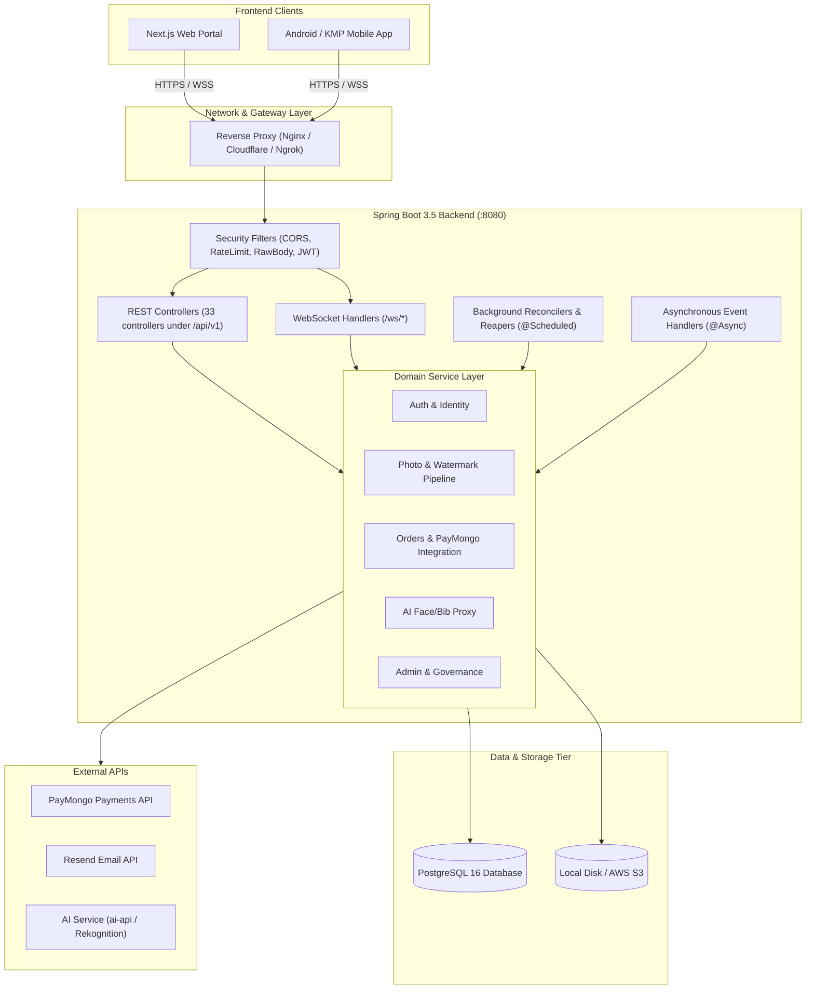
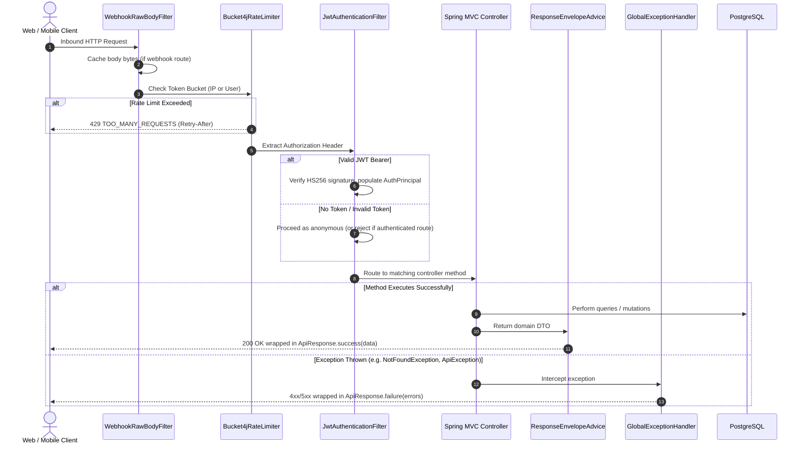
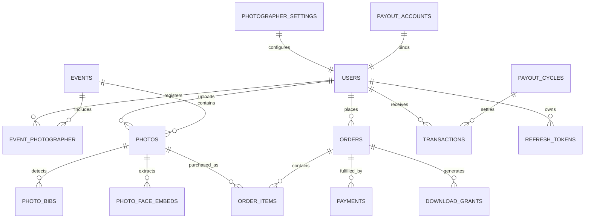
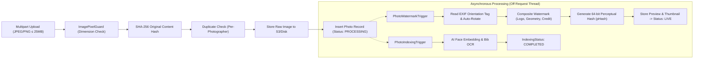
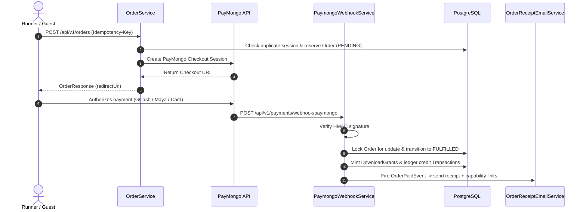
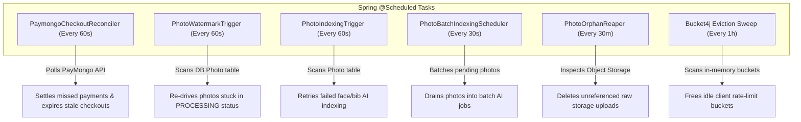

# QuickPitik Backend: Comprehensive Architecture & System Design

**Document Version:** 1.0.0  
**Generated Date:** September 4, 2026  
**Target Service:** `backend` (Spring Boot 3.5.14 / Kotlin 1.9.25 / JDK 21)  
**Corpus / Context:** Event Photography Marketplace (Sports / Marathons)  

---

## Table of Contents
1. [Executive Summary & System Context](#1-executive-summary--system-context)
2. [Technology Stack & Runtime Environment](#2-technology-stack--runtime-environment)
3. [High-Level Architecture & Topology](#3-high-level-architecture--topology)
4. [Request Lifecycle & Cross-Cutting Infrastructure](#4-request-lifecycle--cross-cutting-infrastructure)
5. [Database Architecture & Data Model](#5-database-architecture--data-model)
6. [Security & Identity Architecture](#6-security--identity-architecture)
7. [Core Subsystems & Pipelines](#7-core-subsystems--pipelines)
   - [7.1. Authentication & Identity Management](#71-authentication--identity-management)
   - [7.2. Event Management & Fair Gallery Delivery](#72-event-management--fair-gallery-delivery)
   - [7.3. Photo Ingestion & Watermarking Pipeline](#73-photo-ingestion--watermarking-pipeline)
   - [7.4. AI Face Indexing & Bib OCR Pipeline](#74-ai-face-indexing--bib-ocr-pipeline)
   - [7.5. E-Commerce, PayMongo Payments & Fulfillment](#75-e-commerce-paymongo-payments--fulfillment)
   - [7.6. Financial Ledger, Earnings & Payouts](#76-financial-ledger-earnings--payouts)
   - [7.7. Admin Operations & Governance](#77-admin-operations--governance)
8. [Real-Time WebSocket Architecture](#8-real-time-websocket-architecture)
9. [Background Schedulers & Self-Healing Reconcilers](#9-background-schedulers--self-healing-reconcilers)
10. [Environment Variables & Configuration Reference](#10-environment-variables--configuration-reference)
11. [Package & Symbol Navigation](#11-package--symbol-navigation)

---

## 1. Executive Summary & System Context

**QuickPitik** is a specialized, multi-sided event photography platform tailored for sports and athletic events (such as marathons, triathlons, and fun runs) in the Philippines.

The system serves three primary user personas:
1. **Runners / Athletes:** Discover photos via bib number OCR search or selfie facial recognition; purchase high-resolution unwatermarked photos via Philippine payment rails (GCash, Maya, cards); download single photos or streamed ZIP bundles.
2. **Photographers:** Register coverage for events; upload raw high-resolution captures in bulk; configure custom watermarks, logos, and coupon promotions; track earnings and request payouts.
3. **Platform Administrators:** Review and approve events; audit photographer verifications; arbitrate customer disputes; monitor financial health and manage payout cycles.

The **Spring Boot Backend** acts as the authoritative core for the entire ecosystem. Both the Next.js web application and the Android/KMP mobile application communicate strictly with this backend. The backend encapsulates business rules, arbitrates database persistence, coordinates asynchronous media pipelines, safeguards financial transactions, and securely proxies AI inference calls.

---

## 2. Technology Stack & Runtime Environment

| Concern | Selection | Architectural Justification |
|---|---|---|
| **Language** | Kotlin 1.9.25 | Null safety, concise data classes, clean functional idioms, and full Java interoperability. |
| **Runtime** | OpenJDK 21 | Modern LTS JVM supporting virtual threads and performance optimizations. |
| **Framework** | Spring Boot 3.5.14 | Comprehensive enterprise ecosystem (Spring Web, Spring Security, Spring Data JPA, WebSockets). |
| **Database** | PostgreSQL 16 | Relational consistency, JSONB support, transactional integrity, partial indices. |
| **Schema Migration** | Flyway Core 10 | 46 reproducible, linear SQL migrations ([db/migration/](file:///c:/Users/USER/Documents/School/4th%20Year%201st%20Semester/Capstone%20and%20Research%202/CAPSTONE%20PROJECT/Capstone-Project/backend/src/main/resources/db/migration)). |
| **Auth & Security** | JJWT (0.12.6) + Nimbus JOSE | Stateless HMAC-SHA256 JWT access tokens, SHA-256 opaque refresh tokens, and Google JWKS verification. |
| **Rate Limiting** | Bucket4j 8.10.1 | In-memory token bucket algorithms guarding sensitive routes from credential stuffing and DoS. |
| **Object Storage** | Pluggable (Local FS / AWS S3) | Seamless switching between local filesystem for development and AWS S3 for production. |
| **Image Processing** | Java2D + Metadata Extractor | Dynamic watermarking, EXIF orientation rotation, and DCT-based 64-bit perceptual hashing. |
| **AI Inference** | Pluggable (`ai-api` or Rekognition) | Self-hosted PyTorch/FastAPI engine or managed AWS Rekognition with event-isolated collections. |
| **Payment Gateway** | PayMongo API v1 | Philippine payment infrastructure supporting GCash, Maya, cards, and webhooks. |
| **Email Service** | Resend API | Transactional emails (receipts, password reset OTPs, verification links). |

---

## 3. High-Level Architecture & Topology



---

## 4. Request Lifecycle & Cross-Cutting Infrastructure

Every inbound HTTP request undergoes a standardized sequence of filter evaluations, controller execution, response envelope wrapping, and error interception.



### Key Infrastructure Classes

1. **[WebhookRawBodyFilter.kt](file:///c:/Users/USER/Documents/School/4th%20Year%201st%20Semester/Capstone%20and%20Research%202/CAPSTONE%20PROJECT/Capstone-Project/backend/src/main/kotlin/com/quickpitik/security/WebhookRawBodyFilter.kt)**  
   Wraps the `HttpServletRequest` in a caching wrapper for webhook paths (`/api/v1/payments/webhook/**`, `/api/v1/internal/ai-webhooks`). This allows constant-time cryptographic HMAC verification of the raw payload without consuming the request stream before controller binding.

2. **[Bucket4jRateLimiter.kt](file:///c:/Users/USER/Documents/School/4th%20Year%201st%20Semester/Capstone%20and%20Research%202/CAPSTONE%20PROJECT/Capstone-Project/backend/src/main/kotlin/com/quickpitik/service/ratelimit/Bucket4jRateLimiter.kt)**  
   Applies in-memory token bucket rate limiting. Protected scopes:
   - `auth-login`, `auth-register`, `auth-forgot-password`: 10 requests / 15 min per IP.
   - `photo-search`: 30 requests / 15 min per IP (protects expensive AI inference).
   - `photographer-upload`: 600 requests / 1 min per user.
   - `order-create`: 10 requests / 1 min per IP/user (bounds PayMongo session creation).
   - `photo-verify`: 10 requests / 15 min per IP (bounds CPU-heavy perceptual hash matching).

3. **[JwtAuthenticationFilter.kt](file:///c:/Users/USER/Documents/School/4th%20Year%201st%20Semester/Capstone%20and%20Research%202/CAPSTONE%20PROJECT/Capstone-Project/backend/src/main/kotlin/com/quickpitik/security/JwtAuthenticationFilter.kt)**  
   Parses `Bearer <token>`, extracts claims (`sub=userId`, `email`, `role`), and registers an [AuthPrincipal](file:///c:/Users/USER/Documents/School/4th%20Year%201st%20Semester/Capstone%20and%20Research%202/CAPSTONE%20PROJECT/Capstone-Project/backend/src/main/kotlin/com/quickpitik/security/AuthPrincipal.kt) in Spring's `SecurityContext`.

4. **[ResponseEnvelopeAdvice.kt](file:///c:/Users/USER/Documents/School/4th%20Year%201st%20Semester/Capstone%20and%20Research%202/CAPSTONE%20PROJECT/Capstone-Project/backend/src/main/kotlin/com/quickpitik/common/ResponseEnvelopeAdvice.kt)**  
   A Spring `ResponseBodyAdvice` interceptor that automatically wraps any controller return value into an `ApiResponse<T>`:
   ```json
   {
     "success": true,
     "data": { ... },
     "errors": null
   }
   ```

5. **[GlobalExceptionHandler.kt](file:///c:/Users/USER/Documents/School/4th%20Year%201st%20Semester/Capstone%20and%20Research%202/CAPSTONE%20PROJECT/Capstone-Project/backend/src/main/kotlin/com/quickpitik/exception/GlobalExceptionHandler.kt)**  
   Converts all handled and unhandled exceptions into the standard `ApiResponse` failure structure:
   ```json
   {
     "success": false,
     "data": null,
     "errors": [
       {
         "code": "ACCOUNT_LOCKED",
         "message": "Account is temporarily locked. Please try again in 15 minutes.",
         "field": null
       }
     ]
   }
   ```

---

## 5. Database Architecture & Data Model

The persistence layer uses **Spring Data JPA** over **PostgreSQL 16**. Schema evolution is managed via **Flyway** with 46 incremental migrations (`V1` through `V46`).

### Core Entity Relationships



### Key Performance & Modeling Strategies
- **Collection Batch Fetching:** `application.yml` sets `hibernate.default_batch_fetch_size: 50`. This prevents N+1 query fan-out when loading collections (such as `Photo.bibs` or `Photo.facePersons`), collapsing hundreds of child queries into single `WHERE parent_id IN (...)` queries.
- **Enterprise Deduplication Index:** A partial unique index (`uq_photos_photographer_content_hash`) on `(photographer_id, content_hash)` prevents the same binary photo from being uploaded twice by the same photographer.
- **Fair Ordering:** V44 migration implements randomized discovery order using deterministic seed-based ordering, ensuring all participating photographers receive balanced impressions.

---

## 6. Security & Identity Architecture

### A. Authentication & Session Management
- **Stateless Access Tokens:** Short-lived (15 minutes) HMAC-SHA256 JWTs containing `userId`, `email`, and `role`.
- **Rotated Refresh Tokens:** 32-byte cryptographically secure random base64url strings. The database stores only the SHA-256 hash. When a refresh occurs, the existing token is revoked and a new one is issued.
- **NIST SP 800-63B Password Validation:** Implemented in [PasswordValidator.kt](file:///c:/Users/USER/Documents/School/4th%20Year%201st%20Semester/Capstone%20and%20Research%202/CAPSTONE%20PROJECT/Capstone-Project/backend/src/main/kotlin/com/quickpitik/service/PasswordValidator.kt). Enforces an 8-character floor and screens against a curated dictionary of common and leaked passwords.
- **Account Lockout:** [LoginAttemptService.kt](file:///c:/Users/USER/Documents/School/4th%20Year%201st%20Semester/Capstone%20and%20Research%202/CAPSTONE%20PROJECT/Capstone-Project/backend/src/main/kotlin/com/quickpitik/service/LoginAttemptService.kt) records failed attempts. 5 failed logins within 15 minutes locks the account for 15 minutes (`429 ACCOUNT_LOCKED`).

### B. Google SSO Integration
Implemented in [GoogleAuthService.kt](file:///c:/Users/USER/Documents/School/4th%20Year%201st%20Semester/Capstone%20and%20Research%202/CAPSTONE%20PROJECT/Capstone-Project/backend/src/main/kotlin/com/quickpitik/service/GoogleAuthService.kt):
- Validates the Google ID Token signature using Google's auto-rotating JWKS keys (`spring-security-oauth2-jose`).
- Matches the token's audience against `GOOGLE_CLIENT_ID`.
- Safe auto-linking: If the email already exists and is verified, it links `google_sub`. If an existing account was unverified, its password is rotated to an unguessable string to neutralize potential pre-registration squatting.

### C. Webhook Cryptographic Verification
- **PayMongo Webhooks:** [PaymongoSignatureVerifier.kt](file:///c:/Users/USER/Documents/School/4th%20Year%201st%20Semester/Capstone%20and%20Research%202/CAPSTONE%20PROJECT/Capstone-Project/backend/src/main/kotlin/com/quickpitik/security/PaymongoSignatureVerifier.kt) parses the `Paymongo-Signature` header (`t=<timestamp>,te=<test_sig>,li=<live_sig>`) and computes constant-time HMAC-SHA256 digests against the raw request body.
- **AI Webhooks:** [AiWebhookSignatureVerifier.kt](file:///c:/Users/USER/Documents/School/4th%20Year%201st%20Semester/Capstone%20and%20Research%202/CAPSTONE%20PROJECT/Capstone-Project/backend/src/main/kotlin/com/quickpitik/security/AiWebhookSignatureVerifier.kt) verifies internal job callbacks from `ai-api`.

---

## 7. Core Subsystems & Pipelines

### 7.1. Authentication & Identity Management
Managed by [AuthController.kt](file:///c:/Users/USER/Documents/School/4th%20Year%201st%20Semester/Capstone%20and%20Research%202/CAPSTONE%20PROJECT/Capstone-Project/backend/src/main/kotlin/com/quickpitik/controller/AuthController.kt) and [AuthService.kt](file:///c:/Users/USER/Documents/School/4th%20Year%201st%20Semester/Capstone%20and%20Research%202/CAPSTONE%20PROJECT/Capstone-Project/backend/src/main/kotlin/com/quickpitik/service/AuthService.kt):
- `POST /auth/register`: Signs up `RUNNER` or `PHOTOGRAPHER`. Mails an advisory verification link asynchronously.
- `POST /auth/login`: Validates credentials, checks account lockout state, resets attempt counters on success.
- `POST /auth/google`: Exchanges Google ID Token for QuickPitik access/refresh pair.
- `POST /auth/forgot-password`: Mails a 6-digit OTP code (10-minute validity).
- `POST /auth/verify-reset-otp`: Validates the 6-digit OTP and returns an opaque 15-minute `resetToken`.
- `POST /auth/reset-password`: Uses the `resetToken` to set a new password, revoking all existing sessions.

---

### 7.2. Event Management & Fair Gallery Delivery
Managed by [EventController.kt](file:///c:/Users/USER/Documents/School/4th%20Year%201st%20Semester/Capstone%20and%20Research%202/CAPSTONE%20PROJECT/Capstone-Project/backend/src/main/kotlin/com/quickpitik/controller/EventController.kt) and [EventPhotoController.kt](file:///c:/Users/USER/Documents/School/4th%20Year%201st%20Semester/Capstone%20and%20Research%202/CAPSTONE%20PROJECT/Capstone-Project/backend/src/main/kotlin/com/quickpitik/controller/EventPhotoController.kt):
- Events encapsulate location metadata, dates, organizer profiles, and pricing modes.
- Photographers register coverage for approved events before uploading photos.
- **Fair Gallery Presentation:** When browsing event photos, queries apply deterministic pagination seeds to rotate and interleave photos across all participating photographers.

---

### 7.3. Photo Ingestion & Watermarking Pipeline
Implemented in [PhotoUploadService.kt](file:///c:/Users/USER/Documents/School/4th%20Year%201st%20Semester/Capstone%20and%20Research%202/CAPSTONE%20PROJECT/Capstone-Project/backend/src/main/kotlin/com/quickpitik/service/photographer/PhotoUploadService.kt) and [WatermarkService.kt](file:///c:/Users/USER/Documents/School/4th%20Year%201st%20Semester/Capstone%20and%20Research%202/CAPSTONE%20PROJECT/Capstone-Project/backend/src/main/kotlin/com/quickpitik/service/photographer/WatermarkService.kt).



**Architectural Highlights:**
- **No Transaction Over I/O:** The multipart file write to S3/disk occurs outside any database transaction, preventing long I/O operations from starving the database connection pool.
- **Decompression Bomb Guard:** [ImagePixelGuard.kt](file:///c:/Users/USER/Documents/School/4th%20Year%201st%20Semester/Capstone%20and%20Research%202/CAPSTONE%20PROJECT/Capstone-Project/backend/src/main/kotlin/com/quickpitik/service/image/ImagePixelGuard.kt) reads file headers prior to full raster decoding, rejecting corrupt files or dimension bombs.
- **EXIF Auto-Orientation:** Uses `metadata-extractor` to check EXIF rotation tags (preventing mobile portrait photos from displaying rotated sideways).
- **Watermark Resistance:** Applies diagonal wordmark patterns, custom photographer logos, and seed-based geometry derived from `HMAC(seed, photoId)`.
- **Copyright Verification:** Computes 64-bit DCT perceptual hashes. `POST /public/photos/verify` allows runners or admins to upload screenshots or crops and find the original photographer using Hamming distance comparison (≤ 12 bits).

---

### 7.4. AI Face Indexing & Bib OCR Pipeline
Implemented via [FaceBibProvider.kt](file:///c:/Users/USER/Documents/School/4th%20Year%201st%20Semester/Capstone%20and%20Research%202/CAPSTONE%20PROJECT/Capstone-Project/backend/src/main/kotlin/com/quickpitik/service/ai/FaceBibProvider.kt):
- **Providers:**
  - `AiApiClient`: Interfaces with the standalone Python/FastAPI service using PyTorch models.
  - `RekognitionAiClient`: Interfaces with AWS Rekognition using event-scoped collection boundaries (`qp-event-{eventId}`).
- **Event Isolation:** Face searches are strictly constrained by `eventId`, preventing athletes in Event A from matching faces in Event B.
- **Error Discrimination:** Reconcilers differentiate between *semantic failures* (corrupt image, no faces found), which consume retry attempts, and *transport failures* (AI service offline), which do not consume the retry budget and automatically recover upon reconnection.
- **Runner Quality Gate:** [MeSelfieController.kt](file:///c:/Users/USER/Documents/School/4th%20Year%201st%20Semester/Capstone%20and%20Research%202/CAPSTONE%20PROJECT/Capstone-Project/backend/src/main/kotlin/com/quickpitik/controller/MeSelfieController.kt) evaluates uploaded runner selfies for clarity, lighting, and face count before admitting them for face-search matching.

---

### 7.5. E-Commerce, PayMongo Payments & Fulfillment
Implemented in [OrderService.kt](file:///c:/Users/USER/Documents/School/4th%20Year%201st%20Semester/Capstone%20and%20Research%202/CAPSTONE%20PROJECT/Capstone-Project/backend/src/main/kotlin/com/quickpitik/service/orders/OrderService.kt) and [PaymongoWebhookService.kt](file:///c:/Users/USER/Documents/School/4th%20Year%201st%20Semester/Capstone%20and%20Research%202/CAPSTONE%20PROJECT/Capstone-Project/backend/src/main/kotlin/com/quickpitik/service/orders/PaymongoWebhookService.kt):



- **Guest Purchases & Capability Tokens:** Unregistered users can purchase photos. Full order details and downloads are secured via cryptographically signed tokens ([OrderAccessTokenService.kt](file:///c:/Users/USER/Documents/School/4th%20Year%201st%20Semester/Capstone%20and%20Research%202/CAPSTONE%20PROJECT/Capstone-Project/backend/src/main/kotlin/com/quickpitik/service/orders/OrderAccessTokenService.kt)), eliminating the need for mandatory pre-checkout account creation.
- **On-the-Fly Bundle Streaming:** [OrderBundleService.kt](file:///c:/Users/USER/Documents/School/4th%20Year%201st%20Semester/Capstone%20and%20Research%202/CAPSTONE%20PROJECT/Capstone-Project/backend/src/main/kotlin/com/quickpitik/service/orders/OrderBundleService.kt) streams high-resolution unwatermarked photos into a single ZIP archive over the HTTP connection without buffering entire multi-gigabyte files in server memory.
- **Mobile Bridge:** [MobileReturnController.kt](file:///c:/Users/USER/Documents/School/4th%20Year%201st%20Semester/Capstone%20and%20Research%202/CAPSTONE%20PROJECT/Capstone-Project/backend/src/main/kotlin/com/quickpitik/controller/MobileReturnController.kt) serves HTML redirection bridges that invoke `quickpitik://` deep links to return the runner to the Android app upon PayMongo checkout completion.

---

### 7.6. Financial Ledger, Earnings & Payouts
- **Split Calculation:** By default, each photo is priced at PHP 125. The platform takes a 25% commission (PHP 31.25), and the photographer receives 75% (PHP 93.75).
- **Coupons:** Photographers can create discount coupons (up to 50% of their cut). Coupons reduce only the photographer's portion; the platform fee is non-discountable.
- **Disbursements:** Administrators create payout cycles ([AdminPayoutService.kt](file:///c:/Users/USER/Documents/School/4th%20Year%201st%20Semester/Capstone%20and%20Research%202/CAPSTONE%20PROJECT/Capstone-Project/backend/src/main/kotlin/com/quickpitik/service/admin/AdminPayoutService.kt)) to aggregate balances, attach disbursement proof receipts, and record transfers to photographer GCash/Maya/Bank accounts.

---

### 7.7. Admin Operations & Governance
Admins have access to governance surfaces protected by `@PreAuthorize("hasRole('ADMIN')")`:
- **Dispute Resolution:** Arbitrate customer disputes and issue PayMongo automated refunds via [PaymongoRefundService.kt](file:///c:/Users/USER/Documents/School/4th%20Year%201st%20Semester/Capstone%20and%20Research%202/CAPSTONE%20PROJECT/Capstone-Project/backend/src/main/kotlin/com/quickpitik/service/orders/PaymongoRefundService.kt).
- **Audit Logging:** [AdminDecisionLogService.kt](file:///c:/Users/USER/Documents/School/4th%20Year%201st%20Semester/Capstone%20and%20Research%202/CAPSTONE%20PROJECT/Capstone-Project/backend/src/main/kotlin/com/quickpitik/service/admin/AdminDecisionLogService.kt) tracks all admin actions (actor, action, target, metadata diff) for compliance and auditing.
- **KPI Dashboards:** Real-time financial and operational metrics (gross volume, net platform revenue, pending verifications, active uploaders) served via [AdminKpisController.kt](file:///c:/Users/USER/Documents/School/4th%20Year%201st%20Semester/Capstone%20and%20Research%202/CAPSTONE%20PROJECT/Capstone-Project/backend/src/main/kotlin/com/quickpitik/controller/AdminKpisController.kt).

---

## 8. Real-Time WebSocket Architecture

Configured in [WebSocketConfig.kt](file:///c:/Users/USER/Documents/School/4th%20Year%201st%20Semester/Capstone%20and%20Research%202/CAPSTONE%20PROJECT/Capstone-Project/backend/src/main/kotlin/com/quickpitik/config/WebSocketConfig.kt):

| Channel Path | Purpose | Authorization Mechanism |
|---|---|---|
| `/ws/events/*/photos` | Broadcasts newly published photos to runners browsing an active event gallery. | Public handshake with event verification. |
| `/ws/me/photographer/notifications` | Pushes real-time sales alerts, upload processing milestones, and payout notices. | JWT handshake interceptor (validates user ID). |
| `/ws/me/runner/notifications` | Pushes order fulfillment notices and runner message notifications. | JWT handshake interceptor. |
| `/ws/admin/notifications` | Real-time broadcast of newly opened disputes, flagged photos, and pending approvals. | JWT handshake interceptor (verifies `ROLE_ADMIN`). |

---

## 9. Background Schedulers & Self-Healing Reconcilers

The backend runs scheduled background tasks to guarantee consistency and automatic fault recovery:



---

## 10. Environment Variables & Configuration Reference

| Environment Variable | Default Value | Production Requirement | Purpose |
|---|---|---|---|
| `DB_HOST` | `localhost` | Required (RDS / Cloud SQL) | PostgreSQL host address |
| `DB_PORT` | `5432` | `5432` | PostgreSQL port |
| `DB_NAME` | `quickpitik` | Custom DB Name | PostgreSQL database name |
| `DB_USER` | `quickpitik` | Production DB User | PostgreSQL username |
| `DB_PASSWORD` | `quickpitik` | **MUST OVERRIDE** | PostgreSQL password |
| `JWT_SECRET` | *(dev placeholder)* | **MUST OVERRIDE** (≥ 32 bytes) | Secret key for HS256 JWT access tokens |
| `GOOGLE_CLIENT_ID` | *(blank)* | Google Cloud Client ID | Client ID for Google SSO validation |
| `STORAGE_BACKEND` | `LOCAL` | Set to `S3` | File storage provider (`LOCAL` or `S3`) |
| `STORAGE_BUCKET` | `quickpitik-dev` | Production S3 Bucket | Target S3 bucket name |
| `AI_API_ENABLED` | `false` | Set to `true` | Master switch for face & bib AI processing |
| `AI_PROVIDER` | `ai-api` | `ai-api` or `rekognition` | Vision provider implementation selection |
| `PAYMONGO_SECRET_KEY` | *(dev placeholder)* | Production PayMongo Key | PayMongo HTTP Basic API key (`sk_live_...`) |
| `PAYMONGO_WEBHOOK_SECRET` | *(dev placeholder)* | Production Signing Secret | PayMongo webhook HMAC verification key |
| `RESEND_API_KEY` | *(dev placeholder)* | Production Resend Key | Resend transactional email API key |
| `ORDER_CAPABILITY_SECRET` | *(dev placeholder)* | **MUST OVERRIDE** (≥ 32 bytes) | HMAC secret for guest download capability tokens |
| `RATE_LIMIT_ENABLED` | `true` | Keep `true` | In-memory token bucket rate limiting toggle |

---

## 11. Package & Symbol Navigation

All backend code lives under package `com.quickpitik`:

- **Entry Point:** [QuickPitikApplication.kt](file:///c:/Users/USER/Documents/School/4th%20Year%201st%20Semester/Capstone%20and%20Research%202/CAPSTONE%20PROJECT/Capstone-Project/backend/src/main/kotlin/com/quickpitik/QuickPitikApplication.kt)
- **Configuration:** [src/main/kotlin/com/quickpitik/config/](file:///c:/Users/USER/Documents/School/4th%20Year%201st%20Semester/Capstone%20and%20Research%202/CAPSTONE%20PROJECT/Capstone-Project/backend/src/main/kotlin/com/quickpitik/config)  
  *Key files:* `SecurityConfig.kt`, `CorsConfig.kt`, `WebSocketConfig.kt`, `OpenApiConfig.kt`
- **Security & Filters:** [src/main/kotlin/com/quickpitik/security/](file:///c:/Users/USER/Documents/School/4th%20Year%201st%20Semester/Capstone%20and%20Research%202/CAPSTONE%20PROJECT/Capstone-Project/backend/src/main/kotlin/com/quickpitik/security)  
  *Key files:* `JwtAuthenticationFilter.kt`, `PaymongoSignatureVerifier.kt`, `WebhookRawBodyFilter.kt`
- **Controllers (33):** [src/main/kotlin/com/quickpitik/controller/](file:///c:/Users/USER/Documents/School/4th%20Year%201st%20Semester/Capstone%20and%20Research%202/CAPSTONE%20PROJECT/Capstone-Project/backend/src/main/kotlin/com/quickpitik/controller)  
  *Key files:* `AuthController.kt`, `EventPhotoController.kt`, `OrderController.kt`, `MePhotographerController.kt`, `AdminDisputesController.kt`
- **Entities (51):** [src/main/kotlin/com/quickpitik/entity/](file:///c:/Users/USER/Documents/School/4th%20Year%201st%20Semester/Capstone%20and%20Research%202/CAPSTONE%20PROJECT/Capstone-Project/backend/src/main/kotlin/com/quickpitik/entity)  
  *Key files:* `User.kt`, `Event.kt`, `Photo.kt`, `Order.kt`, `Payment.kt`, `Transaction.kt`, `Dispute.kt`
- **Services:** [src/main/kotlin/com/quickpitik/service/](file:///c:/Users/USER/Documents/School/4th%20Year%201st%20Semester/Capstone%20and%20Research%202/CAPSTONE%20PROJECT/Capstone-Project/backend/src/main/kotlin/com/quickpitik/service)  
  - `orders/`: `OrderService.kt`, `PaymongoWebhookService.kt`, `OrderBundleService.kt`
  - `photographer/`: `PhotoUploadService.kt`, `WatermarkService.kt`, `PhotoIndexingService.kt`
  - `ai/`: `AiApiClient.kt`, `RekognitionAiClient.kt`, `FaceBibProvider.kt`
  - `admin/`: `AdminPayoutService.kt`, `AdminDisputeService.kt`, `AdminDecisionLogService.kt`
- **WebSockets:** [src/main/kotlin/com/quickpitik/websocket/](file:///c:/Users/USER/Documents/School/4th%20Year%201st%20Semester/Capstone%20and%20Research%202/CAPSTONE%20PROJECT/Capstone-Project/backend/src/main/kotlin/com/quickpitik/websocket)  
  *Key files:* `EventPhotoWebSocketHandler.kt`, `PhotoPublishedBroadcaster.kt`, `AdminNotificationWebSocketHandler.kt`
- **Database Migrations (46):** [src/main/resources/db/migration/](file:///c:/Users/USER/Documents/School/4th%20Year%201st%20Semester/Capstone%20and%20Research%202/CAPSTONE%20PROJECT/Capstone-Project/backend/src/main/resources/db/migration)
