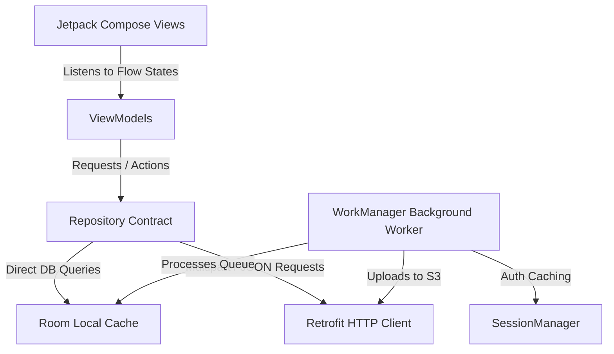

# CLAUDE.md — QuickPitik Mobile App (Kotlin/Compose)

**Status:** MVVM Architecture, Room Local SQLite Caching, Retrofit Network Syncing, Session Management, and DSLR Background Uploads **100% Operational & Compiled.**

---

## 🛠️ Build and Developer Commands
* **Build app:** `.\gradlew.bat assembleDebug` (from the `mobile/` directory)
* **Clean cache:** `.\gradlew.bat clean`
* **Check compile validity:** `.\gradlew.bat compileDebugKotlin`
## 📱 Mobile-to-PC Backend Network Bridging Guide (ADB & Emulator)

When debugging the mobile app on a physical phone or an emulator, the Android device sees **"localhost"** as its own internal loopback interface rather than your PC. To route phone traffic straight to your laptop's running Spring Boot server on port `8080`, use the guides below:

### 🔌 Option A: Physical Android Phone via USB (Highly Recommended)
1. **Enable USB Debugging on your phone:**
   * Go to **Settings** -> **About Phone**.
   * Tap **Build Number** 7 times until it says *"You are now a developer!"*.
   * Go back to settings -> **System** -> **Developer Options** -> Enable **USB Debugging**.
   * Plug your phone into your laptop via USB cable and select "Allow USB Debugging" when prompted.
2. **Check phone connectivity:**
   * Open PowerShell/Terminal on your laptop and run:
     ```powershell
     & "$env:LOCALAPPDATA\Android\Sdk\platform-tools\adb.exe" devices
     ```
     *(You should see your phone listed in the list of devices.)*
3. **Establish Port Forwarding:**
   * Run this command to bridge port `8080` across the USB cable:
     ```powershell
     # Windows PowerShell (Universal Path)
     & "$env:LOCALAPPDATA\Android\Sdk\platform-tools\adb.exe" reverse tcp:8080 tcp:8080
     
     # macOS Terminal
     ~/Library/Android/sdk/platform-tools/adb reverse tcp:8080 tcp:8080
     
     # Linux Terminal
     adb reverse tcp:8080 tcp:8080
     ```
     *(After running this, the phone will successfully communicate with `http://localhost:8080` on your laptop!)*

### 💻 Option B: Android Emulator (Virtual Device)
* If using the standard Android Studio Emulator, the laptop's loopback interface is mapped to the special IP address **`10.0.2.2`**.
* Open `RetrofitClient.kt` and change the `BASE_URL` to:
  ```kotlin
  private const val BASE_URL = "http://10.0.2.2:8080/"
  ```

### 📶 Option C: Wireless local Wi-Fi (No USB cable)
* Ensure both your laptop and phone are connected to the exact same Wi-Fi network.
* Open `RetrofitClient.kt` and change `localhost` to your computer's local Wi-Fi IP address (e.g. `192.168.1.XX`):
  ```kotlin
  private const val BASE_URL = "http://192.168.1.50:8080/"
  ```

---

## 🏗️ Clean MVVM Architecture Map

The mobile module utilizes a modern **MVVM (Model-View-ViewModel)** architecture built with Kotlin Coroutines, Jetpack Compose, Retrofit, and Room SQLite.



### 1. Model Layer (Data Source)
* **Local Persistence (Room SQLite):**
  * [UploadRecord.kt](file:///c:/Users/USER/Documents/School/3rd%20Year%202nd%20Semester/IT332%20-%20Capstone%20and%20Research%201/CAPSTONE%20PROJECT/Capstone-Project/mobile/app/src/main/java/com/quickpitik/mobile/data/local/UploadRecord.kt): Table storing queue items, filePath, eventId, uploadState, retryCounts, and network errors.
  * [UploadQueueDao.kt](file:///c:/Users/USER/Documents/School/3rd%20Year%202nd%20Semester/IT332%20-%20Capstone%20and%20Research%201/CAPSTONE%20PROJECT/Capstone-Project/mobile/app/src/main/java/com/quickpitik/mobile/data/local/UploadQueueDao.kt): DAO query declarations (INSERT, UPDATE, DELETE, status modification).
  * [AppDatabase.kt](file:///c:/Users/USER/Documents/School/3rd%20Year%202nd%20Semester/IT332%20-%20Capstone%20and%20Research%201/CAPSTONE%20PROJECT/Capstone-Project/mobile/app/src/main/java/com/quickpitik/mobile/data/local/AppDatabase.kt): Thread-safe Room Database singleton launcher.
  * [SessionManager.kt](file:///c:/Users/USER/Documents/School/3rd%20Year%202nd%20Semester/IT332%20-%20Capstone%20and%20Research%201/CAPSTONE%20PROJECT/Capstone-Project/mobile/app/src/main/java/com/quickpitik/mobile/data/local/SessionManager.kt): Thread-safe SharedPreference wrapper caching the user's JWT access token, email, name, and database role.
* **Remote Integration (Retrofit HTTP):**
  * [AuthDto.kt](file:///c:/Users/USER/Documents/School/3rd%20Year%202nd%20Semester/IT332%20-%20Capstone%20and%20Research%201/CAPSTONE%20PROJECT/Capstone-Project/mobile/app/src/main/java/com/quickpitik/mobile/data/remote/AuthDto.kt): JSON-serializable requests and response models.
  * [ApiResponseEnvelope.kt](file:///c:/Users/USER/Documents/School/3rd%20Year%202nd%20Semester/IT332%20-%20Capstone%20and%20Research%201/CAPSTONE%20PROJECT/Capstone-Project/mobile/app/src/main/java/com/quickpitik/mobile/data/remote/ApiResponseEnvelope.kt): Standard generic wrapper matching Spring Boot's envelope body adviser.
  * [QuickPitikApi.kt](file:///c:/Users/USER/Documents/School/3rd%20Year%202nd%20Semester/IT332%20-%20Capstone%20and%20Research%201/CAPSTONE%20PROJECT/Capstone-Project/mobile/app/src/main/java/com/quickpitik/mobile/data/remote/QuickPitikApi.kt): Retrofit interface mapping POST logins, POST registrations, and Multipart S3 image uploads.
  * [RetrofitClient.kt](file:///c:/Users/USER/Documents/School/3rd%20Year%202nd%20Semester/IT332%20-%20Capstone%20and%20Research%201/CAPSTONE%20PROJECT/Capstone-Project/mobile/app/src/main/java/com/quickpitik/mobile/data/remote/RetrofitClient.kt): HTTP network engine singleton carrying GSON and HTTP packet Logcat logging interceptors.

### 2. Repository Layer (Data Coordinator)
* [PhotoRepository.kt](file:///c:/Users/USER/Documents/School/3rd%20Year%202nd%20Semester/IT332%20-%20Capstone%20and%20Research%201/CAPSTONE%20PROJECT/Capstone-Project/mobile/app/src/main/java/com/quickpitik/mobile/data/repository/PhotoRepository.kt) (Contract) & [PhotoRepositoryImpl.kt](file:///c:/Users/USER/Documents/School/3rd%20Year%202nd%20Semester/IT332%20-%20Capstone%20and%20Research%201/CAPSTONE%20PROJECT/Capstone-Project/mobile/app/src/main/java/com/quickpitik/mobile/data/repository/PhotoRepositoryImpl.kt) (Implementation): Manages thread dispatchers, Room caching synchronization, and coordinates local repository database queries.

### 3. ViewModel Layer (State Holder)
* [AuthViewModel.kt](file:///c:/Users/USER/Documents/School/3rd%20Year%202nd%20Semester/IT332%20-%20Capstone%20and%20Research%201/CAPSTONE%20PROJECT/Capstone-Project/mobile/app/src/main/java/com/quickpitik/mobile/ui/auth/AuthViewModel.kt):
  * Coordinates async HTTP login/register routines under `viewModelScope`.
  * Integrates an HTTP exception body parser using Gson to display backend errors (like *"Email already registered"*) in a beautiful, red UI warning banner.
  * Automatically saves user profiles and bearer JWT tokens into `SessionManager` on success.

### 4. Background Sync Layer (WorkManager)
* [PhotoUploadWorker.kt](file:///c:/Users/USER/Documents/School/3rd%20Year%202nd%20Semester/IT332%20-%20Capstone%20and%20Research%201/CAPSTONE%20PROJECT/Capstone-Project/mobile/app/src/main/java/com/quickpitik/mobile/worker/PhotoUploadWorker.kt): Background CoroutineWorker executing background sync:
  1. Checks for local `"QUEUED"` DSLR photo files in Room.
  2. Extracts the photographer's authenticated JWT bearer token from `SessionManager`.
  3. Maps photos to multipart payloads, dispatches S3 upload requests, and marks items as `"COMPLETED"` upon success.

### 5. View Layer (Jetpack Compose UI)
* [MainActivity.kt](file:///c:/Users/USER/Documents/School/3rd%20Year%202nd%20Semester/IT332%20-%20Capstone%20and%20Research%201/CAPSTONE%20PROJECT/Capstone-Project/mobile/app/src/main/java/com/quickpitik/mobile/MainActivity.kt): Setups `NavHost` state routes. Instantiates shared `AuthViewModel` using Compose delegates.
* **Authentication Screens:**
  * [LoginScreen.kt](file:///c:/Users/USER/Documents/School/3rd%20Year%202nd%20Semester/IT332%20-%20Capstone%20and%20Research%201/CAPSTONE%20PROJECT/Capstone-Project/mobile/app/src/main/java/com/quickpitik/mobile/ui/auth/LoginScreen.kt): Warm-cream light card style aligning with the web page design. Dispatches logins and automatically redirects users based on their backend role.
  * [RegisterScreen.kt](file:///c:/Users/USER/Documents/School/3rd%20Year%202nd%20Semester/IT332%20-%20Capstone%20and%20Research%201/CAPSTONE%20PROJECT/Capstone-Project/mobile/app/src/main/java/com/quickpitik/mobile/ui/auth/RegisterScreen.kt): Visual selector cards ("I run" vs "I shoot"), validation fields, and automatic role mapping.
* **Role Dashboards:**
  * [DashboardScreen.kt](file:///c:/Users/USER/Documents/School/3rd%20Year%202nd%20Semester/IT332%20-%20Capstone%20and%20Research%201/CAPSTONE%20PROJECT/Capstone-Project/mobile/app/src/main/java/com/quickpitik/mobile/ui/photographer/DashboardScreen.kt): Tech-forward photographer console with DSLR OTG tether configurations, battery metrics, and Room SQLite synchronizer grids.
  * [GalleryScreen.kt](file:///c:/Users/USER/Documents/School/3rd%20Year%202nd%20Semester/IT332%20-%20Capstone%20and%20Research%201/CAPSTONE%20PROJECT/Capstone-Project/mobile/app/src/main/java/com/quickpitik/mobile/ui/runner/GalleryScreen.kt): Interactive Light-mode marathon gallery enabling AI Face scans, Bib number queries, and watermarked image grid previews.

---

## 🚦 Integration Details & Settings
* **Permissions & Sandbox ([AndroidManifest.xml](file:///c:/Users/USER/Documents/School/3rd%20Year%202nd%20Semester/IT332%20-%20Capstone%20and%20Research%201/CAPSTONE%20PROJECT/Capstone-Project/mobile/app/src/main/AndroidManifest.xml)):**
  * `<uses-permission android:name="android.permission.INTERNET" />` enabled.
  * `android:usesCleartextTraffic="true"` configured to allow standard HTTP local transport calls to `http://localhost:8080`.
* **Libraries ([libs.versions.toml](file:///c:/Users/USER/Documents/School/3rd%20Year%202nd%20Semester/IT332%20-%20Capstone%20and%20Research%201/CAPSTONE%20PROJECT/Capstone-Project/mobile/gradle/libs.versions.toml)):**
  * Retrofit & OkHttp with `logging-interceptor` (v4.12.0) and `converter-gson` (v2.9.0).
  * Room SQLite persistence (v2.6.1).
  * WorkManager Coroutine runtime (v2.9.0).
  * Coil Jetpack Compose image loader (v2.6.0).

---

## 🎯 Next Steps for Development
When continuing in a new conversation or context, prioritize the following tasks:
1. **Unit Test Room & WorkManager:** Create Android instrumented unit tests testing `UploadRecord` insertions, `UploadQueueDao` queries, and `PhotoUploadWorker` queue synchronization.
2. **Implement DSLR Camera OTG WiFi/USB SDK Hook:** Connect the Photographer console to raw camera file listeners (like Sony Camera Remote SDK or standard PTP/IP Android USB listeners) to automatically insert captured files into the local Room `UploadRecord` queue.
3. **Selfie Capture Upload for Runner Search:** Wire the Runner's selfie capture button in `GalleryScreen.kt` to trigger the front camera, take a selfie, and POST it as multipart to the face recognition service (`POST /api/v1/events/{slug}/photos/search-by-face`).
