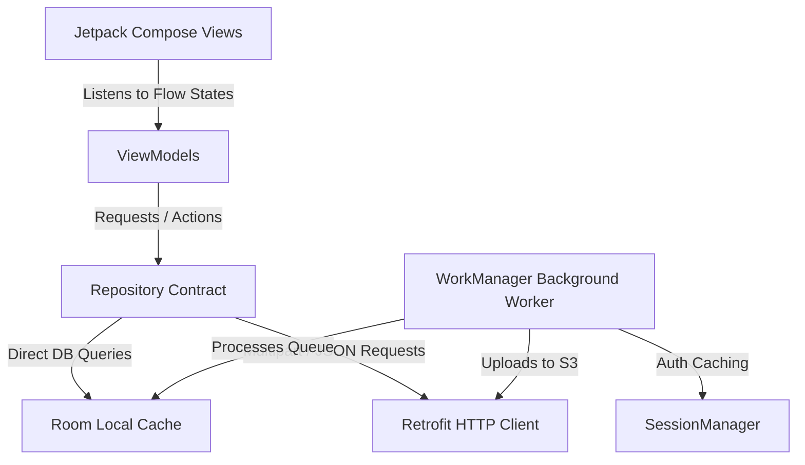

# CLAUDE.md — QuickPitik Mobile App (Kotlin/Compose)

**Status:** MVVM Architecture, Room Local SQLite Caching, Retrofit Network Syncing, Session Management, DSLR Background Uploads, Mobile Marketplace Flow, and Runner Profile, Selfie Library, & Account Settings **100% Operational & Compiled.**

> **Standing directive for all mobile work → read [Build Mandate](#-build-mandate--website-parity-protocol-read-first) FIRST.** Replicate the exact website flows (runner + photographer) and connect to the already-working backend. Do not change the backend or website *on mobile's own initiative* — see rule 2 for the one carve-out. Tether auto-upload ships last.

---

## 🎯 Build Mandate — Website Parity Protocol (READ FIRST)

**The mobile app's job is to replicate the EXACT flows of the already-working website + backend — for both the runner and the photographer — and to connect to the existing backend. Nothing more, until parity is reached.**

This is the standing directive for every mobile task. It **overrides** any default instinct to redesign, re-architect, "improve," or simplify a flow. When a default approach conflicts with this mandate, the mandate wins.

### The four rules

1. **Replicate the website flow exactly — both roles.** Every runner and photographer surface in `website/` must have a faithful mobile equivalent: same steps, same states, same order of actions, same validation rules, same intent of copy. The source of truth for "what the flow is" = the website (`website/src/app/`, `website/src/components/`) and the backend contract it calls.
2. **Backend + website are FROZEN — connect, don't change.** The Spring Boot backend and the Next.js website already work. Mobile only wires Retrofit to **existing** endpoints. **Never edit the backend or the website to make mobile easier.** If mobile needs something the backend doesn't already expose (a missing field, a missing endpoint, a shape mismatch), **STOP and report the exact gap to the user.** Do not invent a workaround, a mock, a local-only field, or a new feature flag — and do not modify the backend yourself.

   **Carve-out — user-directed cross-module reconciliation (added 2026-08-16).** The freeze binds *mobile's own initiative*. It does **not** bind a session the user has explicitly scoped as a cross-module reconciliation across backend + website + mobile. In that mode all three are in scope and edits may land in any of them.

   The distinction that matters:
   - ❌ Still forbidden: mobile hits a gap mid-parity-task and patches the backend to unblock itself. That is what rule 2 exists to stop. Stop and report, as before.
   - ✅ Permitted: the user asks for the three modules to be reconciled, a divergence is found, and the fix is applied wherever it actually belongs — including backend or website.

   Two conditions hold even inside the carve-out: the user must have scoped the session that way (an agent may not declare it for itself), and a change spanning modules updates the integration docs in the same commit, per root `CLAUDE.md` § Cross-module changes.

   Rationale: the freeze was written while mobile was chasing parity and the other two were ahead. Mobile has since reached parity, so the remaining drift is *mutual* — some of it only fixable backend- or website-side. Left unamended, this rule would have the next mobile session revert reconciliation work as a mandate violation.
3. **Parity is priority #1.** Build runner + photographer website-flow parity before any net-new, mobile-only capability. `/admin/*` is OUT of scope (web-only ops console). `/onboarding` is N/A (role is chosen at register).
4. **The USB-C tethered-camera auto-upload is the FINAL milestone — build it LAST.** The photographer MVP — connect a camera over USB-C, auto-upload every shot to the backend, and have it appear in **both** the mobile app and the website — is deferred until website-flow parity (rules 1–3) is complete. Do not start it early. It is the last thing built, not the first.

### The workflow for any parity task

1. **Find the website flow.** Read the matching `website/src/app/...` page + its components and trace every step, state, and API call.
2. **Find the backend contract.** Read the controller + DTOs the website calls. Match field names and request/response shapes **exactly** in the mobile DTOs (the envelope is `ApiResponseEnvelope<T>`).
3. **Replicate in Compose** following the existing mobile MVVM layering: DTO → `QuickPitikApi` → Repository (contract + impl) → ViewModel (StateFlow + sealed UI-state) → Screen. Reuse the existing mobile design tokens (`com.quickpitik.mobile.ui.theme.*` — Bone / Ink / Fresh / Slate / Line / etc.); match the app's current look — **do not introduce a new design system.** Functional-first; polish is a later pass.
4. **Confirm the boundary held.** No backend or website edits. If a gap forced a stop, it was *reported to the user*, not patched locally. (In a user-scoped cross-module reconciliation session, rule 2's carve-out applies instead — the boundary is the session's scope, not the module's.)
5. **Compile-check** with `.\gradlew.bat compileDebugKotlin` before declaring a task done. Runtime verification needs a device/emulator — if you could not actually run it, **say so explicitly**; a clean compile is necessary but not sufficient.

### For sub-agents (IMPORTANT)

Sub-agents (feature / Explore / general-purpose) do **NOT** automatically load this file — only the main session gets it injected. Whoever dispatches a mobile feature agent **MUST paste the four rules + the workflow above into that agent's prompt.** Otherwise the mandate never reaches the agent doing the work.

> **Live task list + current parity scope:** vault `mobile/tasks.md`.
> **Rationale (why parity-first, tether-last, backend-frozen):** vault `mobile/decisions.md` — 2026-05-25 parity-mandate ADR.

---

## 🛠️ Build and Developer Commands
* **Build app:** `.\gradlew.bat assembleDebug` (from the `mobile/` directory)
* **Clean cache:** `.\gradlew.bat clean`
* **Check compile validity:** `.\gradlew.bat compileDebugKotlin`
## 📱 Mobile-to-PC Backend Network Bridging Guide (ADB & Emulator)

When debugging the mobile app on a physical phone or an emulator, the Android device sees **"localhost"** as its own internal loopback interface rather than your PC. To route phone traffic straight to your laptop's running Spring Boot server on port `8080`, use the guides below.

### ⭐ Option 0: Set it in the app (debug builds — start here)

Since 2026-08-16 the backend origin is **settable at runtime**, so a changed laptop IP no longer costs a recompile + reinstall:

1. On the **Login** screen, scroll to the bottom and tap the `SERVER · <host>` row.
2. Enter the laptop's Wi-Fi IPv4 with the port — e.g. `192.168.1.232:8080`. The `http://` and the trailing slash are added for you.
3. Tap **Use this server**. It persists across restarts *and across sign-out*, and takes effect on the next request — no restart needed.

`Reset to default` returns to the compiled-in `RetrofitClient.DEFAULT_BASE_URL`.

Everything derives from that one value — image URLs (`backendHost`/`backendOrigin`), WebSockets (`wsOrigin`), and Coil's separate `ImageLoader` via `HostRewriteInterceptor` — so there are no per-screen hardcodes to chase.

> **Debug builds only.** `BuildConfig.DEBUG` gates both the UI and `RetrofitClient.setBaseUrl`, so a release APK is pinned to the compiled default and cannot be pointed at another host. Caveat: an **already-open** WebSocket keeps the host it dialled — irrelevant in practice, since the field lives on Login before any socket is opened.

This is what unblocked the physical-device protocols: during a camera shoot the phone's USB-C port is occupied by the body, so there is no cable to push a new build over.

The options below remain valid, and `DEFAULT_BASE_URL` in `RetrofitClient.kt` is still what a fresh install uses.

### 🔌 Option A: Physical Android Phone via USB (Highly Recommended)
1. **Enable USB Debugging on your phone:**
   * Go to **Settings** -> **About Phone**.
   * Tap **Build Number** 7 times until it says *"You are now a developer!"*.
   * Go back to settings -> **System** -> **Developer Options** -> Enable **USB Debugging**.
   * Plug your phone into your laptop via USB cable and select "Allow USB Debugging" when prompted.
2. **Check phone connectivity:**
   * Open PowerShell/Terminal on your laptop and run:
     ```powershell
     & "$env:LOCALAPPDATA\Android\Sdk\platform-tools\adb.exe" devices
     ```
     *(You should see your phone listed in the list of devices.)*
3. **Establish Port Forwarding:**
   * Run this command to bridge port `8080` across the USB cable:
     ```powershell
     # Windows PowerShell (Universal Path)
     & "$env:LOCALAPPDATA\Android\Sdk\platform-tools\adb.exe" reverse tcp:8080 tcp:8080
     
     # macOS Terminal
     ~/Library/Android/sdk/platform-tools/adb reverse tcp:8080 tcp:8080
     
     # Linux Terminal
     adb reverse tcp:8080 tcp:8080
     ```
     *(After running this, the phone will successfully communicate with `http://localhost:8080` on your laptop!)*

### 💻 Option B: Android Emulator (Virtual Device)
* If using the standard Android Studio Emulator, the laptop's loopback interface is mapped to the special IP address **`10.0.2.2`**.
* Enter `10.0.2.2:8080` via **Option 0**, or change the compiled default in `RetrofitClient.kt`:
  ```kotlin
  const val DEFAULT_BASE_URL = "http://10.0.2.2:8080/"
  ```

### 📶 Option C: Wireless local Wi-Fi (No USB cable)
* Ensure both your laptop and phone are connected to the exact same Wi-Fi network.
* Run `ipconfig` (PowerShell) to find the laptop's Wi-Fi IPv4, then enter it via **Option 0** — e.g. `192.168.1.50:8080`. Editing `DEFAULT_BASE_URL` also works but needs a rebuild.
* Allow inbound `8080` through the Windows firewall.

---

## 🏗️ Clean MVVM Architecture Map

The mobile module utilizes a modern **MVVM (Model-View-ViewModel)** architecture built with Kotlin Coroutines, Jetpack Compose, Retrofit, and Room SQLite.



### 1. Model Layer (Data Source)
* **Local Persistence (Room SQLite):**
  * [UploadRecord.kt](file:///c:/Users/USER/Documents/School/3rd%20Year%202nd%20Semester/IT332%20-%20Capstone%20and%20Research%201/CAPSTONE%20PROJECT/Capstone-Project/mobile/app/src/main/java/com/quickpitik/mobile/data/local/UploadRecord.kt): Table storing queue items, filePath, eventId, uploadState, retryCounts, and network errors.
  * [UploadQueueDao.kt](file:///c:/Users/USER/Documents/School/3rd%20Year%202nd%20Semester/IT332%20-%20Capstone%20and%20Research%201/CAPSTONE%20PROJECT/Capstone-Project/mobile/app/src/main/java/com/quickpitik/mobile/data/local/UploadQueueDao.kt): DAO query declarations (INSERT, UPDATE, DELETE, status modification).
  * [AppDatabase.kt](file:///c:/Users/USER/Documents/School/3rd%20Year%202nd%20Semester/IT332%20-%20Capstone%20and%20Research%201/CAPSTONE%20PROJECT/Capstone-Project/mobile/app/src/main/java/com/quickpitik/mobile/data/local/AppDatabase.kt): Thread-safe Room Database singleton launcher.
  * [SessionManager.kt](file:///c:/Users/USER/Documents/School/3rd%20Year%202nd%20Semester/IT332%20-%20Capstone%20and%20Research%201/CAPSTONE%20PROJECT/Capstone-Project/mobile/app/src/main/java/com/quickpitik/mobile/data/local/SessionManager.kt): Thread-safe SharedPreference wrapper caching the user's JWT access token, email, name, and database role.
* **Remote Integration (Retrofit HTTP):**
  * [AuthDto.kt](file:///c:/Users/USER/Documents/School/3rd%20Year%202nd%20Semester/IT332%20-%20Capstone%20and%20Research%201/CAPSTONE%20PROJECT/Capstone-Project/mobile/app/src/main/java/com/quickpitik/mobile/data/remote/AuthDto.kt): JSON-serializable requests and response models.
  * [ApiResponseEnvelope.kt](file:///c:/Users/USER/Documents/School/3rd%20Year%202nd%20Semester/IT332%20-%20Capstone%20and%20Research%201/CAPSTONE%20PROJECT/Capstone-Project/mobile/app/src/main/java/com/quickpitik/mobile/data/remote/ApiResponseEnvelope.kt): Standard generic wrapper matching Spring Boot's envelope body adviser.
  * [QuickPitikApi.kt](file:///c:/Users/USER/Documents/School/3rd%20Year%202nd%20Semester/IT332%20-%20Capstone%20and%20Research%201/CAPSTONE%20PROJECT/Capstone-Project/mobile/app/src/main/java/com/quickpitik/mobile/data/remote/QuickPitikApi.kt): Retrofit interface mapping POST logins, POST registrations, Multipart S3 image uploads, selfie library management, and account settings.
  * [RetrofitClient.kt](file:///c:/Users/USER/Documents/School/3rd%20Year%202nd%20Semester/IT332%20-%20Capstone%20and%20Research%201/CAPSTONE%20PROJECT/Capstone-Project/mobile/app/src/main/java/com/quickpitik/mobile/data/remote/RetrofitClient.kt): HTTP network engine singleton carrying GSON and HTTP packet Logcat logging interceptors.

### 2. Repository Layer (Data Coordinator)
* [PhotoRepository.kt](file:///c:/Users/USER/Documents/School/3rd%20Year%202nd%20Semester/IT332%20-%20Capstone%20and%20Research%201/CAPSTONE%20PROJECT/Capstone-Project/mobile/app/src/main/java/com/quickpitik/mobile/data/repository/PhotoRepository.kt) (Contract) & [PhotoRepositoryImpl.kt](file:///c:/Users/USER/Documents/School/3rd%20Year%202nd%20Semester/IT332%20-%20Capstone%20and%20Research%201/CAPSTONE%20PROJECT/Capstone-Project/mobile/app/src/main/java/com/quickpitik/mobile/data/repository/PhotoRepositoryImpl.kt) (Implementation): Manages photo search, event queries, and DSLR background upload queue persistence.
* [ProfileRepository.kt](file:///c:/Users/USER/Documents/School/3rd%20Year%202nd%20Semester/IT332%20-%20Capstone%20and%20Research%201/CAPSTONE%20PROJECT/Capstone-Project/mobile/app/src/main/java/com/quickpitik/mobile/data/repository/ProfileRepository.kt) (Contract) & [ProfileRepositoryImpl.kt](file:///c:/Users/USER/Documents/School/3rd%20Year%202nd%20Semester/IT332%20-%20Capstone%20and%20Research%201/CAPSTONE%20PROJECT/Capstone-Project/mobile/app/src/main/java/com/quickpitik/mobile/data/repository/ProfileRepositoryImpl.kt) (Implementation): Manages profile name updates, password changes, and selfie file uploads/removals/primary declarations.

### 3. ViewModel Layer (State Holder)
* [AuthViewModel.kt](file:///c:/Users/USER/Documents/School/3rd%20Year%202nd%20Semester/IT332%20-%20Capstone%20and%20Research%201/CAPSTONE%20PROJECT/Capstone-Project/mobile/app/src/main/java/com/quickpitik/mobile/ui/auth/AuthViewModel.kt): Coordinates async HTTP login/register routines under `viewModelScope`.
* [ProfileViewModel.kt](file:///c:/Users/USER/Documents/School/3rd%20Year%202nd%20Semester/IT332%20-%20Capstone%20and%20Research%201/CAPSTONE%20PROJECT/Capstone-Project/mobile/app/src/main/java/com/quickpitik/mobile/ui/runner/ProfileViewModel.kt): Manages selfie library state flows, profile name editing validations, and password update logic.

### 4. Background Sync Layer (WorkManager)
* [PhotoUploadWorker.kt](file:///c:/Users/USER/Documents/School/3rd%20Year%202nd%20Semester/IT332%20-%20Capstone%20and%20Research%201/CAPSTONE%20PROJECT/Capstone-Project/mobile/app/src/main/java/com/quickpitik/mobile/worker/PhotoUploadWorker.kt): Background CoroutineWorker executing background sync for DSLRs.

### 5. View Layer (Jetpack Compose UI)
* [MainActivity.kt](file:///c:/Users/USER/Documents/School/3rd%20Year%202nd%20Semester/IT332%20-%20Capstone%20and%20Research%201/CAPSTONE%20PROJECT/Capstone-Project/mobile/app/src/main/java/com/quickpitik/mobile/MainActivity.kt): Setups `NavHost` state routes. Instantiates shared ViewModels.
* **Authentication Screens:**
  * [LoginScreen.kt](file:///c:/Users/USER/Documents/School/3rd%20Year%202nd%20Semester/IT332%20-%20Capstone%20and%20Research%201/CAPSTONE%20PROJECT/Capstone-Project/mobile/app/src/main/java/com/quickpitik/mobile/ui/auth/LoginScreen.kt) & [RegisterScreen.kt](file:///c:/Users/USER/Documents/School/3rd%20Year%202nd%20Semester/IT332%20-%20Capstone%20and%20Research%201/CAPSTONE%20PROJECT/Capstone-Project/mobile/app/src/main/java/com/quickpitik/mobile/ui/auth/RegisterScreen.kt).
* **Runner Screens & Settings:**
  * [GalleryScreen.kt](file:///c:/Users/USER/Documents/School/3rd%20Year%202nd%20Semester/IT332%20-%20Capstone%20and%20Research%201/CAPSTONE%20PROJECT/Capstone-Project/mobile/app/src/main/java/com/quickpitik/mobile/ui/runner/GalleryScreen.kt): Features a clean dropdown navigation menu attached to the user's avatar.
  * [ProfileScreen.kt](file:///c:/Users/USER/Documents/School/3rd%20Year%202nd%20Semester/IT332%20-%20Capstone%20and%20Research%201/CAPSTONE%20PROJECT/Capstone-Project/mobile/app/src/main/java/com/quickpitik/mobile/ui/runner/ProfileScreen.kt): Display's user data, their race log, and interactive selfie cards (showing AI quality scores, primary badges, and set/delete capabilities).
  * [AccountSettingsScreen.kt](file:///c:/Users/USER/Documents/School/3rd%20Year%202nd%20Semester/IT332%20-%20Capstone%20and%20Research%201/CAPSTONE%20PROJECT/Capstone-Project/mobile/app/src/main/java/com/quickpitik/mobile/ui/runner/AccountSettingsScreen.kt): Forms for editing name and securely changing the runner's password.

---

## 🚦 Integration Details & Settings
* **Permissions & Sandbox ([AndroidManifest.xml](file:///c:/Users/USER/Documents/School/3rd%20Year%202nd%20Semester/IT332%20-%20Capstone%20and%20Research%201/CAPSTONE%20PROJECT/Capstone-Project/mobile/app/src/main/AndroidManifest.xml))**
* **Libraries ([libs.versions.toml](file:///c:/Users/USER/Documents/School/3rd%20Year%202nd%20Semester/IT332%20-%20Capstone%20and%20Research%201/CAPSTONE%20PROJECT/Capstone-Project/mobile/gradle/libs.versions.toml))**

---

## 🎯 Next Steps for Development

**Priority order is governed by the [Build Mandate](#-build-mandate--website-parity-protocol-read-first) — parity first, tether last.** The authoritative, always-current list lives in vault `mobile/tasks.md`. Summary:

1. **Website-flow parity (priority #1):** finish replicating every remaining runner + photographer website surface (auth recovery screens, marketing/explainer pages, any settings/profile gaps) — exact flow, connect to existing backend only. `/admin/*` excluded.
2. **Unit Test Room & WorkManager:** instrumented tests for `UploadRecord` inserts, `UploadQueueDao` queries, and `PhotoUploadWorker` sync.
3. **FINAL milestone (build LAST):** USB-C tethered-camera auto-upload — auto-upload every shot to the backend, display in **both** mobile and website. Deferred until parity is complete (Build Mandate rule 4).

> Done since the last revision (verified 2026-05-25): AI face-search trigger (live camera + stored-selfie), order refund flow, account parity, photographer public-profile + event-share pages. See vault `mobile/tasks.md`.
